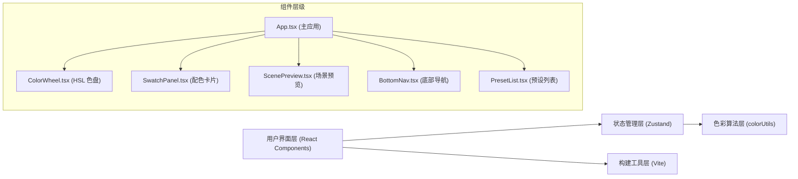

## 1. 架构设计



## 2. 技术选型与说明

| 技术 | 版本 | 用途 | 选型理由 |
|------|------|------|----------|
| React | ^18.3.1 | 前端框架 | 组件化开发，生态成熟，性能优秀 |
| TypeScript | ^5.5.0 | 类型系统 | 类型安全，提升代码可维护性 |
| Vite | ^5.4.0 | 构建工具 | 极速开发体验，热更新快 |
| Zustand | ^4.5.4 | 状态管理 | 轻量级，API 简洁，无 Provider 嵌套 |
| @vitejs/plugin-react | ^4.3.1 | React 支持 | Vite 官方 React 插件，支持 Fast Refresh |
| react-dom | ^18.3.1 | DOM 渲染 | React 官方 DOM 渲染库 |

### 核心设计原则
- **分离关注点**：色彩算法独立于 UI 组件，便于测试和复用
- **性能优先**：使用 `useCallback`、`useMemo`、`React.memo` 优化重渲染
- **类型严格**：tsconfig 开启严格模式，避免隐式 `any`
- **动画优化**：使用 CSS transform 和 opacity 实现 GPU 加速动画

## 3. 目录结构与文件说明

```
auto137/
├── package.json              # 项目依赖与脚本
├── index.html                # 入口 HTML
├── vite.config.ts            # Vite 配置
├── tsconfig.json             # TypeScript 配置
└── src/
    ├── App.tsx               # 主应用组件，路由协调
    ├── main.tsx              # 应用入口
    ├── index.css             # 全局样式与 CSS 变量
    ├── store/
    │   └── colorStore.ts     # Zustand 状态管理
    ├── utils/
    │   └── colorUtils.ts     # 色彩算法与转换函数
    ├── components/
    │   ├── ColorWheel.tsx    # HSL 三环色盘组件
    │   ├── SwatchPanel.tsx   # 配色卡片流组件
    │   ├── ScenePreview.tsx  # 场景预览组件
    │   ├── BottomNav.tsx     # 底部导航组件
    │   └── PresetList.tsx    # 预设列表组件
    └── types/
        └── index.ts          # 全局类型定义
```

### 关键文件职责

#### [src/store/colorStore.ts](file:///e:/solo/SoloAutoDemo/tasks/auto137/src/store/colorStore.ts)
- 管理全局色彩状态：主色 HSL、配色方案列表、当前场景模式
- 提供 actions：`setPrimaryColor`、`updateSwatch`、`setSceneMode`、`applyPreset`
- 内置 5 组经典预设配色数据

#### [src/utils/colorUtils.ts](file:///e:/solo/SoloAutoDemo/tasks/auto137/src/utils/colorUtils.ts)
- `hslToHex(h, s, l)`: HSL 转 HEX
- `hexToHsl(hex)`: HEX 转 HSL
- `generatePalette(primaryHsl)`: 基于主色生成完整配色方案（色相偏移 + 明度阶梯算法）
- `hueOffset(baseHsl, offset)`: 色相偏移计算
- `lightnessStep(baseHsl, step)`: 明度阶梯计算
- `getContrastColor(color)`: 获取对比色（用于文字显示）

#### [src/components/ColorWheel.tsx](file:///e:/solo/SoloAutoDemo/tasks/auto137/src/components/ColorWheel.tsx)
- 使用 Canvas 绘制三个渐变环带
- 实现鼠标/触摸拖拽事件处理
- 三环联动逻辑（色相环、饱和度环、明度环）
- 性能优化：使用 requestAnimationFrame 确保 60FPS

#### [src/components/SwatchPanel.tsx](file:///e:/solo/SoloAutoDemo/tasks/auto137/src/components/SwatchPanel.tsx)
- 展示 5 个配色卡片（主色、主色深、主色浅、点缀色、背景色）
- 双击展开微调面板（HSL 滑块）
- 点击拷贝 HEX 到剪贴板
- 色块淡入淡出动画（0.4s）

#### [src/components/ScenePreview.tsx](file:///e:/solo/SoloAutoDemo/tasks/auto137/src/components/ScenePreview.tsx)
- 三种场景模式切换：网页 UI、海报、室内墙面
- 交叉淡出过渡动画（0.6s）
- 配色自动映射到场景元素

## 4. 类型定义

### 核心类型

```typescript
// src/types/index.ts
export interface HSL {
  h: number; // 0-360
  s: number; // 0-100
  l: number; // 0-100
}

export interface Swatch {
  id: string;
  name: string; // 'primary' | 'primary-dark' | 'primary-light' | 'accent' | 'background'
  hsl: HSL;
  hex: string;
}

export type SceneMode = 'web' | 'poster' | 'interior';
export type PageMode = 'wheel' | 'scheme' | 'preset';

export interface Preset {
  id: string;
  name: string;
  primary: HSL;
}

export interface ColorStore {
  primaryColor: HSL;
  swatches: Swatch[];
  sceneMode: SceneMode;
  pageMode: PageMode;
  presets: Preset[];
  setPrimaryColor: (hsl: HSL) => void;
  updateSwatch: (id: string, hsl: HSL) => void;
  setSceneMode: (mode: SceneMode) => void;
  setPageMode: (mode: PageMode) => void;
  applyPreset: (presetId: string) => void;
  randomPreset: () => void;
}
```

## 5. 色彩算法设计

### 配色方案生成算法

```
输入：主色 HSL (h, s, l)
输出：5 个色块的配色方案

1. 主色 (primary): (h, s, l)
2. 主色深 (primary-dark): (h, s, clamp(l - 20, 10, 90))
3. 主色浅 (primary-light): (h, s, clamp(l + 20, 10, 90))
4. 点缀色 (accent): 
   - 色相偏移: (h + 180) % 360 （互补色）
   - 饱和度: clamp(s + 10, 20, 100)
   - 明度: clamp(l + 10, 30, 70)
5. 背景色 (background):
   - 色相: h
   - 饱和度: clamp(s - 60, 5, 20)
   - 明度: 95-98（近白色）
```

### 同步更新规则

当用户微调某个色块时，其他色块按以下规则更新：
- **调整主色色相**：所有色块色相同步偏移相同角度
- **调整主色饱和度**：主色深/浅同步调整，点缀色按比例调整
- **调整主色明度**：主色深/浅保持明度差同步调整
- **调整点缀色**：仅影响点缀色自身，不联动其他色块
- **调整背景色**：仅影响背景色自身

## 6. 性能优化方案

### 6.1 色盘拖拽性能
- 使用 Canvas 2D 绘制，避免 DOM 重排
- 拖拽事件使用 `passive: true` 提升滚动性能
- 状态更新防抖（16ms）确保 60FPS
- 使用 `requestAnimationFrame` 批量绘制

### 6.2 React 渲染优化
- 组件使用 `React.memo` 包裹，避免不必要重渲染
- 回调函数使用 `useCallback` 缓存
- 计算值使用 `useMemo` 缓存
- 状态切片订阅，避免全量重渲染

### 6.3 动画优化
- 所有动画使用 CSS `transform` 和 `opacity`（GPU 加速属性）
- 使用 `will-change` 提示浏览器提前优化
- 避免在动画中修改 `width`/`height`/`top`/`left` 等触发重排的属性

## 7. 状态管理设计

### Zustand Store 结构

```typescript
// src/store/colorStore.ts
import { create } from 'zustand';
import { generatePalette } from '../utils/colorUtils';
import type { ColorStore, HSL, SceneMode, PageMode, Preset } from '../types';

const PRESETS: Preset[] = [
  { id: '1', name: '莫兰迪蓝', primary: { h: 210, s: 25, l: 45 } },
  { id: '2', name: '复古暖橙', primary: { h: 30, s: 70, l: 55 } },
  { id: '3', name: '森林之绿', primary: { h: 140, s: 45, l: 35 } },
  { id: '4', name: '优雅紫罗兰', primary: { h: 270, s: 40, l: 50 } },
  { id: '5', name: '珊瑚红', primary: { h: 5, s: 75, l: 60 } },
];

export const useColorStore = create<ColorStore>((set, get) => ({
  primaryColor: { h: 210, s: 70, l: 50 },
  swatches: generatePalette({ h: 210, s: 70, l: 50 }),
  sceneMode: 'web',
  pageMode: 'wheel',
  presets: PRESETS,
  
  setPrimaryColor: (hsl: HSL) => {
    set({
      primaryColor: hsl,
      swatches: generatePalette(hsl),
    });
  },
  
  updateSwatch: (id: string, hsl: HSL) => {
    const { swatches } = get();
    // 根据色块类型应用同步更新规则
    const updatedSwatches = applySyncRules(swatches, id, hsl);
    set({ swatches: updatedSwatches });
  },
  
  setSceneMode: (mode: SceneMode) => set({ sceneMode: mode }),
  setPageMode: (mode: PageMode) => set({ pageMode: mode }),
  
  applyPreset: (presetId: string) => {
    const preset = get().presets.find(p => p.id === presetId);
    if (preset) {
      get().setPrimaryColor(preset.primary);
    }
  },
  
  randomPreset: () => {
    const presets = get().presets;
    const random = presets[Math.floor(Math.random() * presets.length)];
    get().setPrimaryColor(random.primary);
  },
}));
```

## 8. 构建与开发配置

### vite.config.ts
```typescript
import { defineConfig } from 'vite';
import react from '@vitejs/plugin-react';

export default defineConfig({
  plugins: [react()],
  server: {
    port: 5173,
    open: true,
  },
  build: {
    target: 'es2020',
    minify: 'esbuild',
    sourcemap: false,
  },
});
```

### tsconfig.json
```json
{
  "compilerOptions": {
    "target": "ES2020",
    "useDefineForClassFields": true,
    "lib": ["ES2020", "DOM", "DOM.Iterable"],
    "module": "ESNext",
    "skipLibCheck": true,
    "moduleResolution": "bundler",
    "allowImportingTsExtensions": true,
    "resolveJsonModule": true,
    "isolatedModules": true,
    "noEmit": true,
    "jsx": "react-jsx",
    "strict": true,
    "noUnusedLocals": true,
    "noUnusedParameters": true,
    "noFallthroughCasesInSwitch": true
  },
  "include": ["src"],
  "references": [{ "path": "./tsconfig.node.json" }]
}
```

### package.json 脚本
```json
{
  "scripts": {
    "dev": "vite",
    "build": "tsc && vite build",
    "lint": "eslint . --ext ts,tsx --report-unused-disable-directives --max-warnings 0",
    "preview": "vite preview"
  }
}
```
