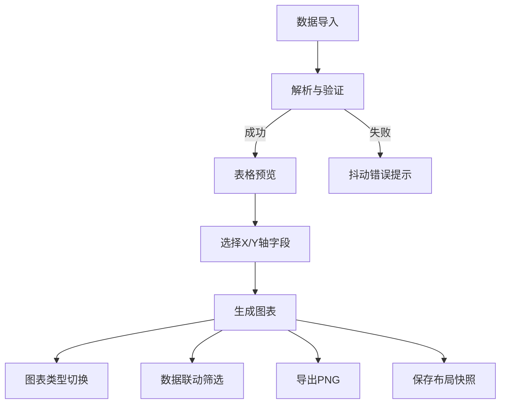

## 1. 产品概述
ChartForge 是一款面向数据分析初学者和非技术团队成员的智能图表生成工具，支持一键将结构化JSON/CSV数据转换为多种风格化图表（折线图、柱状图、雷达图、饼图），并提供数据联动筛选、高清导出等功能，解决用户在快速制作汇报图表时缺乏工具且无法定制视觉风格的痛点。

## 2. 核心特性

### 2.1 用户角色
| 角色 | 注册方式 | 核心权限 |
|------|----------|----------|
| 普通用户 | 无需注册 | 导入数据、生成图表、联动筛选、导出图片、保存布局 |

### 2.2 功能模块
1. **数据导入模块**: 粘贴JSON文本、上传.json/.csv文件、数据预览表格
2. **图表生成模块**: 四种图表类型切换、自动配色、动画过渡
3. **数据联动模块**: 跨图表数据点筛选、高亮联动
4. **交互控制模块**: 缩放、拖拽、删除、下载
5. **主题切换模块**: 日/夜间模式切换
6. **布局管理模块**: 保存/恢复布局快照

### 2.3 页面详情
| 页面名称 | 模块名称 | 功能描述 |
|----------|----------|----------|
| 主应用页 | 顶部导航栏 | Logo展示、数据导入按钮、主题切换按钮 |
| 主应用页 | 数据预览区 | 导入数据表格预览、统计信息、缺失值标注 |
| 主应用页 | 图表网格区 | 响应式图表卡片布局、多图表展示 |
| 主应用页 | 右侧控制面板 | 图表类型切换、坐标轴配置、色板展示 |
| 主应用页 | 底部工具栏 | 布局快照保存/恢复、统计信息 |

## 3. 核心流程
用户导入JSON/CSV数据 → 系统解析并预览表格 → 用户选择X/Y轴字段 → 点击生成图表 → 系统绘制默认折线图 → 用户可切换图表类型 → 支持多图表联动筛选 → 导出高清图片或保存布局

## 4. 界面设计

### 4.1 设计风格
- **主色调**: 渐变Logo从#e94560到#0F3460，选中状态金色填充
- **日间模式**: 背景#F5F5F5，内容区#FFFFFF，边框1px浅灰实线
- **夜间模式**: 背景深蓝#1A1A2E，内容区暗紫#16213E，内阴影无边框
- **导航栏**: 高度56px，深色#0F3460，磨砂玻璃模糊8px
- **字体**: 表格使用等宽字体'Courier New'，加粗表头
- **动画**: 0.3-0.6秒过渡动画，呼吸效果1-1.5Hz
- **卡片**: 圆角12px，悬停上浮4px，阴影加深

### 4.2 页面设计概要
| 页面名称 | 模块名称 | UI元素 |
|----------|----------|--------|
| 主应用页 | 导航栏 | 渐变Logo、导入按钮、主题切换开关 |
| 主应用页 | 数据预览 | 逐行显现表格（每行50ms间隔）、高亮表头、红底缺失值、统计栏 |
| 主应用页 | 图表卡片 | 缩放滑块（50%-200%）、圆形类型按钮、下载/删除按钮、金色选中态 |
| 主应用页 | 控制面板 | 坐标轴选择下拉、色板渐变横条、联动筛选状态指示 |
| 主应用页 | 底部工具栏 | 保存/恢复布局按钮、状态指示器 |

### 4.3 响应式设计
- 桌面端优先，两列网格布局（间距24px）
- 4K宽屏自动调整为三列
- 最小卡片宽度320px
- 所有交互支持键盘导航

### 4.4 动画与交互
- 表格导入：从底部向上逐行显现，50ms间隔
- 图表切换：旧图缩小淡出（0.4s），新图放大淡入（0.4s）
- 框选区域：实线边框，呼吸动画0.7-1.0透明度，1.5Hz
- 图表删除：旋转变小碎裂，碎片散落80px范围，0.6s
- 拖拽移动：Alt+拖拽，半透明投影（偏移2px，模糊8px），释放0.5s消失
- 主题切换：所有元素0.3s颜色渐变

## 5. 性能要求
- 图表渲染（≤1000数据点）：切换+动画≤150ms，60fps
- 数据导入解析（≤100KB JSON）：≤300ms
- 流畅拖拽和滚动体验
