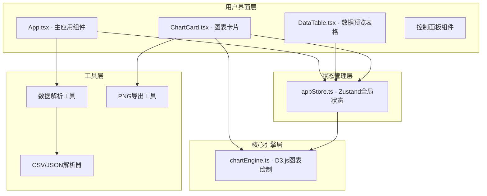

## 1. 架构设计



## 2. 技术选型说明
- **前端框架**: React 18 + TypeScript（严格模式）
- **构建工具**: Vite 5.x，支持React和CSS Modules
- **状态管理**: Zustand 4.x，轻量级全局状态
- **图表绘制**: D3.js v7 + 原生SVG，高性能数据可视化
- **样式方案**: CSS Modules，组件级样式隔离
- **工具库**: uuid（生成唯一ID）

## 3. 目录结构
```
src/
├── main.tsx              # React入口
├── App.tsx               # 主应用组件
├── components/
│   ├── DataTable.tsx     # 数据预览表格组件
│   └── ChartCard.tsx     # 图表卡片组件
├── utils/
│   └── chartEngine.ts    # 图表绘制核心模块
├── stores/
│   └── appStore.ts       # Zustand全局状态
└── styles/
    └── globals.css       # 全局样式和主题变量
```

## 4. 核心数据模型

### 4.1 数据集定义
```typescript
interface DataSet {
  id: string;
  name: string;
  columns: Column[];
  rows: Record<string, any>[];
  stats: {
    fieldCount: number;
    recordCount: number;
    missingCount: number;
  };
}

interface Column {
  name: string;
  type: 'string' | 'number' | 'date' | 'boolean';
  hasMissing: boolean;
}
```

### 4.2 图表定义
```typescript
interface Chart {
  id: string;
  type: 'line' | 'bar' | 'radar' | 'pie';
  dataSetId: string;
  xField: string;
  yFields: string[];
  title: string;
  position: { x: number; y: number };
  size: { width: number; height: number };
  scale: number;
}
```

### 4.3 全局状态
```typescript
interface AppState {
  theme: 'light' | 'dark';
  dataSets: DataSet[];
  charts: Chart[];
  selectedChartId: string | null;
  filterState: FilterState | null;
  layoutSnapshots: LayoutSnapshot[];
  // Actions
  setTheme: (theme: 'light' | 'dark') => void;
  addDataSet: (data: DataSet) => void;
  addChart: (chart: Chart) => void;
  updateChart: (id: string, updates: Partial<Chart>) => void;
  deleteChart: (id: string) => void;
  setFilter: (filter: FilterState | null) => void;
  saveLayout: () => string;
  restoreLayout: (snapshotId: string) => void;
}
```

## 5. 核心API

### 5.1 图表引擎API
```typescript
// chartEngine.ts
export function drawLineChart(
  data: any[],
  container: HTMLElement,
  config: ChartConfig
): ChartInstance;

export function drawBarChart(
  data: any[],
  container: HTMLElement,
  config: ChartConfig
): ChartInstance;

export function drawRadarChart(
  data: any[],
  container: HTMLElement,
  config: ChartConfig
): ChartInstance;

export function drawPieChart(
  data: any[],
  container: HTMLElement,
  config: ChartConfig
): ChartInstance;

interface ChartConfig {
  xField: string;
  yFields: string[];
  colors: string[];
  width: number;
  height: number;
  scale: number;
  filterCategories?: string[];
  onSelection?: (categories: string[]) => void;
}

interface ChartInstance {
  update: (data: any[], config: Partial<ChartConfig>) => void;
  destroy: () => void;
  exportPNG: (dpi: number) => Promise<string>;
}
```

### 5.2 12色调色板
```javascript
const COLOR_PALETTE = [
  '#e94560', '#0F3460', '#533483', '#E94560',
  '#FF6B6B', '#4ECDC4', '#45B7D1', '#96CEB4',
  '#FFEAA7', '#DDA0DD', '#98D8C8', '#F7DC6F'
];
```

## 6. 性能优化策略
1. **图表虚拟化**: 数据点过多时采用采样渲染
2. **SVG复用**: 避免重复创建DOM节点
3. **requestAnimationFrame**: 所有动画使用RAF保证60fps
4. **防抖节流**: 缩放滑块和拖拽操作使用节流
5. **状态分片**: Zustand使用selector避免不必要重渲染
6. **Worker解析**: 大数据集在Web Worker中解析

## 7. 构建配置
- Vite配置开启React Fast Refresh
- CSS Modules配置：`localIdentName: '[name]__[local]___[hash:base64:5]'`
- TypeScript严格模式，开启esModuleInterop
- 生产构建开启代码分割和Tree Shaking
