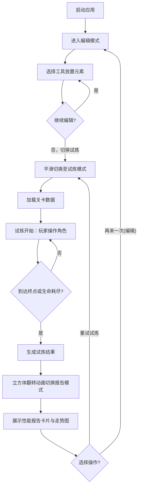

## 1. 产品概述

地形试炼场是一款面向游戏关卡设计师的2D平台关卡实时编辑与战斗模拟工具，支持快速搭建关卡地形、放置游戏元素，并即时验证角色移动与技能释放效果。

- 解决痛点：传统游戏开发中修改地形需重新编译整个工程，耗时过长，缺乏轻量级独立验证工具
- 目标用户：游戏关卡设计师、独立游戏开发者、游戏原型验证人员
- 产品价值：大幅缩短关卡设计迭代周期，从"修改-编译-测试"变为"编辑-试炼-报告"的即时反馈闭环

## 2. 核心特性

### 2.1 功能模块

1. **关卡编辑模式**：30×20网格画布，支持放置/删除/拖拽/旋转平台、尖刺、弹射器、敌人生成点，支持撤销与保存
2. **试炼模式**：实时战斗模拟，WASD移动、空格跳跃、鼠标射击，物理碰撞与敌人AI，HUD状态显示
3. **性能报告模式**：通关数据统计（时间/受伤/击杀/连杀），历史走势迷你图表，重试与再来一次

### 2.2 页面详情

| 页面名称 | 模块名称 | 功能描述 |
|-----------|-------------|---------------------|
| 关卡编辑页 | 顶部导航栏 | 三种模式切换标签（编辑/试炼/报告），当前模式青色下划线高亮 |
| 关卡编辑页 | 左侧工具栏 | 五类工具选择（选择/平台/尖刺/弹射器/敌人生成点），点击选中高亮 |
| 关卡编辑页 | 网格画布 | 30×20等距网格，浅灰色线框背景，支持点击放置、拖拽移动、右键删除 |
| 关卡编辑页 | 底部操作栏 | 保存按钮（JSON序列化至localStorage）、清除全部按钮（带确认对话框） |
| 关卡编辑页 | 快捷键浮窗 | 右下角可拖拽半透明浮窗，悬停放大至1.05倍，列出当前模式快捷键 |
| 试炼模式页 | 游戏画布 | 渲染编辑好的关卡，蓝色圆形角色，终点金色旗帜 |
| 试炼模式页 | HUD面板 | 右上角：生命值（红色心形）、通关时间（黄色秒数）、击杀数（蓝色骷髅） |
| 试炼模式页 | 游戏循环 | 60FPS物理更新，碰撞检测，敌人AI巡逻/追击，子弹系统 |
| 性能报告页 | 数据卡片网格 | 两行两列：通关时间（深蓝）、受伤次数（暗红）、击杀数（深紫）、最高连杀（深绿） |
| 性能报告页 | 操作按钮 | 再来一次（返回编辑并重置）、重试（保持关卡返回试炼） |
| 性能报告页 | 历史走势图 | Canvas绘制最近五次成绩折线图，青蓝色渐变数据点 |

## 3. 核心流程

主用户流程：设计师在编辑模式搭建关卡 → 切换到试炼模式亲自测试跑图 → 试炼结束自动生成性能报告 → 根据报告调整关卡或重试。

## 4. 用户界面设计

### 4.1 设计风格

- **主题基调**：深色科技感，深灰到黑色径向渐变背景（中心略亮），营造游戏编辑器专业氛围
- **主色调与功能色**：
  - 平台绿：`#2d8a4e` 填充 + `#5fd487` 边框
  - 尖刺红：`#d43f3f` 填充
  - 弹射器蓝：`#3a6fd4` 填充 + 白色箭头
  - 敌人紫：`#8a3fd4` 半透明生成点 + 红色三角敌人
  - 角色蓝：`#4da6ff` 圆形
  - 终点金：`#ffd700` 旗帜
  - 导航高亮青：`#00e5ff` 下划线
- **按钮样式**：圆角矩形 border-radius: 8px，悬停亮度+10% + 白色外发光box-shadow，点击缩放至0.95倍
- **字体**：标题使用 'Rajdhani' 或 'Orbitron' 科技感字体，正文使用 'Inter' 或系统无衬线字体
- **布局风格**：顶部导航栏（黑色）+ 主内容区（弹性布局）+ 右下角浮动提示窗
- **图标建议**：使用 lucide-react 图标库，心形❤、骷髅☠、目标🎯、时钟⏱等语义化图标

### 4.2 页面设计概述

| 页面名称 | 模块名称 | UI元素设计 |
|-----------|-------------|-------------|
| 关卡编辑页 | 网格画布 | 浅灰色线框 40px格子，悬停高亮行/列，拖拽时半透明预览跟随，落点0.15s缩放动画 |
| 关卡编辑页 | 工具栏按钮 | 方形按钮带图标与文字标签，选中时青色边框 + 背景微亮 |
| 关卡编辑页 | 确认对话框 | 淡入动画，红色警告边框 `border: 2px solid #ff4444`，悬浮阴影 `shadow-2xl` |
| 试炼模式页 | 角色 | 蓝色圆形带内阴影，移动时轻微压扁拉伸，受伤时红光闪烁0.5s无敌 |
| 试炼模式页 | 敌人 | 红色三角形，巡逻模式慢速，追击模式加速 + 愤怒红光 |
| 试炼模式页 | 胜利特效 | 屏幕中心金色光芒四射，径向渐变 + CSS keyframes 脉冲动画 |
| 性能报告页 | 数据卡片 | 大字号数字 + 图标，从底部弹入动画 cubic-bezier(0.68,-0.55,0.27,1.55) 弹性系数0.6 |
| 性能报告页 | 模式切换动画 | 立方体翻转 3D transform，0.3s perspective(1000px) |

### 4.3 响应式适配

- 桌面优先设计，基准宽度 1280px+
- 断点 <800px：顶部导航转为汉堡菜单（三横线图标点击展开），网格画布按比例缩放 `transform: scale()`，HUD 字号缩小 20%
- 断点 <500px：工具栏改为顶部横向排列，取消左右布局

### 4.4 动画规范

- 所有动画时长控制在 0.2s - 0.6s 区间
- 缓动函数统一使用 `cubic-bezier(0.25, 0.1, 0.25, 1)`
- 弹性动画使用 `cubic-bezier(0.68, -0.55, 0.27, 1.55)` 配合 `bounce` 效果
- 模式切换：编辑↔试炼 0.4s 渐变 opacity + transform: translateY，试炼→报告 0.3s 立方体翻转
- 微交互：按钮悬停 0.15s transition，工具选中 0.2s 高亮过渡
