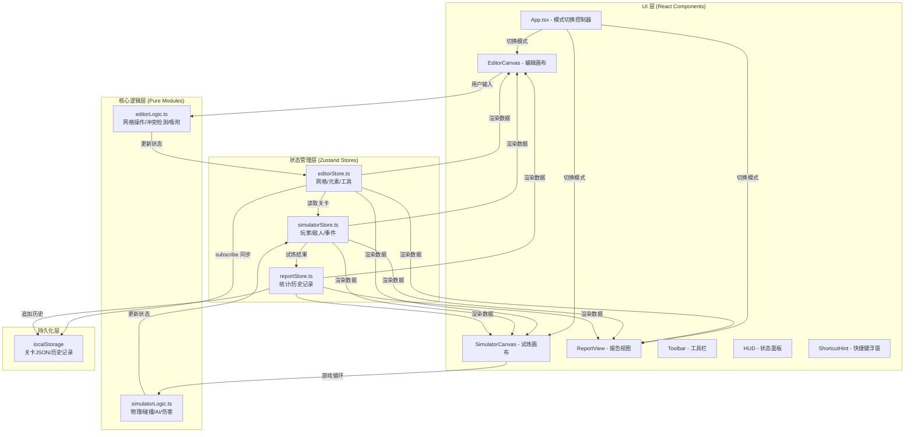

## 1. 架构设计



## 2. 技术描述

- **前端框架**：React@18 + TypeScript（严格模式 strict:true，目标 ES2020）
- **构建工具**：Vite@5 + @vitejs/plugin-react，开发服务器自动打开浏览器
- **状态管理**：zustand@4，使用 create + subscribe 实现跨模块数据同步
- **工具库**：uuid@9（生成元素唯一ID），lucide-react（图标）
- **无后端**：纯前端应用，所有数据通过 localStorage JSON 序列化持久化
- **初始化工具**：vite-init react-ts 模板，后按需精简依赖

## 3. 模块文件结构

```
├── package.json
├── index.html
├── vite.config.ts           (server.open: true)
├── tsconfig.json            (strict: true, target: ES2020)
└── src/
    ├── main.tsx             (ReactDOM.createRoot 入口)
    ├── App.tsx              (三模式切换 + 全局布局)
    ├── index.css            (全局样式 + CSS变量主题)
    ├── store/
    │   ├── editorStore.ts   (网格/元素/工具/撤销栈)
    │   ├── simulatorStore.ts(玩家/敌人/子弹/时间/帧)
    │   └── reportStore.ts   (统计数据 + 历史数组)
    ├── modules/
    │   ├── editorLogic.ts   (纯函数: placeElement/removeElement/rotateElement/snapToGrid)
    │   └── simulatorLogic.ts(纯函数: stepPhysics/checkCollision/updateAI/fireBullet)
    ├── components/
    │   ├── editor/
    │   │   ├── Toolbar.tsx
    │   │   ├── EditorCanvas.tsx
    │   │   └── ConfirmDialog.tsx
    │   ├── simulator/
    │   │   ├── SimulatorCanvas.tsx
    │   │   └── HUD.tsx
    │   ├── report/
    │   │   ├── ReportView.tsx
    │   │   ├── StatCard.tsx
    │   │   └── MiniChart.tsx
    │   └── common/
    │       ├── NavBar.tsx
    │       └── ShortcutHint.tsx
    └── types/
        └── index.ts         (全局类型定义集中管理)
```

## 4. 核心数据模型

### 4.1 类型定义 (types/index.ts)

```typescript
// 元素类型枚举
export type ElementType = 'platform' | 'spike' | 'launcher' | 'enemy_spawner';

// 旋转角度（0/90/180/270度）
export type Rotation = 0 | 90 | 180 | 270;

// 网格上放置的元素
export interface LevelElement {
  id: string;           // uuid
  type: ElementType;
  gridX: number;        // 网格坐标 0-29
  gridY: number;        // 网格坐标 0-19
  rotation: Rotation;   // 旋转角度
}

// 关卡数据（可序列化）
export interface LevelData {
  gridCols: number;     // =30
  gridRows: number;     // =20
  cellSize: number;     // =40
  elements: LevelElement[];
  startPos: { x: number; y: number };   // 左上角 (0.5格, 19.5格)
  endPos: { x: number; y: number };     // 右下角旗帜 (29.5格, 0.5格)
  savedAt: number;
}

// 玩家状态
export interface PlayerState {
  x: number; y: number;          // 像素坐标
  vx: number; vy: number;        // 速度
  hp: number;                    // 生命 0-10
  isInvincible: boolean;         // 受伤无敌
  invincibleTimer: number;       // 无敌剩余ms
  radius: number;                // 角色半径
  onGround: boolean;             // 着地标记
}

// 敌人状态
export interface EnemyState {
  id: string;
  x: number; y: number;
  vx: number; vy: number;
  spawnX: number; spawnY: number;
  state: 'patrol' | 'chase' | 'return' | 'dead';
  hp: number;
  flashTimer: number;            // 被击中闪烁
  patrolDir: 1 | -1;
}

// 子弹
export interface Bullet {
  id: string;
  x: number; y: number;
  vx: number; vy: number;
  alive: boolean;
}

// 试炼结果
export interface TrialResult {
  completed: boolean;            // 是否通关到达终点
  timeMs: number;                // 耗时毫秒
  damageCount: number;           // 受伤次数
  killCount: number;             // 击杀数
  maxCombo: number;              // 最高5秒内连杀
  killTimestamps: number[];      // 击杀时间点（用于连杀计算）
}

// 报告历史条目
export interface ReportHistoryItem {
  id: string;
  timeMs: number;
  damageCount: number;
  killCount: number;
  maxCombo: number;
  timestamp: number;
}
```

## 5. Zustand Store 接口定义

### 5.1 editorStore.ts

```typescript
interface EditorStore {
  // 状态
  gridCols: number;              // 30
  gridRows: number;              // 20
  cellSize: number;              // 40
  elements: LevelElement[];
  selectedTool: 'select' | ElementType;
  selectedElementId: string | null;
  showGrid: boolean;
  history: LevelElement[][];     // 撤销栈（最多10步）
  historyIndex: number;

  // 操作
  setTool: (tool: 'select' | ElementType) => void;
  toggleGrid: () => void;
  placeElement: (type: ElementType, gridX: number, gridY: number) => void;
  removeElement: (id: string) => void;
  moveElement: (id: string, gridX: number, gridY: number) => void;
  rotateElement: (id: string) => void;
  selectElement: (id: string | null) => void;
  clearAll: () => void;
  undo: () => void;
  saveToStorage: () => void;
  loadFromStorage: () => void;
  _pushHistory: () => void;      // 内部：推入撤销步骤
}
```

### 5.2 simulatorStore.ts

```typescript
interface SimulatorStore {
  // 加载状态
  levelData: LevelData | null;
  isRunning: boolean;
  isPaused: boolean;

  // 实体状态
  player: PlayerState;
  enemies: EnemyState[];
  bullets: Bullet[];

  // 统计
  startTime: number;
  elapsedMs: number;
  damageCount: number;
  killTimestamps: number[];

  // FPS控制
  lastFrameTime: number;
  fps: number;
  speedMultiplier: number;       // 帧率不足时降速

  // 操作
  loadLevel: (data: LevelData) => void;
  startTrial: () => void;
  stopTrial: (completed: boolean) => TrialResult;
  reset: () => void;
  step: (dtMs: number, keys: KeyState, mouse: MouseState) => void;
  fireBullet: (targetX: number, targetY: number) => void;
}
```

### 5.3 reportStore.ts

```typescript
interface ReportStore {
  currentReport: TrialResult | null;
  history: ReportHistoryItem[];

  setReport: (result: TrialResult) => void;
  appendHistory: (result: TrialResult) => void;
  loadHistory: () => void;
  clearHistory: () => void;
  getRecentHistory: (n: number) => ReportHistoryItem[];
}
```

## 6. 核心逻辑模块说明

### 6.1 modules/editorLogic.ts（纯函数，无副作用）

```typescript
// 将像素坐标吸附到网格
export function snapToGrid(px: number, py: number, cellSize: number): { gx: number; gy: number }

// 检查坐标是否在网格范围内
export function isInBounds(gx: number, gy: number, cols: number, rows: number): boolean

// 检查位置是否与已有元素冲突（同位置同类型或禁止叠放规则）
export function checkCollision(
  elements: LevelElement[], targetGx: number, targetGy: number, excludeId?: string
): LevelElement | null

// 创建新元素对象
export function createElement(
  type: ElementType, gx: number, gy: number
): LevelElement

// 旋转角度递增（每次90度）
export function nextRotation(r: Rotation): Rotation

// 根据元素类型和旋转获取弹射器方向向量
export function getLauncherVector(rotation: Rotation): { dx: number; dy: number }
```

### 6.2 modules/simulatorLogic.ts（纯函数，无副作用）

```typescript
// 单步物理更新：重力、速度积分、平台AABB碰撞
export function stepPlayerPhysics(
  p: PlayerState, dt: number, platforms: AABB[]
): PlayerState

// 检测玩家与尖刺/弹射器/敌人的碰撞事件
export function checkHazards(
  p: PlayerState, elements: LevelElement[], cellSize: number
): { hitSpike: boolean; hitLauncher: Rotation | null }

// 敌人AI行为树：巡逻/追击/回归三状态
export function updateEnemyAI(
  e: EnemyState, player: PlayerState, dt: number
): EnemyState

// AABB圆碰撞检测
export function circleRectCollide(
  cx: number, cy: number, r: number, rx: number, ry: number, rw: number, rh: number
): boolean

// 扇形视野检测（距离+角度）
export function isInFov(
  ex: number, ey: number, eDir: number, px: number, py: number, range: number, angleDeg: number
): boolean

// 计算5秒窗口内的最高连杀
export function calcMaxCombo(killTimestamps: number[], now: number): number

// 子弹与敌人碰撞检测
export function checkBulletHits(
  bullets: Bullet[], enemies: EnemyState[]
): { updatedBullets: Bullet[]; updatedEnemies: EnemyState[]; killedIds: string[] }
```

## 7. 跨模块数据同步机制

1. **editorStore → localStorage**：editorStore 内部通过 subscribe 订阅 `elements` 变化，每次变化后 50ms 防抖写入 localStorage（key=`terrain_arena_level`）
2. **editorStore → simulatorStore**：用户点击"试炼"按钮时，simulatorStore 调用 `loadLevel(editorStore.getState().serialize())` 读取完整关卡快照
3. **simulatorStore → reportStore**：试炼结束调用 `stopTrial()` 返回 TrialResult，App.tsx 中转调用 `reportStore.setReport(result)` + `appendHistory(result)`
4. **FPS自适应**：simulatorStore 每帧记录 `performance.now()`，计算滚动平均FPS，若 <55 则 `speedMultiplier *= 0.95`，>58 则 `speedMultiplier = min(1, speed*1.01)`

## 8. 性能约束实现方案

- **编辑响应 <50ms**：editorLogic 纯函数无IO，React 渲染使用 memo 包裹 Toolbar/EditorCanvas，避免列表重渲染
- **试炼 ≥55FPS**：Canvas 2D 渲染（非DOM），requestAnimationFrame 驱动，物理计算采用固定步长插值，帧率检测动态降速
- **跨模块IO <10ms**：localStorage 操作防抖 50ms，JSON.stringify 关卡数据（元素通常 <500 个）实测 <2ms
