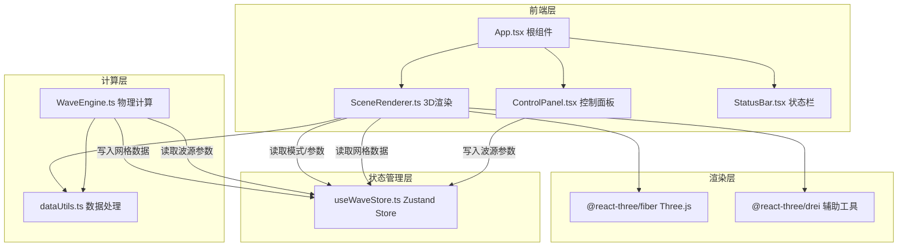

## 1. 架构设计



## 2. 技术说明

- **前端框架**：React 18 + TypeScript (strict模式)
- **3D渲染**：Three.js + @react-three/fiber + @react-three/drei
- **状态管理**：Zustand
- **构建工具**：Vite + @vitejs/plugin-react
- **无后端**：纯前端应用，所有计算在浏览器端完成

## 3. 路由定义

| 路由 | 用途 |
|------|------|
| / | 主页面，包含3D场景和控制面板 |

单页应用，无需路由。

## 4. 文件结构与模块职责

```
project-root/
├── package.json              # 依赖与脚本
├── index.html                # 入口HTML
├── vite.config.ts            # Vite构建配置
├── tsconfig.json             # TypeScript strict配置
└── src/
    ├── main.tsx              # React入口，挂载根组件
    ├── App.tsx               # 根组件，左侧Scene + 右侧Panel布局
    ├── store/
    │   └── useWaveStore.ts   # Zustand store，波源参数+可视化模式
    ├── physics/
    │   └── WaveEngine.ts     # 物理计算：球面波、叠加、干涉
    ├── renderer/
    │   └── SceneRenderer.ts  # 3D场景：波面、云图、粒子系统
    ├── components/
    │   ├── ControlPanel.tsx  # 控制面板UI
    │   └── StatusBar.tsx     # 底部状态栏
    └── utils/
        └── dataUtils.ts      # 坐标映射、颜色插值
```

### 4.1 Zustand Store (useWaveStore.ts)

**状态定义：**
```typescript
interface WaveSource {
  id: number;
  position: [number, number, number];
  frequency: number;    // 10-100 Hz
  amplitude: number;    // 1-10
  phase: number;        // 0-360°
  enabled: boolean;
}

interface WaveState {
  sources: WaveSource[];
  mode: 'wave' | 'interference-slice' | 'energy';
  showInterference: boolean;
  sliceZ: number;       // 干涉切面Z位置
  interferenceData: Float32Array | null;
  time: number;
  fps: number;
  sourceCount: number;
}
```

### 4.2 物理计算模块 (WaveEngine.ts)

- 球面波公式：`A(r,t) = (A₀/r) × sin(kr - ωt + φ₀)`
- 叠加原理：`A_total(x,y,z,t) = Σ A_i(r_i, t)`
- 干涉计算：25×25×25网格，每帧计算叠加振幅
- 能量密度：`E ∝ A_total²` 时间平均

### 4.3 渲染模块 (SceneRenderer.ts)

- **波面传播模式**：球面ShaderMaterial，顶点动画+颜色渐变
- **干涉体云图**：InstancedMesh + 半精度Float16Array
- **干涉切面模式**：2D平面纹理+呼吸动画(1.5s周期)
- **能量分布模式**：粒子系统(Points)，粒子大小/颜色/密度随能量变化

### 4.4 数据处理模块 (dataUtils.ts)

- `gridToWorld(i, j, k)` — 网格索引→世界坐标
- `worldToGrid(x, y, z)` — 世界坐标→网格索引
- `interpolateColor(value, min, max, colorStops)` — 数值→颜色插值
- `amplitudeToEnergy(amplitude)` — 振幅→能量密度

## 5. 性能优化策略

| 策略 | 说明 |
|------|------|
| InstancedMesh | 干涉云图使用实例化网格，减少draw call |
| Float16Array | 半精度浮点存储网格数据，减少内存占用 |
| 按需计算 | 仅在参数变化时重新计算干涉数据 |
| LOD | 远距离降低网格分辨率 |
| requestAnimationFrame | 与Three.js渲染循环同步 |
| Web Worker(可选) | 大规模网格计算移至Worker线程 |

## 6. 依赖清单

```json
{
  "dependencies": {
    "react": "^18.3.0",
    "react-dom": "^18.3.0",
    "three": "^0.170.0",
    "@react-three/fiber": "^8.17.0",
    "@react-three/drei": "^9.114.0",
    "zustand": "^5.0.0"
  },
  "devDependencies": {
    "typescript": "^5.6.0",
    "vite": "^6.0.0",
    "@vitejs/plugin-react": "^4.3.0",
    "@types/react": "^18.3.0",
    "@types/react-dom": "^18.3.0",
    "@types/three": "^0.170.0"
  }
}
```
