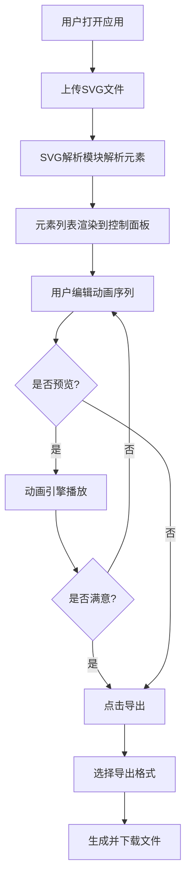

## 1. 产品概述

路径解构师（Path Deconstructor）是一款面向在线教育讲师的SVG流程图动画编排工具，允许用户上传SVG格式流程图，为图中每个元素独立设置出现顺序、动画类型和持续时长，最终生成可导出的动画序列，解决课件动画工具嵌入复杂、自定义控制不足的痛点。

- 目标用户：在线教育讲师、课程制作人员、演示文稿制作者
- 核心价值：将静态流程图转化为逐步出现的动画序列，精准引导学生注意力，降低动画制作门槛

## 2. 核心功能

### 2.1 功能模块

1. **画布页面**：SVG上传与渲染、动画预览与回放、元素选中高亮
2. **控制面板**：元素顺序拖拽排序、动画类型选择、持续时长调节

### 2.2 页面详情

| 页面名称 | 模块名称 | 功能描述 |
|----------|----------|----------|
| 画布页面 | SVG上传区 | 支持点击上传或拖拽上传SVG文件（最大2MB），加载时显示旋转动画，解析成功后原样渲染SVG |
| 画布页面 | SVG画布 | 浅灰色网格背景，编辑模式下SVG元素外围显示虚线边框（选中橙色、非选中灰色），播放时按序执行动画 |
| 画布页面 | 播放控制栏 | 播放/暂停按钮（播放按钮带光晕脉冲动画），显示总时长，支持暂停恢复 |
| 画布页面 | 导出按钮 | 点击弹出模态框选择导出格式（HTML文件/CSS代码段） |
| 控制面板 | 元素列表 | 按文档顺序列出所有可编辑元素，带图标（圆点、方块、箭头、文字A），拖拽手柄（三横线），拖拽时半透明跟随，其他项0.2秒过渡让位 |
| 控制面板 | 动画配置 | 每个元素右侧：动画类型下拉（淡入/从左滑入/从右滑入/向上飞入/向下飞入）、持续时长数字输入（0.3-2秒，步长0.1），默认淡入+0.5秒 |

## 3. 核心流程

用户打开应用 → 上传SVG文件 → 系统解析SVG并提取元素 → 控制面板展示元素列表 → 用户拖拽调整顺序、选择动画类型、设置时长 → 点击播放预览 → 满意后点击导出 → 选择格式并下载

## 4. 用户界面设计

### 4.1 设计风格

- 主色调：深色主题（背景 #1a1a2e，卡片 #16213e，文字 #e0e0e0）
- 强调色：橙色 #ff6b35（选中边框、hover高亮、播放按钮光晕）
- 按钮风格：圆角8px，左对齐图标+右侧文字布局
- 字体：JetBrains Mono（代码/数字区域）+ Noto Sans SC（中文UI）
- 布局风格：左侧控制面板（可拖拽调整宽度）+ 右侧画布区域，竖线分割
- 图标风格：线性图标（lucide-react）

### 4.2 页面设计概览

| 页面名称 | 模块名称 | UI元素 |
|----------|----------|--------|
| 画布页面 | SVG上传区 | 虚线边框、上传图标（悬停放大1.2倍+上移3px）、提示文字、加载旋转动画 |
| 画布页面 | SVG画布 | 浅灰网格背景（20px间距、#e0e0e0、0.3透明度）、元素虚线边框（选中橙色2px/未选中灰色2px） |
| 画布页面 | 播放控制栏 | 播放按钮（光晕脉冲0.5s循环）、暂停按钮、总时长显示 |
| 画布页面 | 导出模态框 | 中央淡入0.25s、背景遮罩0.6透明度、格式选择、确认按钮 |
| 控制面板 | 元素列表 | 元素图标、拖拽手柄（三横线）、hover时rgba(255,107,53,0.1)、选中时rgba(255,107,53,0.2)、间距8px |
| 控制面板 | 面板分割线 | 可拖拽竖线、col-resize光标、最小280px最大480px |

### 4.3 响应式

- 桌面优先设计，控制面板与画布左右分栏
- 面板宽度可拖拽调整（280px-480px），默认320px
- 画布区域自适应剩余空间

## 5. 性能约束

- 动画播放时FPS不低于55帧
- 解析10个元素以内的SVG文件，从上传到列表渲染完成不超过0.5秒
- 导出的HTML文件大小不超过50KB
