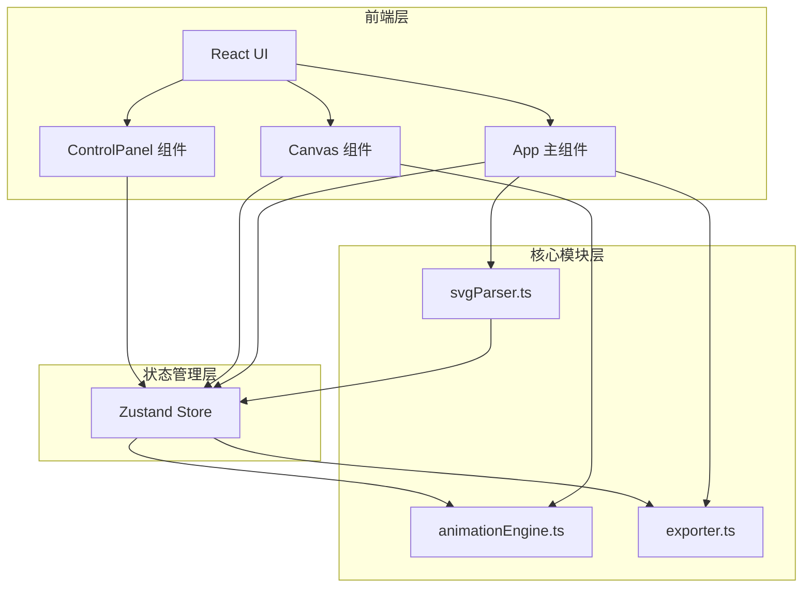

## 1. 架构设计



## 2. 技术描述

- 前端：React 18 + TypeScript + Vite
- 状态管理：Zustand
- 样式方案：Tailwind CSS
- 图标库：lucide-react
- 初始化工具：vite-init（react-ts模板）
- 后端：无
- 数据库：无

## 3. 路由定义

| 路由 | 用途 |
|------|------|
| / | 单页应用，包含上传、编辑、预览、导出全部功能 |

## 4. 文件结构

```
├── package.json
├── index.html
├── vite.config.ts
├── tsconfig.json
├── src/
│   ├── main.tsx
│   ├── App.tsx
│   ├── components/
│   │   ├── Canvas.tsx
│   │   └── ControlPanel.tsx
│   ├── modules/
│   │   ├── svgParser.ts
│   │   ├── animationEngine.ts
│   │   └── exporter.ts
│   └── store/
│       └── useStore.ts
```

## 5. 核心模块接口定义

### 5.1 svgParser.ts

```typescript
interface ParsedElement {
  id: string;
  tagName: string;
  attributes: Record<string, string>;
  innerHTML: string;
  x: number;
  y: number;
  width: number;
  height: number;
}

function parseSVG(svgString: string): ParsedElement[];
```

### 5.2 animationEngine.ts

```typescript
type AnimationType = 'fadeIn' | 'slideFromLeft' | 'slideFromRight' | 'flyFromBottom' | 'flyFromTop';

interface AnimationConfig {
  elementId: string;
  animationType: AnimationType;
  duration: number;
  order: number;
}

interface AnimationEngine {
  play(configs: AnimationConfig[], svgContainer: HTMLElement): void;
  pause(): void;
  resume(): void;
  reset(): void;
  getTotalDuration(configs: AnimationConfig[]): number;
}
```

### 5.3 exporter.ts

```typescript
function exportAsHTML(svgContent: string, configs: AnimationConfig[]): string;
function exportAsCSS(configs: AnimationConfig[]): string;
```

### 5.4 Zustand Store

```typescript
interface AppState {
  svgContent: string | null;
  elements: ParsedElement[];
  elementOrders: string[];
  animationConfigs: Record<string, AnimationConfig>;
  selectedElementId: string | null;
  isPlaying: boolean;
  isPaused: boolean;
  panelWidth: number;
  
  setSVGContent: (content: string) => void;
  setElements: (elements: ParsedElement[]) => void;
  updateElementOrder: (orders: string[]) => void;
  updateAnimationConfig: (elementId: string, config: Partial<AnimationConfig>) => void;
  setSelectedElement: (id: string | null) => void;
  setPlaying: (playing: boolean) => void;
  setPaused: (paused: boolean) => void;
  setPanelWidth: (width: number) => void;
}
```

## 6. 动画实现方案

使用 Web Animations API 实现动画播放，CSS @keyframes 实现导出：

| 动画类型 | 播放实现 | 关键参数 |
|----------|----------|----------|
| 淡入 | opacity: 0→1 | ease-out |
| 从左滑入 | transform: translateX(-canvasWidth)→translateX(0) | ease-out 0.3s |
| 从右滑入 | transform: translateX(canvasWidth)→translateX(0) | ease-out 0.3s |
| 向上飞入 | transform: translateY(50px)→translateY(0) | 弹性效果 0.15s |
| 向下飞入 | transform: translateY(-50px)→translateY(0) | 弹性效果 0.15s |

## 7. 数据流向

1. **上传 → 解析**：用户上传SVG → svgParser解析 → 结果写入Zustand store
2. **编辑 → 存储**：用户在ControlPanel操作 → 直接更新Zustand store → Canvas响应式重绘
3. **播放 → 渲染**：store配置 → animationEngine生成动画队列 → Canvas执行Web Animations API
4. **导出 → 下载**：store全量配置 → exporter生成HTML/CSS → 触发浏览器下载
