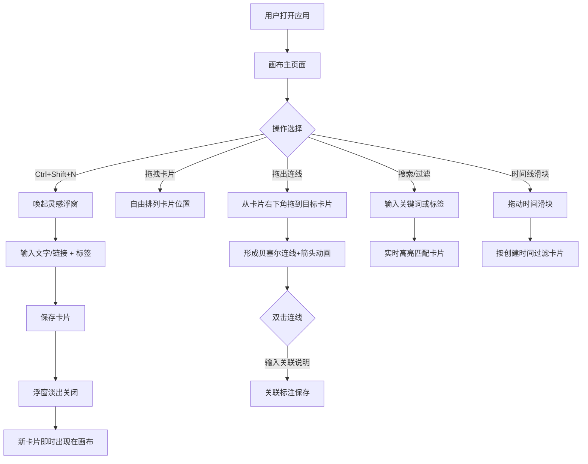

## 1. 产品概述

个人思维管理工具（MindFlow），帮助用户将零散灵感、待办事项和知识碎片快速保存、标注并可视化关联。解决传统笔记软件中信息孤立、缺乏视觉关联和无法灵活组织的痛点，面向创意工作者、知识管理爱好者和效率追求者。

## 2. 核心功能

### 2.1 用户角色

| 角色 | 注册方式 | 核心权限 |
|------|----------|----------|
| 个人用户 | 无需注册，本地使用 | 全部功能 |

### 2.2 功能模块

1. **画布主页面**：卡片画布拖拽排列、贝塞尔曲线连线、全局搜索与时间线过滤
2. **灵感速记浮窗**：快捷键唤起半透明浮窗，快速录入灵感卡片

### 2.3 页面详情

| 页面名称 | 模块名称 | 功能描述 |
|----------|----------|----------|
| 画布主页面 | 卡片画布 | 自由拖拽排列卡片，从卡片右下角拖出贝塞尔连线到另一卡片形成关联，连线带流向箭头动画 |
| 画布主页面 | 关联标注 | 双击连线输入关联说明（如"补充说明"、"导致"），连线颜色根据关联类型自动分配（红色=冲突，绿色=支持） |
| 画布主页面 | 全局搜索 | 顶部搜索框支持按标签、关键词过滤卡片，搜索结果实时高亮 |
| 画布主页面 | 时间线过滤 | 右侧可拖拽时间滑块，按创建时间过滤卡片，带缓动动画和刻度标记 |
| 灵感速记浮窗 | 快捷录入 | Ctrl+Shift+N唤起半透明浮窗，输入文字/粘贴链接自动保存为卡片，支持#标签标注，保存后淡出动画关闭 |
| 灵感速记浮窗 | 即时更新 | 保存后主界面右侧卡片流即时出现新卡片 |

## 3. 核心流程

用户打开应用后进入画布主页面，可自由拖拽已有卡片、创建关联连线。需要快速记录灵感时，按Ctrl+Shift+N唤起浮窗，输入内容并标注标签后保存，卡片立即出现在画布上。通过搜索框或时间滑块可快速定位特定卡片。

## 4. 用户界面设计

### 4.1 设计风格

- 主色调：静谧蓝紫渐变（#667eea → #764ba2）
- 毛玻璃效果：背景模糊 + 半透明卡片（backdrop-filter: blur）
- 卡片样式：圆角16px，细腻阴影过渡
- 按钮：圆角胶囊形，渐变背景，hover微放大
- 字体：Google Fonts - Noto Sans SC（正文）+ Outfit（标题/数字）
- 布局：全屏画布，顶部工具栏，右侧时间滑块
- 图标：Lucide Icons

### 4.2 页面设计概览

| 页面名称 | 模块名称 | UI元素 |
|----------|----------|--------|
| 画布主页面 | 卡片画布 | 深色渐变背景，半透明毛玻璃卡片，拖拽时弹性反馈动画，连线发光描边 |
| 画布主页面 | 顶部工具栏 | 搜索框居中，标签筛选按钮组，毛玻璃背景 |
| 画布主页面 | 时间线滑块 | 右侧竖向滑块，刻度标记，缓动动画，半透明轨道 |
| 画布主页面 | 关联连线 | 贝塞尔曲线，流向箭头动画，发光描边，双击弹出标注输入框 |
| 灵感速记浮窗 | 浮窗本体 | 居中半透明浮窗，毛玻璃背景，输入框+标签输入，保存按钮，淡出关闭动画 |

### 4.3 响应式设计

- 桌面端：多列自由画布布局，卡片可任意拖拽定位
- 平板端：自动调整为单列布局，触屏拖拽流畅
- 手机端：单列堆叠布局，手势操作优化，浮窗全宽显示
- 所有交互均支持触屏操作

### 4.4 性能目标

- 200张卡片同时渲染时保持30FPS以上
- 连线绘制使用Canvas优化
- 拖拽使用requestAnimationFrame节流
- 视口外卡片虚拟化渲染
