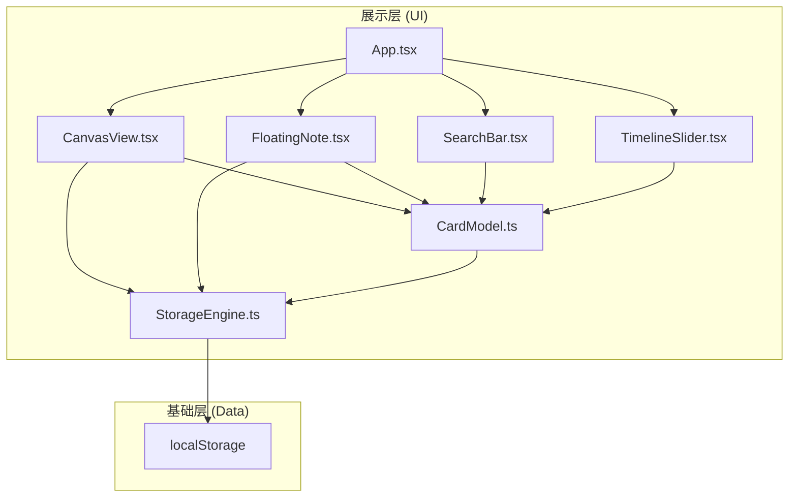
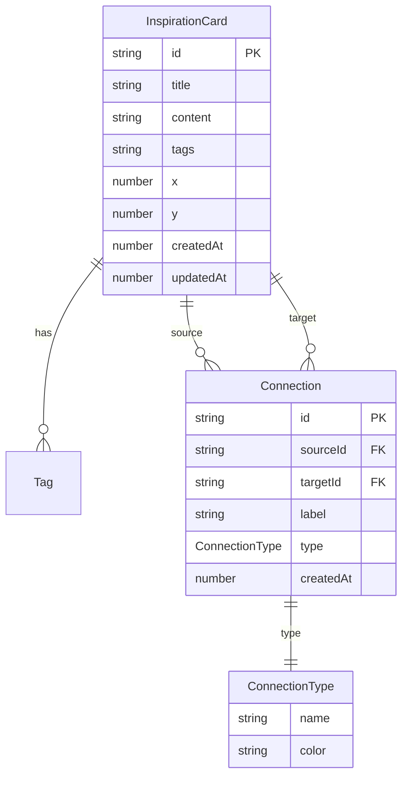

## 1. 架构设计



## 2. 技术说明

- 前端：React@18 + TypeScript + Vite + TailwindCSS + Zustand
- 初始化工具：vite-init（react-ts 模板）
- 后端：无（纯前端，数据存储在 localStorage）
- 数据库：localStorage（通过 StorageEngine 封装）

## 3. 路由定义

| 路由 | 用途 |
|------|------|
| / | 画布主页面，包含所有核心功能 |

## 4. API定义

无后端API，所有数据操作通过 StorageEngine 在本地完成。

## 5. 数据模型

### 5.1 数据模型定义



### 5.2 数据定义

**Tag 枚举：**
- `#灵感` - 灵感类卡片
- `#待办` - 待办事项
- `#阅读` - 阅读笔记
- `#想法` - 想法记录

**ConnectionType 枚举：**
- `support` - 支持（绿色 #22c55e）
- `conflict` - 冲突（红色 #ef4444）
- `supplement` - 补充（蓝色 #3b82f6）
- `cause` - 导致（橙色 #f59e0b）

**InspirationCard 接口：**
- id: string (uuid)
- title: string
- content: string
- tags: Tag[]
- x: number (画布位置)
- y: number (画布位置)
- createdAt: number (时间戳)
- updatedAt: number (时间戳)

**Connection 接口：**
- id: string (uuid)
- sourceId: string (源卡片ID)
- targetId: string (目标卡片ID)
- label: string (关联说明)
- type: ConnectionType
- createdAt: number

## 6. 文件结构

```
├── index.html
├── package.json
├── vite.config.ts
├── tsconfig.json
├── src/
│   ├── main.tsx
│   ├── App.tsx
│   ├── index.css
│   ├── model/
│   │   ├── CardModel.ts          # 卡片数据模型、CRUD方法、关联图结构
│   │   └── StorageEngine.ts      # localStorage封装、批量读写、变更事件
│   ├── store/
│   │   └── useMindStore.ts       # Zustand全局状态管理
│   ├── components/
│   │   ├── CanvasView.tsx         # 画布渲染、拖拽、贝塞尔连线
│   │   ├── FloatingNote.tsx       # 灵感速记浮窗
│   │   ├── SearchBar.tsx          # 搜索框与标签过滤
│   │   ├── TimelineSlider.tsx     # 时间线滑块
│   │   ├── CardItem.tsx           # 单个卡片组件
│   │   └── ConnectionLine.tsx     # 连线渲染组件
│   └── hooks/
│       ├── useDrag.ts             # 拖拽逻辑Hook
│       └── useConnection.ts       # 连线逻辑Hook
```
