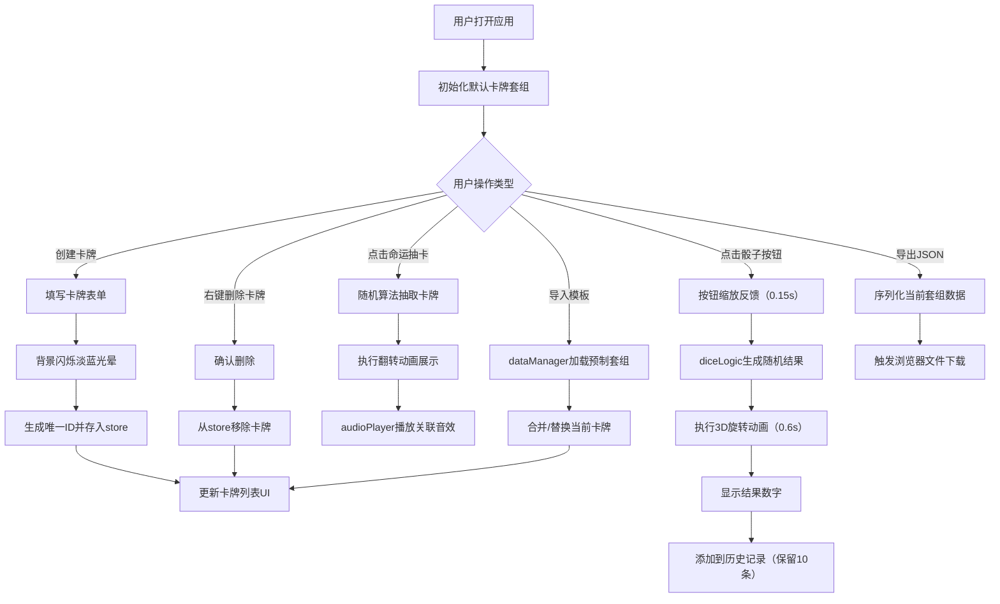

# 命运卡牌 - 产品需求文档 (PRD)

## 1. 产品概述

命运卡牌是一款轻量化的桌面角色扮演（TRPG/跑团）辅助工具，专为多人桌游聚会场景设计。解决纸质卡牌易丢失、无法携带电子音效、骰子结果难以记录等痛点，提供卡牌套组管理、随机抽牌播放音效、自定义骰子投掷与历史记录等核心功能。

- **核心价值**：将传统纸质卡牌和骰子数字化，提供沉浸式的中世纪羊皮卷风格交互体验
- **目标用户**：桌游组织者、跑团DM/GM、角色扮演爱好者
- **市场定位**：免费、本地运行、无需后端的纯前端轻量工具

## 2. 核心功能

### 2.1 用户角色
| 角色 | 注册方式 | 核心权限 |
|------|---------|---------|
| 玩家/组织者 | 无需注册，本地运行 | 创建/编辑/删除卡牌、抽牌、掷骰、导入/导出套组 |

### 2.2 功能模块
1. **卡牌管理面板**（左侧30%区域）：创建卡牌表单、卡牌列表、导入模板、导出套组
2. **抽牌展示区**（右侧70%区域）：命运抽卡大按钮、卡牌翻转展示、骰子动画
3. **骰子面板**（右下角）：D4/D6/D8/D20骰子按钮、投掷结果、历史记录列表

### 2.3 功能详情
| 页面名称 | 模块名称 | 功能描述 |
|---------|---------|---------|
| 主页面 | 卡牌创建表单 | 输入卡牌名称、描述文字、选择关联音效ID，提交时背景闪烁淡蓝色光晕（0.3s过渡） |
| 主页面 | 卡牌列表 | 以列表形式展示已创建卡牌，支持右键菜单删除单张卡牌 |
| 主页面 | 套组管理 | 顶部提供"导入陷阱套组"、"导入奇遇套组"模板按钮，以及"导出JSON"下载按钮 |
| 主页面 | 命运抽卡 | 中央大按钮，点击后从当前套组随机抽取，以0.5s翻转动画展示于右侧高亮区，自动播放关联音效 |
| 主页面 | 卡牌展示 | 羊皮卷轴卡片（400×260px，圆角16px），展示标题和描述文字 |
| 主页面 | 骰子按钮 | D4/D6/D8/D20圆形按钮（直径60px），手写体数字，点击缩放0.9倍再还原（0.15s） |
| 主页面 | 骰子动画 | 0.6s 3D旋转动画后在按钮上方显示结果数字 |
| 主页面 | 骰子历史 | 记录最近10次投掷（骰子图标+结果），新结果淡入显示 |

## 3. 核心流程

### 3.1 主要用户流程描述
1. **创建卡牌流程**：用户在左侧编辑区填写卡牌名称、描述、选择音效 → 点击"创建卡牌" → 编辑区背景闪烁淡蓝色光晕 → 卡牌添加到列表
2. **抽牌流程**：用户点击中央"命运抽卡"按钮 → 从当前套组随机选择一张卡牌 → 执行0.5s翻转动画展示卡牌 → 自动播放关联音效（如有）
3. **骰子投掷流程**：用户点击D4/D6/D8/D20任一按钮 → 按钮缩放反馈 → 骰子执行0.6s 3D旋转动画 → 动画结束显示结果数字 → 结果添加到历史记录（超过10条移除最早）
4. **套组导入导出流程**：点击模板按钮导入预制套组 / 点击导出按钮生成JSON文件下载

### 3.2 核心业务流程图

## 4. 用户界面设计

### 4.1 设计风格
- **主色调**：暖黄色 `#F5E6CA`（羊皮纸底色）与深棕色 `#3E2723`（文字/边框）
- **辅助色**：淡蓝色 `#BBDEFB`（闪烁光晕）、金色 `#B8860B`（装饰元素）
- **按钮风格**：圆角、厚实边框、按压缩放反馈、羊皮纸质感背景
- **字体**：Georgia, "Times New Roman", serif（serif类复古字体），标题手写感强调
- **布局风格**：桌面端左右分栏（30%/70%），移动端纵向堆叠；装饰性SVG绳索分隔两区域
- **背景纹理**：轻微噪点纹理模拟羊皮纸质感，CSS radial-gradient + noise叠加
- **动效风格**：所有过渡动画 0.2s-0.5s，卡牌翻转采用CSS 3D transform，骰子旋转用CSS animation

### 4.2 页面设计概述
| 页面名称 | 模块名称 | UI 元素 |
|---------|---------|--------|
| 主页面 | 整体容器 | 羊皮纸背景噪点、最大宽度1440px居中、padding 24px、桌面端flex横向布局 |
| 主页面 | 卡牌编辑区（左） | 宽30%、min-width 320px、深棕细边框、圆角12px、内边距20px、内部垂直滚动 |
| 主页面 | 绳索分隔符 | SVG绳索图案、宽约20px、垂直贯穿两区域、视觉装饰不交互 |
| 主页面 | 抽牌展示区（右） | 宽70%、flex column布局、居中对齐、主内容区padding 40px |
| 主页面 | 卡牌创建表单 | 输入框：暖黄底色、深棕边框、圆角8px、placeholder深棕半透明；按钮：深棕底暖黄字、hover深色、active缩放 |
| 主页面 | 卡牌列表项 | 每行卡片名+描述预览、hover背景浅金色、右键菜单（仅删除项） |
| 主页面 | 命运抽卡按钮 | 大圆形/盾牌形、宽200px高80px、金色渐变边框、文字"命运抽卡"加粗大号、hover上浮+阴影加深 |
| 主页面 | 展示卡牌 | 居中、400×260px、圆角16px、羊皮卷纹理边框（双线装饰）、box-shadow多层投影、翻转初始不可见 |
| 主页面 | 骰子面板 | 绝对定位右下角、flex横向排列4个骰子+历史列表、背景半透明暖黄面板 |
| 主页面 | 骰子按钮 | 圆形直径60px、深棕边框3px、暖黄底色、数字手写字体、transform-origin中心 |
| 主页面 | 骰子结果显示 | 按钮上方弹出、大号金色数字、fade-in + 轻微上浮 |
| 主页面 | 历史记录列表 | 骰子图标 + 结果数字、最多10行、每行新入fade-in动画（0.3s） |

### 4.3 响应式设计
- **桌面端（≥1024px）**：左右布局，编辑区30% / 展示区70%，绳索SVG垂直分隔，骰子面板右下角
- **平板端（768px-1023px）**：保持左右布局，编辑区最小宽度320px，字体微调
- **移动端（<768px）**：纵向堆叠布局，编辑区在上（width:100%）→ 绳索SVG横向分隔 → 展示区在中 → 骰子面板固定底部；抽卡按钮缩小至160px宽，展示卡牌宽度自适应屏幕90%（max-width 400px）
- **触摸优化**：按钮最小点击区域48×48px，右键删除改为长按弹出菜单（移动端）

### 4.4 3D 场景指导
本项目不涉及three.js 3D场景，但包含以下CSS 3D变换：
- **卡牌翻转**：`transform-style: preserve-3d` + `rotateY(0deg→180deg)`，0.5s ease-in-out，背面（初始）和正面（卡牌内容）两层叠加
- **骰子旋转**：keyframes旋转（`rotateX(0→720deg) rotateY(0→720deg)`），0.6s cubic-bezier(0.25, 0.46, 0.45, 0.94)，结束时停在对应骰面角度
- **灯光/阴影**：卡牌展示时box-shadow模拟卷轴边缘投影，骰子旋转时动态box-shadow模拟光照
