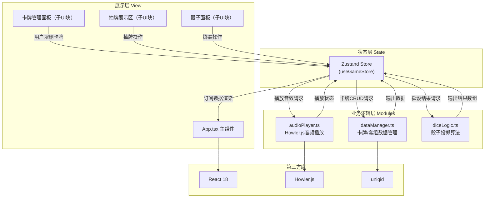

# 命运卡牌 - 技术架构文档

## 1. 架构设计

本项目为纯前端单页应用（SPA），无后端服务，所有数据存储于浏览器内存中，支持导入/导出JSON实现数据持久化。



**调用关系与数据流向**：
1. **用户操作 → App.tsx UI → Zustand Store → 对应模块 → 返回数据 → Store更新 → UI重新渲染**
2. **dataManager.ts**：负责卡牌数据增删改查、预制套组导入、套组JSON序列化/反序列化，输入操作指令，输出卡牌数组
3. **audioPlayer.ts**：接收卡牌ID（关联音效ID），调用Howler播放，输入音效ID/音量参数，输出播放状态事件
4. **diceLogic.ts**：接收骰子类型(D4/D6/D8/D20)和投掷次数，输出随机结果数组，采用伪随机分布补偿算法保证公平性

## 2. 技术描述

### 2.1 核心技术栈
| 层级 | 技术选型 | 版本说明 |
|------|---------|---------|
| 前端框架 | React 18 + React DOM 18 | 使用函数组件 + Hooks |
| 语言 | TypeScript 5.x | 严格模式（strict: true） |
| 构建工具 | Vite 5.x + @vitejs/plugin-react | 启动命令 `npm run dev` |
| 状态管理 | Zustand 4.x | 轻量级，替代Redux |
| 音频播放 | howler 2.x + @types/howler | Web Audio API封装 |
| 工具库 | uniqid | 生成卡牌唯一ID |

### 2.2 初始化工具
- 使用 `vite-init` 脚手架初始化 `react-ts` 模板
- 包管理：npm（环境未指定pnpm）

### 2.3 数据存储
- 运行时：Zustand store（内存）
- 持久化：通过"导出JSON"功能手动下载，不使用localStorage自动持久化（避免意外数据污染）

## 3. 路由定义
单页应用无路由，全部逻辑在首页完成。

| 路由 | 用途 |
|-----|------|
| / | 主界面（卡牌管理 + 抽卡 + 骰子全部功能） |

## 4. 数据模型

### 4.1 TypeScript 类型定义

```typescript
// ===== 卡牌相关 =====
interface Card {
  id: string;            // uniqid生成
  name: string;          // 卡牌名称
  description: string;   // 描述文字
  soundId?: SoundEffectId; // 关联音效ID（可选）
  createdAt: number;     // 创建时间戳
}

type SoundEffectId =
  | 'trap'
  | 'adventure'
  | 'magic'
  | 'battle'
  | 'success'
  | 'failure'
  | 'none';

// ===== 骰子相关 =====
type DiceType = 'D4' | 'D6' | 'D8' | 'D20';

interface DiceResult {
  id: string;            // uniqid
  type: DiceType;
  values: number[];      // 投掷结果数组（通常长度1，支持多次投掷）
  timestamp: number;
}

// ===== 套组相关 =====
interface DeckTemplate {
  id: string;
  name: string;          // 套组名称，如"陷阱套组"
  cards: Omit<Card, 'id' | 'createdAt'>[];
}

interface ExportedDeck {
  version: '1.0';
  exportedAt: number;
  cards: Card[];
}

// ===== Store 状态 =====
interface GameState {
  // 卡牌
  cards: Card[];
  selectedCard: Card | null;     // 当前抽中的卡牌
  isDrawing: boolean;            // 是否正在抽牌动画中
  editorFlash: boolean;          // 编辑区闪烁状态
  // 骰子
  diceHistory: DiceResult[];     // 最近10条
  isRolling: DiceType | null;    // 当前旋转的骰子类型
  currentDiceResult: { type: DiceType; value: number } | null;
  // 音频
  volume: number;                // 0-1
  // 操作方法
  addCard: (card: Omit<Card, 'id' | 'createdAt'>) => void;
  deleteCard: (id: string) => void;
  importTemplate: (templateId: string) => void;
  exportDeck: () => void;
  drawCard: () => void;
  rollDice: (type: DiceType) => void;
  setVolume: (v: number) => void;
  clearEditorFlash: () => void;
  clearRolling: () => void;
}
```

### 4.2 模块内部数据结构
**diceLogic.ts 分布补偿池**：
```typescript
// 每种骰子维护一个补偿池，记录每个面的出现次数偏差
type CompensationPool = Record<DiceType, number[]>;
// 例：D6池 [1面次数, 2面次数, ..., 6面次数]，值越大下次越优先
```

**audioPlayer.ts 音效映射表**：
```typescript
// SoundEffectId → Howl实例的映射（懒加载/预加载）
const soundLibrary: Map<SoundEffectId, Howl>
```

## 5. 文件结构与职责

```
auto150/
├── package.json              # 依赖与脚本（见用户需求）
├── vite.config.js            # Vite + React插件配置
├── tsconfig.json             # TS严格模式配置
├── index.html                # 入口HTML，内联基础样式
└── src/
    ├── dataManager.ts        # 【模块】卡牌与套组数据管理
    │   ├── 输入：操作参数（新增卡牌数据、模板ID、导出请求）
    │   ├── 输出：Card[] / ExportedDeck JSON
    │   └── 被调用方：useGameStore
    ├── audioPlayer.ts        # 【模块】Howler封装音频播放
    │   ├── 输入：soundId, volume, loop?
    │   ├── 输出：播放状态回调
    │   └── 被调用方：useGameStore（抽卡后调用）
    ├── diceLogic.ts          # 【模块】骰子投掷逻辑
    │   ├── 输入：DiceType, times?（默认1）
    │   ├── 输出：number[]（随机结果）
    │   ├── 算法：伪随机+分布补偿（记录历史偏差加权）
    │   └── 被调用方：useGameStore
    ├── store.ts              # Zustand store 定义（GameState）
    │   ├── 依赖：dataManager / audioPlayer / diceLogic
    │   └── 消费方：App.tsx
    └── App.tsx               # 【主组件】整合所有UI
        ├── 子UI块1：卡牌管理面板（表单+列表+导入导出按钮）
        ├── 子UI块2：抽牌展示区（命运抽卡按钮+卡牌翻转展示）
        └── 子UI块3：骰子面板（4个骰子按钮+结果+历史10条）
```

## 6. 关键算法说明

### 6.1 伪随机分布补偿算法（diceLogic.ts）
为了防止连续多次掷出相同点数带来的"不公平感"，实现分布补偿：

```
步骤：
1. 为每种骰子类型维护 distributionCount 数组，记录每个面的累积出现次数
2. 每次掷骰时，先计算各面的"欠损值" = (理论平均次数) - (该面实际次数)
3. 将欠损值归一化为权重，欠损越多权重越高
4. 使用加权随机选择结果，而非均匀随机
5. 每投掷100次后重置计数器，避免长期偏置过强
```

### 6.2 卡牌翻转动画实现
纯CSS 3D transform实现，无需JS库：
```css
.card-wrapper { perspective: 1000px; }
.card-inner {
  transform-style: preserve-3d;
  transition: transform 0.5s ease-in-out;
}
.card-flipped { transform: rotateY(180deg); }
.card-back, .card-front { backface-visibility: hidden; }
.card-front { transform: rotateY(180deg); }
```

### 6.3 骰子旋转动画实现
CSS keyframes + transform-origin，0.6s完成2圈旋转：
```css
@keyframes diceRoll {
  0%   { transform: rotateX(0deg) rotateY(0deg) scale(1); }
  50%  { transform: rotateX(360deg) rotateY(360deg) scale(1.2); }
  100% { transform: rotateX(720deg) rotateY(720deg) scale(1); }
}
```

## 7. 性能指标保障措施

| 指标 | 目标 | 实现方案 |
|-----|------|---------|
| 动画帧率 | ≥30FPS | 全部动画使用CSS transform/opacity（GPU加速），避免JS逐帧动画 |
| 卡牌增删响应 | ≤200ms | Zustand轻量更新，数组增删O(n)但n通常<100，无性能问题；删除用filter而非splice避免React key错误 |
| 音频播放延迟 | ≤100ms | Howler.js预加载音效池（首次访问后缓存Howl实例），禁用HTML5 Audio fallback强制Web Audio |
| 内存占用 | <50MB | 卡牌数据量小（通常<100张），历史记录限制10条；音效预加载但仅6种短音效 |

## 8. 预制套组数据（内置）

**陷阱套组（5张）**：
- 毒针陷阱（trap音效）：踩到机关射出毒针，受到2D4毒素伤害
- 落石陷阱（trap音效）：天花板坍塌，受到D8钝击伤害
- 火焰喷射（battle音效）：墙壁喷出火焰，受到2D6火焰伤害
- 地刺陷阱（trap音效）：地面伸出尖刺，受到D6穿刺伤害并减速
- 魔法封印（magic音效）：触发诅咒，下次攻击判定-3

**奇遇套组（5张）**：
- 神秘商人（adventure音效）：遇见旅行商人，可购买稀有物品
- 古老祭坛（magic音效）：祈祷后随机恢复2D8生命值
- 迷路旅人（adventure音效）：帮助旅人获得10金币作为感谢
- 龙的宝藏（success音效）：发现隐藏宝藏，获得D6×10金币
- 神秘旅者（adventure音效）：获得一条有益的冒险提示
