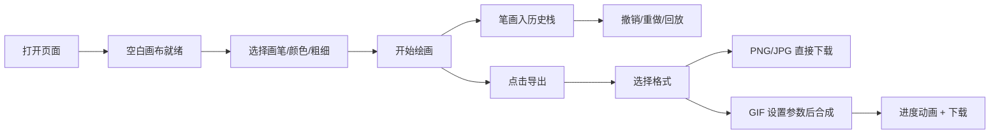

## 1. 产品概述

墨迹速写本是一款轻量级的网页涂鸦应用，旨在帮助用户快速捕捉灵感、自由创作，并将作品导出为高清图片或 GIF 动画。

- 核心价值：极简的创作体验 + 流畅的笔触 + 丰富的导出选项
- 目标用户：设计师、插画师、随手记录灵感的创意工作者

## 2. 核心功能

### 2.1 功能模块

1. **画布区域**：仿羊皮纸米黄色背景，带颗粒纹理，占屏幕 80% 区域
2. **工具栏**：三种画笔（硬笔、毛笔、马克笔），笔画粗细 1px-20px 可调
3. **调色盘**：扇形弹出式 12 色环，切换颜色有缩放动画
4. **撤销/重做**：逐笔擦除/重现动画，每笔 0.2 秒
5. **时间轴滑块**：拖动回放任意历史时刻的画布状态，实时渐变过渡
6. **导出功能**：支持 PNG/JPG/GIF，GIF 可设帧延迟和循环次数，下载进度波浪动画

### 2.2 页面详情

| 页面名称 | 模块名称 | 功能描述 |
|-----------|-------------|---------------------|
| 主页面 | 画布区域 | 80% 屏幕，米黄色羊皮纸背景，支持自由涂鸦 |
| 主页面 | 底部工具条 | 画笔选择、粗细调节、颜色选择入口 |
| 主页面 | 扇形调色盘 | 12 色环弹出切换，0.15 秒缩放动画 |
| 主页面 | 顶部操作区 | 撤销、重做按钮 |
| 主页面 | 时间轴 | 历史回放滑块，实时渐变过渡 |
| 主页面 | 导出模态框 | 格式选择、GIF 参数设置、进度显示 |

## 3. 核心流程

## 4. 用户界面设计

### 4.1 设计风格

- **主色调**：米黄色 (#f5f0e1) 画布 + 深灰 (#333) 工具栏 + 金色点缀
- **按钮风格**：圆角矩形，微弱阴影悬浮，悬停阴影加深 + 上移 2px，点击缩小到 0.95 倍
- **字体**：优雅的衬线体（如 Noto Serif SC）配合简洁无衬线体
- **布局**：画布居中，工具条固定底部，操作区固定顶部
- **动效**：所有交互有 0.15s - 0.5s 的平滑过渡动画

### 4.2 页面设计概述

| 页面名称 | 模块名称 | UI 元素 |
|-----------|-------------|-------------|
| 主页面 | 画布 | 米黄色背景、颗粒纹理、阴影边框 |
| 主页面 | 工具条 | 圆角按钮、图标 + 文字、粗细滑块 |
| 主页面 | 调色盘 | 扇形色环、缩放弹出动画 |
| 主页面 | 时间轴 | 线性滑块、刻度标记 |
| 主页面 | 导出模态框 | 卡片式布局、波浪进度条 |

### 4.3 响应式

- 桌面端：画布 80% 宽高，工具条底部展开
- 移动端：调色盘和工具条折叠为汉堡菜单，画布全屏
- 触摸优化：增大点击热区，支持压感触控笔
