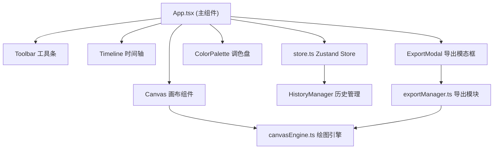

## 1. 架构设计



## 2. 技术说明

- **前端**：React 18 + TypeScript + Vite
- **状态管理**：Zustand
- **绘图**：原生 Canvas 2D API
- **导出**：html2canvas (PNG/JPG) + gif.js (GIF 合成)
- **样式**：CSS Modules + CSS Variables
- **性能目标**：4000 笔以下 60fps 流畅

## 3. 文件结构

```
src/
├── App.tsx              # 主组件，组合所有子组件
├── store.ts             # Zustand store，管理状态和历史
├── canvasEngine.ts      # 纯函数绘图引擎
├── exportManager.ts     # 导出逻辑 (PNG/JPG/GIF)
└── components/          # UI 子组件 (内部)
```

## 4. 数据模型

### 4.1 Stroke (笔画)

```typescript
interface Point {
  x: number;
  y: number;
  pressure: number;
}

interface Stroke {
  id: string;
  points: Point[];
  color: string;
  brushSize: number;
  brushType: 'hard' | 'soft' | 'marker';
  timestamp: number;
}
```

### 4.2 Store State

```typescript
interface DrawingState {
  strokes: Stroke[];
  redoStack: Stroke[];
  currentStroke: Stroke | null;
  color: string;
  brushSize: number;
  brushType: 'hard' | 'soft' | 'marker';
  timelineIndex: number;
  history: HistoryManager;
  
  addStroke: (stroke: Stroke) => void;
  undo: () => void;
  redo: () => void;
  clear: () => void;
  setColor: (c: string) => void;
  setBrushSize: (s: number) => void;
  setBrushType: (t: string) => void;
  setTimelineIndex: (i: number) => void;
}
```
