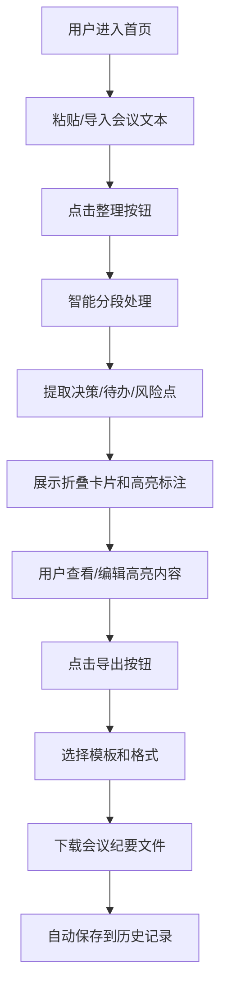

## 1. 产品概述

会议纪要智能整理助手是一款帮助用户将杂乱无章的会议录音转写文本自动整理成结构清晰会议纪要的Web应用。通过智能分段、关键信息提取和模板化导出，解决日常工作中会议记录混乱、无法快速提炼重点、待办追踪困难的痛点。

- 目标用户：职场人士、会议组织者、项目管理者
- 核心价值：将冗长的会议录音转写文本快速转化为结构化、可行动的会议纪要
- 产品定位：轻量级、高效的会议记录整理工具

## 2. 核心功能

### 2.1 功能模块

1. **文本输入与智能分段**：粘贴/导入文本，基于关键词识别与句子长度阈值自动分割议题段落
2. **智能提取与高亮标注**：自动识别决策、待办事项、风险点，支持点击编辑
3. **会议纪要导出**：支持简洁/详细两种模板，导出Markdown或纯文本格式
4. **历史记录与搜索**：本地存储历史记录，支持关键词搜索和快速回顾

### 2.2 功能详情

| 功能模块 | 子功能 | 功能描述 |
|---------|--------|----------|
| 文本输入与智能分段 | 文本输入 | 支持粘贴或导入会议录音转写文本（最长8000字） |
|  | 智能分段 | 基于关键词识别与句子长度阈值，自动按议题分割段落 |
|  | 折叠卡片展示 | 每个段落以折叠卡片形式展示，带时间戳锚点和议题摘要 |
|  | 逐行渐入动画 | 卡片展开时文本逐行渐入（每行0.2秒，行间延迟0.05秒） |
| 智能提取与高亮标注 | 决策提取 | 蓝色高亮背景（#E3F2FD）标注决策内容 |
|  | 待办提取 | 红色高亮背景（#FFEBEE）标注待办事项 |
|  | 风险提取 | 黄色高亮背景（#FFF8E1）标注风险点 |
|  | 详情抽屉 | 点击高亮文本，右侧抽屉展示可编辑信息卡片 |
| 会议纪要导出 | 模板选择 | 简洁模板（标题、决策、待办）/ 详细模板（全部内容） |
|  | 格式选择 | Markdown / 纯文本格式导出 |
|  | 文件命名 | 自动以"会议纪要_日期.md"命名下载 |
| 历史记录与搜索 | 历史列表 | 左侧列表展示历史记录，最新在前 |
|  | 搜索过滤 | 顶部搜索框实时过滤，0.1秒防抖 |
|  | 记录详情 | 点击历史记录重新查看完整整理结果 |

## 3. 核心流程

### 3.1 用户主流程

用户进入首页 → 粘贴或导入会议文本 → 点击"整理"按钮 → 系统智能分段并提取关键信息 → 用户查看/编辑高亮内容 → 选择导出模板 → 下载会议纪要文件 → 记录自动保存到历史记录

## 4. 用户界面设计

### 4.1 设计风格

- **设计理念**：极简主义，专注内容
- **主色调**：冷灰色系背景（#F5F7FA），白色卡片（#FFFFFF），品牌蓝色（#1976D2）作为互动主色
- **卡片样式**：8px圆角，轻微阴影（0 2px 8px rgba(0,0,0,0.08)），间距16px
- **按钮效果**：hover时背景加深10%，微缩1.02倍，0.2秒过渡
- **字体**：现代无衬线字体，清晰易读

### 4.2 页面布局

| 区域 | 宽度/尺寸 | 功能说明 |
|------|----------|----------|
| 左侧历史记录面板 | 280px | 历史记录列表、搜索框、选中指示条 |
| 主内容区 | 自适应剩余宽度，最小600px | 文本输入区、卡片列表、导出按钮 |
| 右侧抽屉面板 | 从右侧划入，0.3秒 | 高亮内容详情编辑 |
| 导出模态框 | 中心弹窗，0.3秒缩放 | 模板选择和导出确认 |

### 4.3 响应式设计

- **桌面端（>768px）**：左右分栏布局，历史记录常驻左侧
- **移动端（≤768px）**：历史记录隐藏，通过左上角汉堡菜单呼出侧边抽屉
- 采用桌面优先的设计方式，移动端做适配优化

### 4.4 动效设计

- 卡片展开：文本逐行渐入动画（每行0.2秒，行间延迟0.05秒）
- 右侧抽屉：从右侧划入，0.3秒，cubic-bezier(0.4, 0, 0.2, 1)
- 模态框：0.3秒缩放动画，从0.8倍放大到1.0
- 按钮hover：背景色加深10%，微缩1.02倍，0.2秒过渡
- 搜索过滤：0.1秒防抖，实时高亮匹配文本

## 5. 性能要求

- 智能分段：8000字文本分段耗时不超过1秒（Chrome 120）
- 高亮标注：页面卡顿时间不超过300ms
- 搜索过滤：0.1秒防抖，流畅响应
