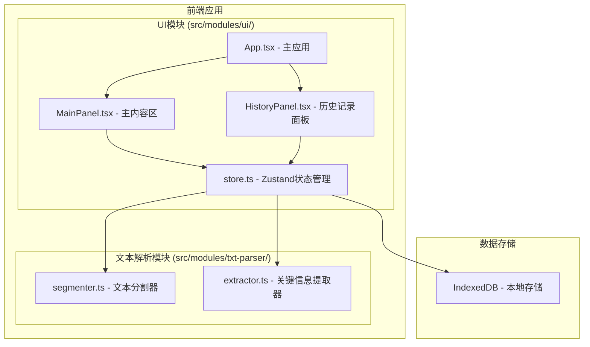

## 1. 架构设计

### 1.1 整体架构

本项目为纯前端应用，采用模块化架构设计，分为文本解析模块和UI模块，通过Zustand状态管理进行数据交互。



## 2. 技术选型

| 类别 | 技术 | 版本/说明 |
|------|------|-----------|
| 框架 | React | 18.x |
| 语言 | TypeScript | 严格模式 |
| 构建工具 | Vite | 最新稳定版 |
| 状态管理 | Zustand | 轻量级状态管理 |
| ID生成 | uuid | 唯一标识符生成 |
| 本地存储 | IndexedDB | 历史记录持久化 |
| 样式方案 | CSS Modules / 内联样式 | 极简主义风格 |

## 3. 目录结构

```
project-root/
├── package.json              # 项目依赖和脚本
├── index.html                # 入口HTML
├── vite.config.ts            # Vite配置
├── tsconfig.json             # TypeScript配置（严格模式）
└── src/
    └── modules/
        ├── txt-parser/       # 文本解析模块
        │   ├── segmenter.ts  # 文本分割器
        │   └── extractor.ts  # 关键信息提取器
        └── ui/               # UI模块
            ├── store.ts      # Zustand全局状态
            ├── App.tsx       # 主应用组件
            ├── MainPanel.tsx # 主内容区组件
            └── HistoryPanel.tsx # 历史记录面板
```

## 4. 核心模块设计

### 4.1 文本分割器 (segmenter.ts)

**功能**：接收原始文本字符串，基于关键词识别和句子长度阈值进行智能分段。

**输出类型**：
```typescript
interface Segment {
  id: string;
  title: string;       // 议题摘要（≤15字）
  timestamp: string;   // 时间戳（如 09:32）
  content: string;     // 段落内容
  lines: string[];     // 分行内容（用于动画）
}
```

**分割策略**：
- 关键词触发：检测"议题"、"接下来"、"下面讨论"等议题转换词
- 句子长度阈值：综合考虑段落长度和语义完整性
- 时间戳识别：识别文本中的时间格式，作为锚点时间戳

### 4.2 关键信息提取器 (extractor.ts)

**功能**：接收分割后的段落，提取决策、待办事项和风险点。

**输出类型**：
```typescript
type HighlightType = 'decision' | 'todo' | 'risk';

interface Highlight {
  id: string;
  type: HighlightType;
  text: string;        // 高亮文本
  segmentId: string;   // 所属段落ID
  startIndex: number;  // 在段落中的起始位置
  endIndex: number;    // 在段落中的结束位置
  note?: string;       // 用户备注
}
```

**提取策略**：
- 决策关键词："决定"、"通过"、"同意"、"确定"、"决议"等
- 待办关键词："需要"、"负责"、"跟进"、"完成"、"截止"等
- 风险关键词："风险"、"问题"、"挑战"、"担心"、"隐患"等

### 4.3 状态管理 (store.ts)

**状态定义**：
```typescript
interface AppState {
  // 当前编辑状态
  rawText: string;
  segments: Segment[];
  highlights: Highlight[];
  
  // 历史记录
  historyRecords: HistoryRecord[];
  selectedRecordId: string | null;
  
  // UI状态
  isProcessing: boolean;
  drawerOpen: boolean;
  selectedHighlightId: string | null;
  modalOpen: boolean;
  sidebarOpen: boolean;  // 移动端侧边栏
  
  // Actions
  setRawText: (text: string) => void;
  processText: () => void;
  updateHighlight: (id: string, updates: Partial<Highlight>) => void;
  exportToFile: (template: 'simple' | 'detailed', format: 'md' | 'txt') => void;
  loadHistory: () => void;
  selectRecord: (id: string) => void;
  searchHistory: (keyword: string) => void;
}
```

### 4.4 历史记录数据模型

```typescript
interface HistoryRecord {
  id: string;
  title: string;           // 会议标题（自动生成）
  rawText: string;         // 原始文本
  segments: Segment[];     // 整理后的段落
  highlights: Highlight[]; // 提取的关键信息
  summary: string;         // 摘要（前20字）
  createdAt: number;       // 创建时间戳
}
```

## 5. 性能优化策略

1. **智能分段优化**：使用正则表达式和线性扫描，避免重复遍历
2. **高亮渲染优化**：使用文档片段（DocumentFragment）批量更新DOM
3. **搜索防抖**：0.1秒防抖处理，避免频繁重渲染
4. **懒加载动画**：卡片展开时才执行逐行动画，减少初始渲染压力
5. **IndexedDB异步操作**：历史记录读写异步执行，不阻塞主线程

## 6. 构建与运行

- 开发命令：`npm run dev`
- 构建命令：`npm run build`
- 依赖安装：`npm install`
