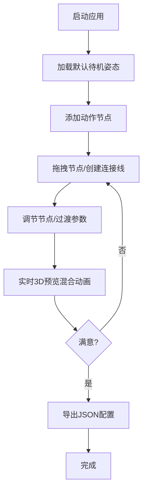

## 1. 产品概述

角色动画混合图实时编辑与预览应用，面向游戏开发工作室的设计师，用于快速为不同角色原型生成动画动作。
- 主要目的：解决手调骨骼关键帧耗时过长、难以获得自然多动作混合过渡效果的问题
- 目标用户：游戏动画设计师、角色美术师
- 产品价值：通过可视化混合图编辑 + 实时3D预览，大幅提升动画原型迭代效率

## 2. 核心功能

### 2.1 用户角色
| 角色 | 注册方式 | 核心权限 |
|------|----------|----------|
| 设计师用户 | 无需注册，本地工具 | 创建/编辑混合图、调节动画参数、实时预览、导入导出配置 |

### 2.2 功能模块
1. **混合图编辑面板**：动作节点添加、节点拖拽、连接线创建与编辑
2. **3D实时预览区**：骨骼角色模型渲染、动画混合播放、相机交互
3. **参数控制面板**：权重、播放速度、过渡时间、循环开关调节
4. **配置导入导出**：JSON格式的混合图配置保存与恢复

### 2.3 页面详情
| 页面名称 | 模块名称 | 功能描述 |
|----------|----------|----------|
| 主应用页 | 左侧混合图编辑区 | 占30%宽度，可滚动，动作节点卡片，SVG连接线绘制 |
| 主应用页 | 中央3D预览区 | 占50%宽度，Three.js渲染场景，深灰渐变背景，30度俯角相机 |
| 主应用页 | 右侧参数控制区 | 占20%宽度，滑块组件，参数实时调节 |
| 主应用页 | 顶部工具栏 | 动作节点下拉选择、导入/导出JSON按钮 |

## 3. 核心流程

设计师工作流程：
1. 打开应用 → 默认展示待机姿态的人形骨骼模型
2. 在左侧面板通过下拉选择添加动作节点（待机/行走/跑步/跳跃/攻击）
3. 拖拽节点卡片调整位置，拖拽连接线建立动作间过渡关系
4. 选中节点或连接线，在右侧面板调节参数（权重、速度、过渡时间、循环）
5. 中央预览区实时响应参数变化，展示混合动画效果
6. 满意后导出混合图配置为JSON文件，或导入已有配置继续编辑

## 4. 用户界面设计

### 4.1 设计风格
- **主色调**：深色主题，主背景#1a1a2e，面板#16213e，高亮#0f3460
- **文字颜色**：#e0e0e0
- **强调色**：#e94560（节点选中边框、按钮、滑块把手）
- **节点卡片**：圆角10px，微弱阴影，选中时边框强调色，背景轻微放大1.02倍，过渡0.2s
- **滑块**：深蓝背景色，圆形白色把手带微光晕，数值标签跟随显示，过渡0.2s
- **连接线**：SVG绘制，2px线宽，带方向箭头的曲线，0.3s渐变出现动画
- **交互反馈**：0.15-0.3秒缓动动画
- **最小宽度**：1024px

### 4.2 页面设计概览
| 页面名称 | 模块名称 | UI元素 |
|----------|----------|----------|
| 主应用页 | 混合图编辑区 | 节点卡片（拖拽、选中态）、SVG贝塞尔曲线连接线、方向箭头、滚动容器 |
| 主应用页 | 3D预览区 | Three.js Canvas、深灰渐变背景、OrbitControls相机控制、骨骼蒙皮模型 |
| 主应用页 | 参数控制区 | 权重滑块(0-1, 步长0.01)、速度滑块(0.5-2.0)、过渡时间滑块(0.1-1.0)、循环开关 |
| 主应用页 | 顶部工具栏 | 动作类型下拉选择器、"添加节点"按钮、"导入"按钮、"导出"按钮 |

### 4.3 响应式
- Desktop-first设计，最小宽度1024px
- 三栏布局固定比例：30% / 50% / 20%
- 面板内部支持垂直滚动

### 4.4 3D场景指导
- **环境**：深灰渐变色背景（#1a1a2e → #0a0a1a），营造专业工具氛围
- **灯光设置**：1个主方向光（暖白，强度1.0）+ 2个补光（冷色，强度0.3）+ 半球光（天空色/地面色）
- **相机设置**：PerspectiveCamera，默认30度俯角，距离角色3.5单位，OrbitControls支持拖拽旋转/缩放/平移
- **构图**：角色居中，地面网格辅助定位，焦点在角色上半身
- **交互动画**：骨骼关节基于混合权重实时插值变换，蒙皮网格跟随骨骼变形
- **后处理**：无复杂后处理，保持高性能
- **资源**：程序化生成的简化人形骨骼模型（15关节），动作关键帧数据内置

## 5. 性能约束
- 3D预览帧率：Chrome最新版 ≥ 55fps
- 参数变更到预览更新延迟：≤ 150ms
- 最大支持8个动作节点同时活跃，帧率 ≥ 30fps
