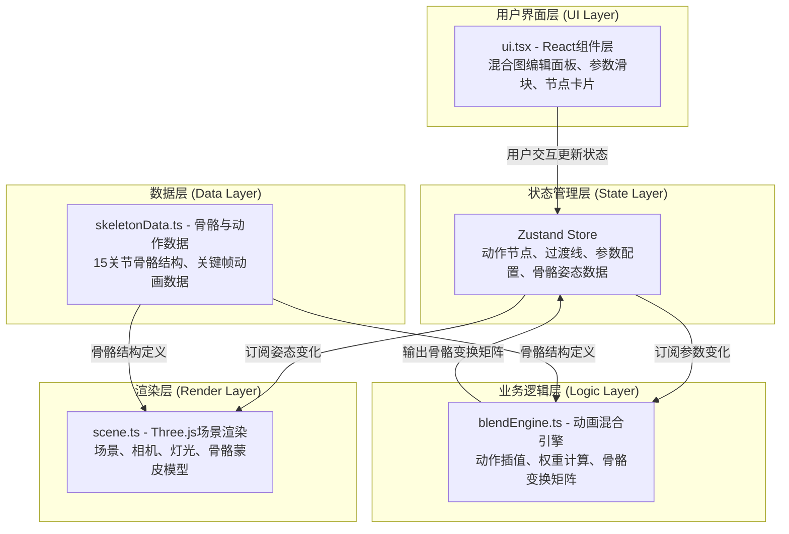

## 1. 架构设计



数据流向说明：
1. 用户在UI层交互 → 更新Zustand状态
2. 混合引擎订阅状态变化 → 计算骨骼变换矩阵 → 写回Zustand
3. 场景渲染订阅姿态数据 → 更新Three.js模型 → 渲染到屏幕

## 2. 技术描述

- **前端框架**：React 18 + TypeScript 5
- **构建工具**：Vite 5 + @vitejs/plugin-react
- **3D渲染**：three.js + @react-three/fiber + @react-three/drei
- **状态管理**：zustand 4
- **UI参数面板**：leva（可选，辅助调试参数）
- **样式方案**：纯CSS + CSS Modules，深色主题CSS变量
- **后端**：无，纯前端本地工具
- **数据库**：无，使用JSON文件导入导出

## 3. 模块文件职责与调用关系

| 文件 | 职责 | 依赖/调用关系 |
|------|------|---------------|
| `package.json` | 项目依赖与脚本 | 声明所有npm包 |
| `vite.config.ts` | Vite构建配置 | 配置React插件 |
| `tsconfig.json` | TypeScript编译配置 | 严格模式，ESNext |
| `index.html` | 入口HTML页面 | 挂载根React节点 |
| `src/main.tsx` | React应用入口 | 渲染App组件 |
| `src/App.tsx` | 主应用组件 | 组合三大面板：编辑区/预览区/控制区 |
| `src/skeletonData.ts` | 骨骼与动作数据模块 | 被blendEngine、scene引用 |
| `src/store.ts` | Zustand状态管理 | 被ui、blendEngine、scene引用 |
| `src/blendEngine.ts` | 动画混合引擎 | 引用skeletonData，读写store |
| `src/scene.tsx` | 3D场景渲染组件 | 引用skeletonData、store |
| `src/ui.tsx` | UI交互组件 | 读写store |

## 4. 核心数据模型

### 4.1 TypeScript类型定义

```typescript
// 骨骼关节定义
interface Bone {
  name: string;
  parent: string | null;
  restPosition: [number, number, number];
}

// 动作关键帧（单关节）
interface BoneKeyframe {
  time: number;
  rotation: [number, number, number]; // Euler angles
  position?: [number, number, number];
}

// 单个动作的动画数据
interface ActionClip {
  name: ActionType;
  duration: number; // 秒
  boneKeyframes: Record<string, BoneKeyframe[]>;
}

// 混合图中的动作节点
interface ActionNode {
  id: string;
  type: ActionType;
  position: { x: number; y: number }; // 在画布上的2D位置
  weight: number;        // 0-1
  speed: number;         // 0.5-2.0
  transitionTime: number; // 0.1-1.0
  loop: boolean;
  active: boolean;
}

// 节点间过渡连接线
interface TransitionEdge {
  id: string;
  from: string; // node id
  to: string;   // node id
  blendWeight: number; // 0-1
}

// 骨骼变换矩阵输出
interface BonePose {
  boneName: string;
  matrix: THREE.Matrix4;
}

type ActionType = 'idle' | 'walk' | 'run' | 'jump' | 'attack';
```

### 4.2 Zustand Store结构

```typescript
interface AnimationState {
  // 混合图
  nodes: ActionNode[];
  edges: TransitionEdge[];
  selectedNodeId: string | null;
  selectedEdgeId: string | null;

  // 骨骼姿态输出（由blendEngine写入）
  bonePoses: Record<string, THREE.Matrix4>;
  globalTime: number;

  // Actions
  addNode: (type: ActionType) => void;
  removeNode: (id: string) => void;
  updateNode: (id: string, partial: Partial<ActionNode>) => void;
  addEdge: (from: string, to: string) => void;
  removeEdge: (id: string) => void;
  selectNode: (id: string | null) => void;
  selectEdge: (id: string | null) => void;
  setBonePoses: (poses: Record<string, THREE.Matrix4>) => void;
  updateGlobalTime: (dt: number) => void;

  // 导入导出
  exportConfig: () => string;
  importConfig: (json: string) => void;
}
```

## 5. 动画混合算法

```
对于每个骨骼关节：
1. 遍历所有活跃的动作节点
2. 根据节点的播放速度和循环状态，计算该动作当前时间t
3. 在该动作的关键帧中，找到t所在区间，使用线性插值得到当前关节旋转
4. 使用节点权重对所有动作的关节旋转进行加权平均（四元数slerp或矩阵线性插值）
5. 若存在过渡线，使用过渡权重进行额外混合
6. 输出最终的骨骼变换矩阵到Zustand
```

## 6. 性能优化策略

- **requestAnimationFrame**：使用Three.js内置渲染循环，60fps上限
- **矩阵复用**：预分配Matrix4对象，避免GC
- **浅层订阅**：Zustand使用selector精确订阅，避免不必要的重渲染
- **节流防抖**：滑块参数变化直接写入store，无额外节流（Zustand本身轻量）
- **骨骼计算优化**：最多8节点 × 15骨骼 = 120次插值/帧，计算量可控
