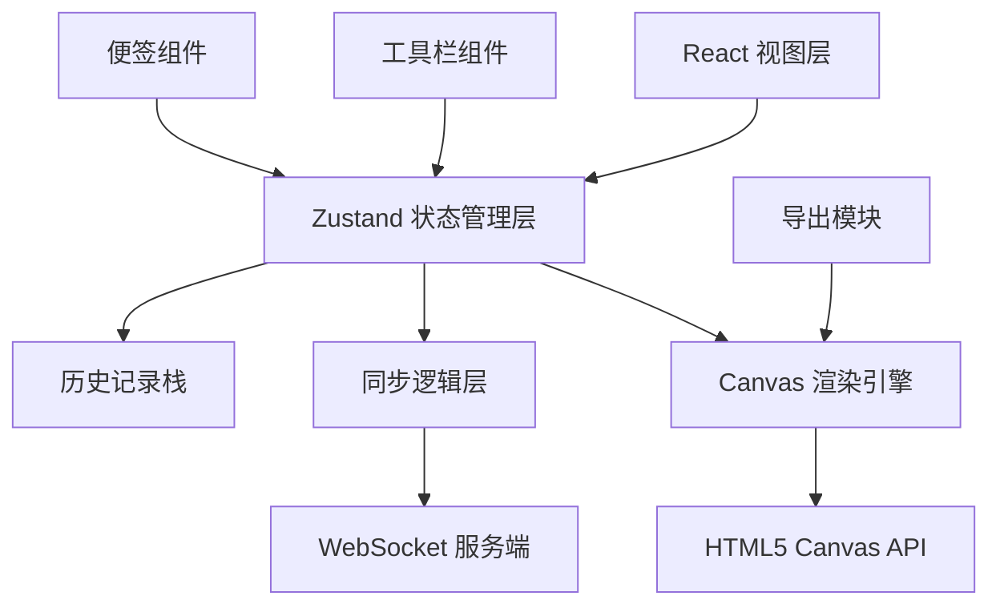

## 1. 架构设计



## 2. 技术描述

- **前端框架**：React 18 + TypeScript
- **构建工具**：Vite
- **状态管理**：Zustand
- **实时通信**：Socket.IO Client（WebSocket）
- **画布渲染**：HTML5 Canvas 2D API
- **唯一ID生成**：uuid
- **后端**：无（前端演示项目，同步逻辑模拟实现）
- **样式方案**：内联样式 + CSS（遵循极简深色主题）

## 3. 路由定义
| 路由 | 用途 |
|------|------|
| / | 主画布页面（单页应用） |

## 4. 数据模型

### 4.1 图形元素类型定义

```typescript
interface BaseElement {
  id: string;
  type: 'rectangle' | 'circle' | 'line' | 'pen' | 'sticky';
  x: number;
  y: number;
  color: string;
  strokeWidth: number;
  createdAt: number;
  userId: string;
  opacity: number;
}

interface RectangleElement extends BaseElement {
  type: 'rectangle';
  width: number;
  height: number;
}

interface CircleElement extends BaseElement {
  type: 'circle';
  radiusX: number;
  radiusY: number;
}

interface LineElement extends BaseElement {
  type: 'line';
  x2: number;
  y2: number;
}

interface PenElement extends BaseElement {
  type: 'pen';
  points: { x: number; y: number }[];
}

interface StickyElement extends BaseElement {
  type: 'sticky';
  width: number;
  height: number;
  text: string;
}

type BoardElement = RectangleElement | CircleElement | LineElement | PenElement | StickyElement;
```

### 4.2 全局状态类型

```typescript
interface BoardState {
  elements: BoardElement[];
  selectedId: string | null;
  currentTool: ToolType;
  currentColor: string;
  strokeWidth: number;
  zoom: number;
  pan: { x: number; y: number };
  users: User[];
  currentUserId: string;
  isSyncing: boolean;
  
  // 历史记录
  undoStack: HistoryAction[];
  redoStack: HistoryAction[];
  
  // 操作方法
  addElement: (element: BoardElement) => void;
  updateElement: (id: string, updates: Partial<BoardElement>) => void;
  deleteElement: (id: string) => void;
  setTool: (tool: ToolType) => void;
  setColor: (color: string) => void;
  setStrokeWidth: (width: number) => void;
  setZoom: (zoom: number) => void;
  setPan: (pan: { x: number; y: number }) => void;
  selectElement: (id: string | null) => void;
  undo: () => void;
  redo: () => void;
  exportPNG: (fullCanvas?: boolean) => Promise<void>;
}
```

### 4.3 同步消息类型

```typescript
interface SyncMessage {
  type: 'add' | 'update' | 'delete' | 'undo' | 'redo';
  payload: any;
  userId: string;
  timestamp: number;
}
```

## 5. 文件结构

```
├── package.json
├── index.html
├── vite.config.ts
├── tsconfig.json
└── src/
    ├── App.tsx                    # 主应用组件
    ├── main.tsx                   # 入口文件
    ├── index.css                  # 全局样式
    ├── store/
    │   └── useBoardStore.ts       # Zustand全局状态管理
    ├── components/
    │   ├── Canvas.tsx             # 画布组件
    │   ├── Toolbar.tsx            # 工具栏组件
    │   ├── StickyNote.tsx         # 便签组件
    │   ├── UserAvatar.tsx         # 用户头像组件
    │   └── ExportProgress.tsx     # 导出进度组件
    └── utils/
        ├── sync.ts                # WebSocket同步逻辑
        ├── draw.ts                # 绘制工具函数
        └── history.ts             # 历史记录管理
```

## 6. 性能优化策略

1. **Canvas渲染优化**：使用脏矩形区域重绘，避免全画布重绘
2. **离屏Canvas**：复杂绘制使用离屏Canvas缓存
3. **requestAnimationFrame**：所有动画使用 RAF 确保60FPS
4. **事件节流**：鼠标移动事件节流处理
5. **增量同步**：仅同步变更的元素数据，不全量传输
6. **对象池**：频繁创建的对象使用对象池复用
7. **虚拟渲染**：视口外的元素暂不渲染（1000+元素时）
