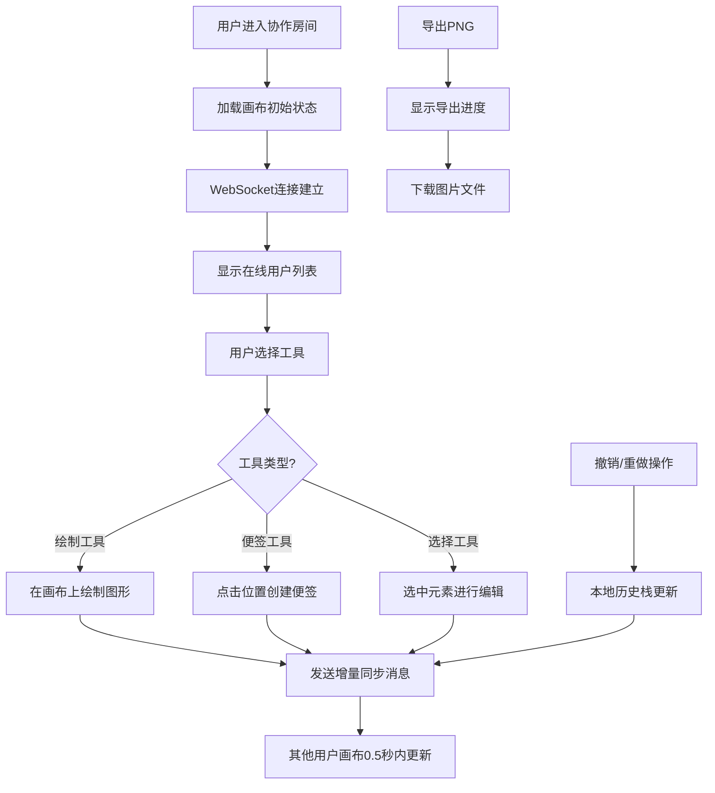

## 1. 产品概述

在线协作白板应用，让团队成员能够在同一块无限画布上实时绘制图形、添加便签、创建思维导图，并通过视频会议进行讨论。

- 解决远程团队协作沟通效率低下的问题，提供可视化的实时协作工具
- 目标用户：产品团队、设计团队、开发团队、教育工作者等需要协作讨论的人群
- 产品价值：提供高效、直观的实时协作白板体验，替代线下白板和零散的协作工具

## 2. 核心功能

### 2.1 用户角色
| 角色 | 注册方式 | 核心权限 |
|------|----------|----------|
| 协作用户 | 加入协作房间 | 绘制图形、添加便签、编辑内容、导出画布 |

### 2.2 功能模块
1. **画布页面**：无限画布、工具栏、用户列表、导出功能
2. **绘制系统**：矩形、圆形、直线、自由画笔工具
3. **便签系统**：黄色便签、文字编辑、拖拽缩放删除
4. **协作同步**：WebSocket实时增量同步、用户列表展示
5. **历史记录**：撤销重做（最多50步）
6. **导出功能**：PNG图片导出（当前视图/全画布）

### 2.3 页面详情
| 页面名称 | 模块名称 | 功能描述 |
|----------|----------|----------|
| 画布页面 | 无限画布 | 支持平移（拖拽）、缩放（鼠标滚轮）、网格背景 |
| 画布页面 | 工具栏 | 工具切换（选择/矩形/圆形/直线/画笔/便签）、颜色选择、撤销重做按钮 |
| 画布页面 | 绘制预览 | 矩形和圆形拖拽时显示虚线轮廓预览，松开鼠标生成实线 |
| 画布页面 | 便签编辑 | 点击创建黄色便签，自动聚焦输入，支持换行，可拖拽移动缩放删除 |
| 画布页面 | 用户列表 | 右上角显示在线用户头像（圆形重叠排列，滑入动画） |
| 画布页面 | 导出按钮 | 导出PNG图片，显示进度条 |
| 画布页面 | 退出按钮 | 右下角退出协作按钮 |

## 3. 核心流程

用户进入协作房间后，可以选择工具进行绘制或添加便签，所有操作通过WebSocket实时同步给其他用户。用户可以随时撤销重做本地操作，或导出画布为PNG图片。

## 4. 用户界面设计

### 4.1 设计风格
- **主色调**：深色主题，主背景深灰 #1e1e1e，画布背景浅灰网格（网格线 #2a2a2a，格子 20px）
- **强调色**：高亮蓝 #4a90d9（选中工具、选中元素边框）
- **辅助色**：便签黄 #FFF9C4
- **按钮样式**：圆角 8px，柔和阴影，悬停放大 1.05 倍（0.2秒过渡），点击波纹效果（0.3秒）
- **字体**：系统默认无衬线字体
- **布局风格**：左侧垂直工具栏（移动端底部水平），画布居中全屏

### 4.2 页面设计概述
| 页面名称 | 模块名称 | UI元素 |
|----------|----------|----------|
| 画布页面 | 工具栏 | 垂直排列（移动端水平），SVG几何图标，选中时高亮蓝背景+0.2秒缩放动画 |
| 画布页面 | 画布 | 浅灰网格背景，支持平移缩放，图形淡入动画（0.3秒透明到不透明），移动平滑插值 |
| 画布页面 | 便签 | 黄色背景 #FFF9C4，选中时蓝色虚线边框+八个调整手柄 |
| 画布页面 | 用户头像 | 右上角小圆形重叠排列，进入时从右侧滑入动画 |
| 画布页面 | 导出进度条 | 顶部或中心显示，带进度百分比 |

### 4.3 响应式
- 桌面端（≥768px）：工具栏左侧垂直排列，画布全屏
- 移动端（<768px）：工具栏底部水平排列，画布高度自适应剩余空间
- 所有交互元素支持触摸操作

### 4.4 动效设计
- 工具图标选中：0.2秒缩放动画 + 高亮蓝背景
- 新图形同步：0.3秒透明到不透明淡入
- 元素移动：平滑插值动画
- 撤销动画：图形缩小并淡出（0.2秒）
- 悬停效果：放大 1.05 倍（0.2秒过渡）
- 点击效果：波纹反馈（0.3秒）
- 用户头像进入：从右侧滑入
