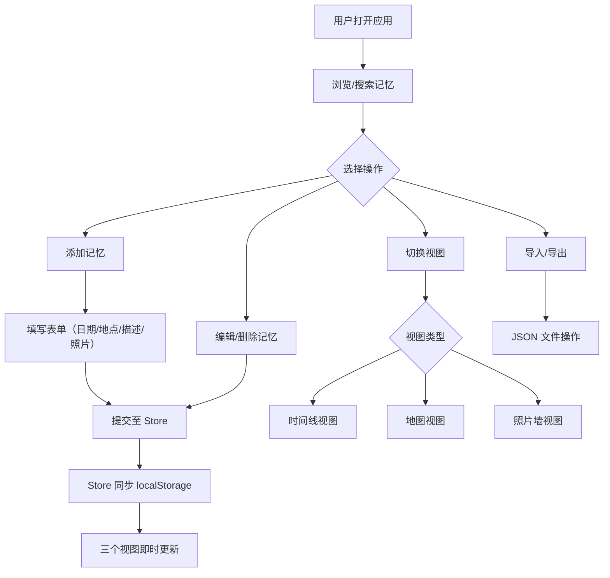

## 1. 产品概述

旅行纪念册是一款基于时间线的交互式旅行记忆管理应用，让用户以日记、地图、照片墙三种视角回顾和整理旅行经历。目标用户为热爱旅行、希望以多媒体形式记录和重温旅途记忆的人群。

## 2. 核心功能

### 2.1 用户角色
| 角色 | 注册方式 | 核心权限 |
|------|----------|----------|
| 普通用户 | 无需注册 | 添加/编辑/删除记忆、浏览三种视图、搜索筛选、导入导出 |

### 2.2 功能模块
1. **主页面**：时间线视图、地图视图、照片墙视图三种视角展示旅行记忆
2. **记忆编辑器**：弹窗表单，添加/编辑旅行记忆（日期、地点、文字描述、照片上传）
3. **视图切换器**：三种视图的切换导航，带滑动过渡动画
4. **搜索筛选**：顶部搜索框，实时模糊匹配地点名称或日记文本
5. **数据管理**：localStorage 持久化、JSON 导入导出

### 2.3 页面详情
| 页面名称 | 模块名称 | 功能描述 |
|----------|----------|----------|
| 主页面 | 时间线视图 | 按日期降序排列记忆卡片，卡片含标题、日期、摘要和缩略图，点击展开详情 |
| 主页面 | 地图视图 | Leaflet 世界地图，标记每条记忆的坐标位置，点击弹出信息窗 |
| 主页面 | 照片墙视图 | 瀑布流网格展示所有照片，支持预览放大和左右滑动 |
| 主页面 | 记忆编辑器 | 弹窗表单，输入日期、地点、描述、上传最多5张照片 |
| 主页面 | 视图切换器 | 固定左上角，三个按钮切换视图，带过渡动画 |
| 主页面 | 搜索筛选 | 顶部搜索框，实时过滤，三个视图同步更新 |
| 主页面 | 导入导出 | 底部按钮，支持 JSON 文件导入导出 |

## 3. 核心流程

用户打开应用 → 通过 MemoryEditor 添加旅行记忆（输入日期、地点、描述、上传照片）→ 数据存入 Zustand store 并同步到 localStorage → 三个视图即时更新展示 → 用户切换视图浏览不同维度的记忆 → 通过搜索框筛选特定记忆 → 可导出/导入 JSON 备份数据

## 4. 用户界面设计

### 4.1 设计风格
- 主色调：浅米色（#faf0e6）为背景，白色卡片配浅灰色阴影
- 辅助色：淡紫色渐变（照片墙空白区域）、浅灰色虚线（时间线连接线）
- 字体：系统无衬线字体栈（-apple-system, BlinkMacSystemFont, Segoe UI, sans-serif）
- 布局：卡片式布局，顶部搜索栏，左上角视图切换器，底部工具栏
- 按钮风格：圆角柔和按钮，悬停放大+颜色加深
- 图标风格：线性简洁图标

### 4.2 页面设计概览
| 页面名称 | 模块名称 | UI 元素 |
|----------|----------|---------|
| 主页面 | 时间线视图 | 卡片列表、虚线连接、悬停上浮阴影、折叠展开动画 |
| 主页面 | 地图视图 | Leaflet 地图、圆形渐变标记、信息弹窗 |
| 主页面 | 照片墙视图 | 瀑布流网格、随机旋转卡片、全屏模态预览 |
| 主页面 | 记忆编辑器 | 模态弹窗、表单输入、照片上传区 |
| 主页面 | 视图切换器 | 固定定位按钮组、高亮指示条、滑动过渡 |
| 主页面 | 搜索筛选 | 搜索输入框、实时过滤、空状态插图 |
| 主页面 | 导入导出 | 底部按钮、文件选择器 |

### 4.3 响应式设计
- 桌面端：多列布局，时间线双列卡片，照片墙4列网格
- 平板端：时间线单列全宽，照片墙3列网格
- 手机端：时间线单列全宽，地图标记字号缩小，照片墙2列网格
- 所有交互元素支持触摸操作

### 4.4 动画规范
- 所有过渡动画时长 0.3 秒，缓动函数 ease-out
- 卡片展开/收起：高度动画 + 透明度渐变
- 视图切换：水平滑动过渡（左→右或右→左）
- 弹窗打开：淡入 + 轻微缩放
- 悬停效果：轻微放大（scale 1.02）+ 阴影加深
