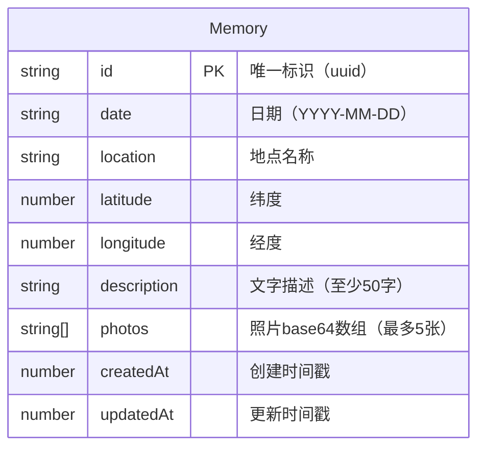

## 1. 架构设计

```mermaid
flowchart TB
    subgraph Frontend["前端层"]
        App["App 主组件"]
        Router["React Router"]
        Timeline["TimelineView"]
        Map["MapView"]
        Gallery["GalleryView"]
        Editor["MemoryEditor"]
        Switcher["ViewSwitcher"]
        Search["搜索筛选"]
    end

    subgraph State["状态管理层"]
        Store["Zustand Store"]
        LS["localStorage"]
    end

    subgraph Hooks["自定义 Hooks"]
        Geo["useGeolocation"]
    end

    subgraph External["外部服务"]
        Nominatim["Nominatim 地理编码"]
        LeafletLib["Leaflet 地图库"]
    end

    App --> Router
    Router --> Timeline
    Router --> Map
    Router --> Gallery
    App --> Editor
    App --> Switcher
    App --> Search
    Timeline --> Store
    Map --> Store
    Gallery --> Store
    Editor --> Store
    Store --> LS
    Map --> LeafletLib
    Map --> Geo
    Geo --> Nominatim
end
```

## 2. 技术说明
- 前端框架：React 18 + TypeScript（严格模式）
- 构建工具：Vite
- 状态管理：Zustand
- 路由管理：React Router DOM
- 地图渲染：Leaflet + react-leaflet
- 唯一标识：uuid
- 持久化：localStorage
- 地理编码：Nominatim（免费 API，反向地理编码）
- 初始化工具：vite-init（react-ts 模板）

## 3. 路由定义
| 路由 | 用途 |
|------|------|
| / | 主页面，包含时间线/地图/照片墙三种视图 |

注：三种视图通过组件内状态切换，不使用独立路由，以保证视图切换动画的连贯性。

## 4. 数据模型

### 4.1 数据模型定义



### 4.2 TypeScript 类型定义

```typescript
interface Memory {
  id: string;
  date: string;
  location: string;
  latitude: number | null;
  longitude: number | null;
  description: string;
  photos: string[];
  createdAt: number;
  updatedAt: number;
}

interface MemoryStore {
  memories: Memory[];
  searchQuery: string;
  addMemory: (memory: Omit<Memory, 'id' | 'createdAt' | 'updatedAt'>) => void;
  updateMemory: (id: string, data: Partial<Memory>) => void;
  deleteMemory: (id: string) => void;
  setSearchQuery: (query: string) => void;
  getFilteredMemories: () => Memory[];
  exportData: () => string;
  importData: (json: string) => void;
}
```

## 5. 文件结构

```
├── package.json
├── vite.config.ts
├── tsconfig.json
├── index.html
├── src/
│   ├── main.tsx
│   ├── App.tsx
│   ├── index.css
│   ├── modules/
│   │   ├── timeline/
│   │   │   └── TimelineView.tsx
│   │   ├── map/
│   │   │   └── MapView.tsx
│   │   └── gallery/
│   │       └── GalleryView.tsx
│   ├── store/
│   │   └── useMemoryStore.ts
│   ├── components/
│   │   ├── MemoryEditor.tsx
│   │   └── ViewSwitcher.tsx
│   └── hooks/
│       └── useGeolocation.ts
```
