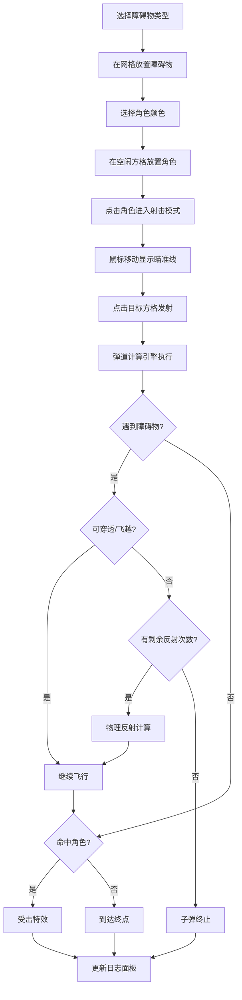

## 1. 产品概述
2D回合制战术棋类游戏弹道模拟器，用于测试和调试网格地图上子弹/抛射体的飞行轨迹计算、碰撞检测、反弹和穿透效果。
- 主要解决策略游戏开发中弹道精确计算的可视化调试问题
- 目标用户为游戏开发者、战术游戏设计人员

## 2. 核心功能

### 2.1 功能模块
1. **网格地图模块**：20x15方格平面地图，支持障碍物和角色放置，支持鼠标交互
2. **工具栏模块**：左侧工具选择栏，提供障碍物类型和角色颜色选择
3. **弹道计算模块**：计算子弹飞行轨迹、障碍物穿透、命中判定、反射物理
4. **日志面板模块**：右侧可折叠日志面板，实时记录每次射击的计算结果
5. **视觉特效模块**：障碍物弹出动画、受击特效、屏幕闪光和振动效果

### 2.2 页面详情
| 页面名称 | 模块名称 | 功能描述 |
|-----------|-------------|---------------------|
| 主页面 | 网格地图 | 20x15方格深灰背景，支持点击/拖拽放置障碍物和角色 |
| 主页面 | 工具栏 | 障碍物类型选择（碎石/低墙/高墙）、角色颜色选择（红/蓝/黄）、反弹模块开关 |
| 主页面 | 弹道计算 | 根据射击属性计算轨迹，支持穿透、反射、命中判定 |
| 主页面 | 日志面板 | 实时显示射击记录，可清空，含时间戳和详细计算信息 |
| 主页面 | 特效系统 | 弹出动画、受击闪烁、裂纹动画、屏幕闪光振动、音效 |

## 3. 核心流程
用户从工具栏选择障碍物类型，在网格上点击/拖拽放置；选择角色颜色并放置；点击角色进入射击模式，鼠标变为十字准星，拉出瞄准线；点击目标方格触发弹道计算，子弹沿轨迹飞行，处理与障碍物的碰撞/穿透/反射，命中目标时显示特效，计算结果同步到日志面板。

## 4. 用户界面设计

### 4.1 设计风格
- 主色调：深灰色背景 `#2a2a35`，面板背景 `#1e1e28`
- 强调色：蓝色高亮 `#4fc3f7`，危险/命中红色
- 障碍物色：褐色碎石、灰色低墙、深灰色高墙
- 角色色：红、蓝、黄三色纯色圆形，带发光边缘
- 布局：左工具栏(240px) + 中央网格 + 右日志面板(300px可折叠)
- 过渡动画：所有交互元素0.2秒缓动过渡
- 字体：现代等宽字体显示坐标和数据，无衬线字体用于界面文字

### 4.2 页面设计概述
| 页面名称 | 模块名称 | UI元素 |
|-----------|-------------|-------------|
| 主页面 | 工具栏 | 深色半透明背景，按钮悬停蓝色高亮，分组布局，图标+文字 |
| 主页面 | 网格地图 | 浅灰网格线，障碍物实体带微妙阴影，角色圆形带发光边缘 |
| 主页面 | 瞄准线 | 白色渐变红色虚线，目标方格半透明红色高亮 |
| 主页面 | 日志面板 | 深色圆角背景，可折叠按钮，每条日志灰色时间戳，可清空 |
| 主页面 | 特效 | 障碍物弹出动画0.3s，受击闪烁2次，裂纹动画0.3s，屏幕闪光+振动0.15s |

### 4.3 响应式
桌面优先设计，适配1920x1080分辨率；窗口缩小时网格自动缩放，保持画面居中；工具栏和面板固定宽度，网格区域弹性缩放。
