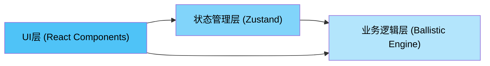
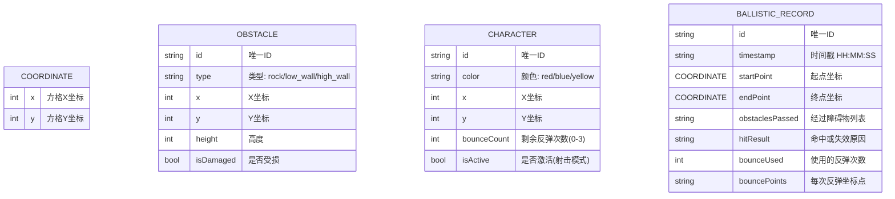

## 1. 架构设计



整体采用三层架构：
- **UI渲染层**：React组件负责网格、工具栏、日志面板的渲染和用户交互
- **状态管理层**：Zustand Store集中管理障碍物、角色、射击记录等全局状态
- **弹道计算引擎**：纯函数模块，无外部依赖，独立处理碰撞检测、反射计算、命中判定

## 2. 技术描述
- **前端框架**：React@18 + TypeScript
- **构建工具**：Vite@5 + @vitejs/plugin-react
- **状态管理**：Zustand
- **辅助库**：uuid（生成唯一ID）
- **后端**：无，纯前端应用
- **数据库**：无，内存状态管理

## 3. 路由定义
| 路由 | 用途 |
|-------|---------|
| / | 主应用页面（单页应用，无路由） |

## 4. 数据模型

### 4.1 数据模型定义



### 4.2 核心类型定义
- `Coordinate`: { x: number, y: number } - 方格坐标
- `ObstacleType`: 'rock' | 'low_wall' | 'high_wall' - 障碍物类型
- `CharacterColor`: 'red' | 'blue' | 'yellow' - 角色颜色
- `Obstacle`: id, type, position, height, isDamaged
- `Character`: id, color, position, bounceCount, isActive
- `BallisticResult`: path, hitTarget, hitObstacle, bouncePoints, obstaclesPassed, reason
- `ShootLog`: id, timestamp, start, end, obstacles, result, bounces

## 5. 文件结构

```
├── package.json
├── index.html
├── vite.config.ts
├── tsconfig.json
├── src/
│   ├── types.ts          # 所有数据类型定义
│   ├── dataStore.ts      # Zustand全局状态管理
│   ├── ballisticEngine.ts # 弹道计算纯函数引擎
│   ├── App.tsx           # 根组件
│   ├── main.tsx          # 入口文件
│   ├── index.css         # 全局样式
│   └── components/
│       ├── Grid.tsx      # 网格地图组件
│       ├── Toolbar.tsx   # 左侧工具栏
│       └── LogPanel.tsx  # 右侧日志面板
```

## 6. 弹道计算核心算法

### 6.1 射线方格遍历算法 (Bresenham's Line Algorithm)
- 使用改进的Bresenham算法计算子弹经过的方格序列
- 按顺序检查每个方格是否存在障碍物或角色

### 6.2 碰撞处理逻辑
- **碎石堆(rock)**: 高度0，阻挡子弹，不可穿透，可反射
- **低墙(low_wall)**: 高度1，弹道高度高于1时可飞越，否则阻挡/反射
- **高墙(high_wall)**: 高度2，不可飞越，可被命中受损，阻挡/反射

### 6.3 反射计算
- 子弹接触高墙或障碍物时，按入射角等于反射角计算新方向
- 水平/垂直边界分别反转x或y方向分量
- 每次反射消耗一次反弹次数，最多3次
- 反射后从新的路径点继续射线遍历

### 6.4 Web Audio API音效
- 使用OscillatorNode生成800Hz-1200Hz的短促金属碰撞音
- 反射时触发，Attack/Release包络，持续0.08秒
