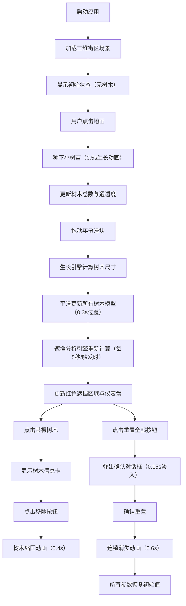

## 1. 产品概述

城市街区植被生长模拟与视觉遮挡分析应用，面向城市规划师与景观设计师，提供快速评估不同植被配置方案对街区未来十年生长后的视觉遮挡效果与空间通透度的交互式工具。解决现有三维软件操作繁琐、难以快速切换参数的痛点。

## 2. 核心功能

### 2.1 用户角色
| 角色 | 注册方式 | 核心权限 |
|------|----------|----------|
| 城市规划师/景观设计师 | 无需注册，本地使用 | 全部功能：种树、参数调节、遮挡分析、结果查看 |

### 2.2 功能模块
1. **三维街区场景**：建筑、地面、树木模型渲染，实时交互
2. **植被种植系统**：点击地面种树、移除单棵树、重置全部
3. **生长模拟系统**：年份滑块控制，平滑过渡动画
4. **遮挡分析系统**：建筑立面红色遮挡区域、通透度仪表盘
5. **信息展示系统**：树木信息卡、控制面板、状态指示器

### 2.3 页面详情
| 页面名称 | 模块名称 | 功能描述 |
|----------|----------|----------|
| 主应用页面 | 三维场景区域 | 展示街区建筑、地面、树木，支持点击种树、点击选中树木 |
| 主应用页面 | 左侧控制面板 | 年份滑块、树木参数调节、树木总数显示、重置按钮 |
| 主应用页面 | 顶部仪表盘 | 视线通透度百分比与指针可视化 |
| 主应用页面 | 右上角树木信息卡 | 显示选中树木的树龄、树高、冠幅、生长速率，移除按钮 |
| 主应用页面 | 确认对话框 | 重置全部操作的二次确认 |

## 3. 核心流程

用户打开应用 → 查看初始街区场景 → 点击地面种树（小树苗动画生长）→ 拖动年份滑块观察树木生长与遮挡变化 → 点击树木查看详情或移除 → 点击重置按钮清空场景。

## 4. 用户界面设计

### 4.1 设计风格
- **主背景色**：深蓝灰 #2a2d34
- **地面色**：浅灰绿 #c7d1c0
- **树冠色**：深绿 #2d5a27
- **树干色**：棕色 #5c4033
- **遮挡区域**：半透明红色
- **按钮风格**：圆角设计，悬浮上浮（translateY(-2px) + box-shadow增强），点击按压缩放（scale: 0.95, 0.1s）
- **滑块风格**：圆角，拖动时轨道冷色到暖色渐变
- **面板风格**：280px宽度，磨砂玻璃背景（backdrop-filter: blur(6px)）

### 4.2 页面设计概览
| 页面名称 | 模块名称 | UI元素 |
|----------|----------|--------|
| 主页面 | 3D场景区域 | 全屏Three.js渲染，OrbitControls交互，深蓝灰背景 |
| 主页面 | 左侧控制面板 | 磨砂玻璃面板，滑块、按钮、文字标签，悬浮/点击动画 |
| 主页面 | 顶部仪表盘 | 大型半圆仪表盘，指针动画，通透度百分比文字 |
| 主页面 | 树木信息卡 | 右上角固定位置卡片，详情信息，移除按钮 |
| 主页面 | 确认对话框 | 全屏遮罩，居中对话框，淡入动画，确认/取消按钮 |

### 4.3 响应式
- 桌面端优先设计，适配 1440x900 分辨率
- 左侧面板固定宽度 280px，3D场景自适应剩余空间

### 4.4 3D场景指引
- **环境**：深蓝灰背景，DirectionalLight + AmbientLight 组合
- **相机**：PerspectiveCamera，初始俯视角观察街区
- **交互**：OrbitControls 支持旋转、缩放、平移
- **建筑**：BoxGeometry，底部深灰向上渐变到浅灰的材质
- **地面**：PlaneGeometry，浅灰绿，支持点击射线检测
- **树木**：CylinderGeometry（树干）+ ConeGeometry（树冠），带生长/移除缩放动画
- **遮挡区域**：半透明红色 PlaneGeometry，叠加在建筑立面
