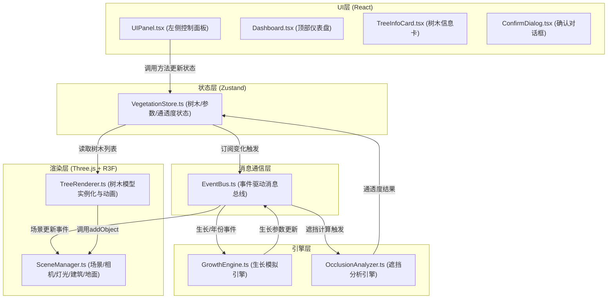

## 1. 架构设计



## 2. 技术描述
- **前端框架**：React 18 + TypeScript
- **3D渲染**：Three.js + @react-three/fiber + @react-three/drei
- **状态管理**：Zustand
- **构建工具**：Vite
- **唯一ID**：uuid

## 3. 模块职责与数据流向

### 3.1 事件总线 EventBus.ts
- 实现发布/订阅模式
- 事件类型：`tree:added`, `tree:removed`, `year:changed`, `growth:updated`, `occlusion:updated`, `scene:reset`
- 作为引擎层与渲染层之间的解耦通道

### 3.2 状态仓库 VegetationStore.ts
- 维护树木列表（id, position, age, height, crownRadius, growthRate）
- 维护当前年份（0-10）
- 维护通透度百分比（0-100）
- 维护选中树木ID
- 提供增删改方法：addTree, removeTree, updateTree, setYear, setTransparency, selectTree, resetAll

### 3.3 生长引擎 GrowthEngine.ts
- 输入：初始树高、初始冠幅、生长速率、目标年份
- 输出：当前树高、当前冠幅
- 算法：线性生长模型，每年按生长速率递增
- 每秒触发一次更新，通过EventBus广播生长参数变化

### 3.4 遮挡分析引擎 OcclusionAnalyzer.ts
- 输入：所有树木的位置/尺寸、建筑的位置/包围盒
- 输出：每条主要视线的遮挡比例、整体通透度百分比、被遮挡建筑区域列表
- 算法：从多个预设观察点向建筑发射射线，统计被树木阻挡的射线比例
- 每5秒自动重新计算，或当年份/树木变化时触发

### 3.5 场景管理 SceneManager.ts
- 创建Three.js场景、PerspectiveCamera、DirectionalLight、AmbientLight
- 创建地面网格（可点击射线检测）
- 创建建筑网格（带渐变色材质）
- 维护场景中的Object3D列表，提供addObject/removeObject方法
- 响应EventBus事件更新场景

### 3.6 树木渲染 TreeRenderer.ts
- 根据树木参数实例化3D树模型（Cylinder树干 + Cone树冠）
- 处理生长动画（0.5s种下、0.3s年份过渡、0.4s移除、0.6s连锁重置）
- 从VegetationStore读取树木列表，同步到Three.js场景
- 处理树木点击选中事件

### 3.7 UI模块
- **UIPanel.tsx**：左侧控制面板，年份滑块、树木总数、重置按钮
- **Dashboard.tsx**：顶部通透度仪表盘
- **TreeInfoCard.tsx**：右上角树木详情卡
- **ConfirmDialog.tsx**：重置确认对话框

## 4. 数据模型

### 4.1 Tree 数据结构
```typescript
interface Tree {
  id: string;
  position: { x: number; z: number; y: number };
  initialAge: number;       // 初始树龄（年）
  initialHeight: number;    // 初始树高（米）
  initialCrownRadius: number; // 初始冠幅半径（米）
  growthRate: number;       // 年生长速率（m/年）
  currentHeight: number;    // 当前树高
  currentCrownRadius: number; // 当前冠幅
  animationState: 'growing' | 'idle' | 'shrinking' | 'removing';
}
```

### 4.2 Building 数据结构
```typescript
interface Building {
  id: string;
  position: { x: number; y: number; z: number };
  width: number;
  height: number;
  depth: number;
  occlusionAreas: OcclusionArea[];
}
```

### 4.3 OcclusionArea 数据结构
```typescript
interface OcclusionArea {
  faceIndex: number;  // 建筑立面索引
  rect: { x: number; y: number; width: number; height: number };
  opacity: number;    // 遮挡强度 0-1
}
```

## 5. 文件结构

```
src/
├── core/
│   └── EventBus.ts              # 事件总线
├── store/
│   └── VegetationStore.ts       # Zustand状态仓库
├── engine/
│   ├── GrowthEngine.ts          # 生长模拟引擎
│   └── OcclusionAnalyzer.ts     # 遮挡分析引擎
├── renderer/
│   ├── SceneManager.ts          # 场景管理
│   └── TreeRenderer.ts          # 树木渲染
├── components/
│   ├── UIPanel.tsx              # 左侧控制面板
│   ├── Dashboard.tsx            # 顶部仪表盘
│   ├── TreeInfoCard.tsx         # 树木信息卡
│   └── ConfirmDialog.tsx        # 确认对话框
├── App.tsx                      # 主应用组件
├── main.tsx                     # 入口文件
└── index.css                    # 全局样式
```

## 6. 性能优化策略
- 树木模型使用简单几何体（Cylinder + Cone），避免复杂网格
- 遮挡分析使用空间分区（网格划分）减少射线检测数量
- 树木动画使用requestAnimationFrame + 线性插值
- 200棵树木时遮挡分析响应时间 < 300ms：限制射线数量、使用包围盒预检测
- 帧率稳定在45FPS以上：避免每帧重建几何体，复用网格更新变换矩阵
