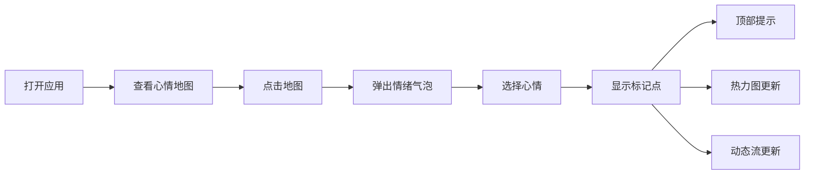

## 1. 产品概述

基于地理位置的匿名心情地图应用，让用户在世界地图上匿名标记当前心情，系统聚合展示全球情绪分布。
- 核心目的：通过可视化方式展现全球用户的情绪状态，创造一个情感共鸣的社交体验
- 目标用户：所有希望表达和观察全球情绪分布的用户
- 市场价值：创新的情绪可视化平台，兼具社交表达和数据洞察价值

## 2. 核心功能

### 2.1 用户角色

| 角色 | 注册方式 | 核心权限 |
|------|---------|----------|
| 匿名用户 | 无需注册 | 标记心情、查看心情地图、浏览心情动态 |

### 2.2 功能模块

1. **地图交互模块**：Leaflet 地图渲染、点击标记、情绪选择气泡
2. **热力图模块**：时间段聚合、缩放聚类、情绪颜色渐变
3. **心情动态模块**：侧边栏动态流、相对时间显示、滑入动画
4. **主题系统**：心情驱动背景色、毛玻璃风格、响应式布局

### 2.3 页面详情

| 页面名称 | 模块名称 | 功能描述 |
|---------|---------|----------|
| 主页面 | 地图交互 | 点击地图弹出情绪选择气泡，包含6个表情符号按钮（快乐😊、平静😌、忧郁😢、愤怒😠、惊喜😮、喜爱❤️） |
| 主页面 | 标记渲染 | 选择情绪后显示带颜色脉动动画的标记点，顶部显示"X 公里外有人刚标记了心情"提示条 |
| 主页面 | 热力图 | 根据今天/本周/本月动态聚合，缩放时自动合并分裂，暖色到冷色渐变表示情绪强度 |
| 主页面 | 侧边栏 | 最近20条心情动态流，相对时间、抽象位置、表情符号，右侧滑入动画 |
| 主页面 | 主题系统 | 毛玻璃半透明控件、柔和圆角、心情驱动背景色调 |

## 3. 核心流程

用户打开应用 → 查看全球心情地图 → 点击地图任意位置 → 弹出情绪选择气泡 → 选择心情表情 → 标记点显示在地图上 → 顶部提示条出现 → 热力图动态更新 → 侧边栏动态流添加新记录

## 4. 用户界面设计

### 4.1 设计风格

- **主色调**：动态变化，根据心情自动微调背景色
  - 快乐😊：暖橙色系 (#FFB347 → #FF8C00)
  - 平静😌：薄荷绿色系 (#98FB98 → #3CB371)
  - 忧郁😢：冷蓝色系 (#87CEEB → #4682B4)
  - 愤怒😠：暖红色系 (#FF6B6B → #DC143C)
  - 惊喜😮：明黄色系 (#FFD700 → #FFA500)
  - 喜爱❤️：粉红色系 (#FFB6C1 → #FF69B4)
- **辅助色**：半透明白色作为毛玻璃背景 (rgba(255,255,255,0.15-0.25)
- **按钮风格**：圆形毛玻璃按钮，悬停放大效果，柔和圆角 (16px)
- **字体**：现代无衬线字体，标题 16-24px，正文 14px
- **布局**：地图全屏，侧边栏固定右侧，顶部提示条固定顶部
- **图标风格**：Emoji 表情符号作为情绪图标

### 4.2 页面设计概述

| 页面名称 | 模块名称 | UI 元素 |
|---------|---------|----------|
| 主页面 | 地图交互 | Leaflet 全屏地图、半透明情绪气泡、6个表情按钮、毛玻璃背景 |
| 主页面 | 标记渲染 | 彩色脉动标记点、顶部半透明提示条、平滑过渡动画 |
| 主页面 | 热力图 | 暖色到冷色渐变热力点、缩放聚类动画、淡入淡出效果 |
| 主页面 | 侧边栏 | 毛玻璃背景卡片、右侧滑入动画、相对时间显示、抽象位置 |
| 主页面 | 主题系统 | 心情驱动背景渐变、毛玻璃控件、柔和阴影 |

### 4.3 响应式设计

- **桌面端**：侧边栏宽度 360px，固定右侧
- **平板横屏**：侧边栏宽度 320px
- **平板竖屏**：侧边栏宽度 280px
- **手机横屏**：侧边栏宽度 240px，字体缩小 10%
- **手机竖屏**：侧边栏改为底部抽屉，宽度 100%，高度 50%
- **触摸优化**：按钮最小触摸区域 44x44px，手势支持

### 4.4 性能优化

- 地图拖拽和缩放帧率不低于 30 FPS
- 心情标记点超过 200 个时自动切换到聚类显示模式
- 使用 requestAnimationFrame 优化动画性能
- 虚拟滚动优化侧边栏性能
