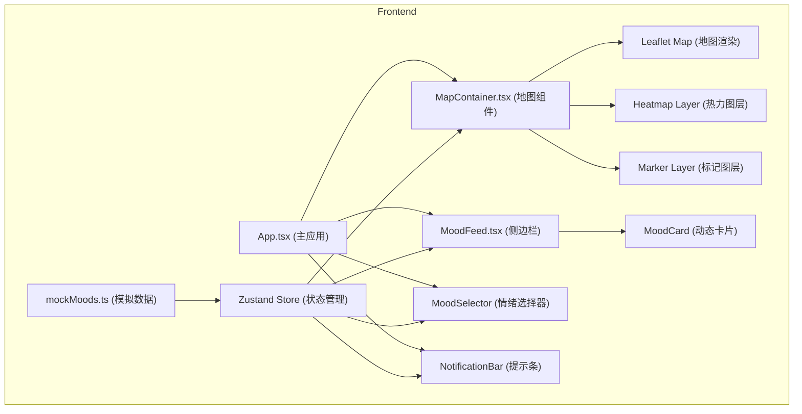

## 1. 架构设计



## 2. 技术描述

- **前端框架**：React@18 + TypeScript@5
- **构建工具**：Vite@5 + @vitejs/plugin-react@4
- **地图渲染**：leaflet@1.9 + react-leaflet@4.2
- **状态管理**：zustand@4
- **工具库**：uuid@9
- **样式方案**：CSS 变量 + CSS Modules / 全局 CSS
- **无后端**：使用 mock 数据模拟真实场景

## 3. 核心类型定义

```typescript
type MoodType = 'happy' | 'calm' | 'sad' | 'angry' | 'surprised' | 'loved'

interface MoodEntry {
  id: string
  mood: MoodType
  lat: number
  lng: number
  location: string
  timestamp: number
}

interface MoodStore {
  moods: MoodEntry[]
  currentMood: MoodType | null
  timeFilter: 'today' | 'week' | 'month'
  addMood: (mood: Omit<MoodEntry, 'id' | 'timestamp'>) => void
  getFilteredMoods: () => MoodEntry[]
  setCurrentMood: (mood: MoodType | null) => void
  setTimeFilter: (filter: 'today' | 'week' | 'month') => void
}
```

## 4. 目录结构

```
├── src/
│   ├── map/
│   │   └── MapContainer.tsx      # 地图主组件
│   ├── store/
│   │   └── moodStore.ts          # Zustand 状态管理
│   ├── sidebar/
│   │   └── MoodFeed.tsx          # 侧边栏动态流
│   ├── data/
│   │   └── mockMoods.ts          # 模拟数据生成
│   ├── App.tsx                   # 主应用组件
│   ├── main.tsx                  # 应用入口
│   └── index.css                 # 全局样式
├── index.html                    # HTML 入口
├── vite.config.ts                # Vite 配置
├── tsconfig.json                 # TypeScript 配置
└── package.json                  # 项目配置
```

## 5. 数据模型

### 5.1 心情记录模型

| 字段 | 类型 | 说明 |
|------|------|------|
| id | string | 唯一标识符 (UUID) |
| mood | MoodType | 情绪类型 (happy/calm/sad/angry/surprised/loved) |
| lat | number | 纬度 |
| lng | number | 经度 |
| location | string | 抽象位置名称 (如 "东京·涩谷区") |
| timestamp | number | 时间戳 (毫秒) |

### 5.2 情绪配色方案

| 情绪类型 | Emoji | 主色 | 渐变色 |
|---------|-------|------|--------|
| happy | 😊 | #FFB347 | #FF8C00 |
| calm | 😌 | #98FB98 | #3CB371 |
| sad | 😢 | #87CEEB | #4682B4 |
| angry | 😠 | #FF6B6B | #DC143C |
| surprised | 😮 | #FFD700 | #FFA500 |
| loved | ❤️ | #FFB6C1 | #FF69B4 |

## 6. 核心功能实现方案

### 6.1 地图交互
- 使用 `react-leaflet` 的 `MapContainer` 组件
- 监听 `click` 事件获取点击坐标
- 点击后在坐标位置显示情绪选择气泡 (Popup)
- 气泡内包含 6 个情绪按钮，点击后调用 store 添加心情记录

### 6.2 热力图实现
- 根据时间段过滤数据 (今天/本周/本月)
- 基于地图缩放级别动态调整聚合粒度
- 使用 `L.circleMarker` 绘制热力点，半径和颜色根据密度计算
- 缩放时通过 `transition` 实现平滑的淡入淡出动画

### 6.3 标记点动画
- 使用 CSS `@keyframes` 实现脉动动画
- 每个标记点根据情绪类型设置不同颜色
- 新标记点添加时带有缩放动画效果

### 6.4 性能优化
- 超过 200 个标记点时启用聚类模式 (使用 `leaflet.markercluster`)
- 使用 `requestAnimationFrame` 优化动画性能
- 侧边栏使用 CSS `transform` 实现滑入动画，避免重排

### 6.5 响应式布局
- 使用 CSS 媒体查询适配不同屏幕尺寸
- 侧边栏在移动端转为底部抽屉模式
- 地图控件在小屏幕上自动调整位置和大小

## 7. 动画规范

| 动画类型 | 时长 | 缓动函数 | 触发时机 |
|---------|------|---------|----------|
| 标记点脉动 | 2s | ease-in-out | 持续循环 |
| 标记点出现 | 0.3s | ease-out | 新增标记时 |
| 热力点淡入 | 0.5s | ease-out | 缩放/过滤变化时 |
| 热力点淡出 | 0.3s | ease-in | 缩放/过滤变化时 |
| 卡片滑入 | 0.4s | cubic-bezier(0.25, 0.46, 0.45, 0.94) | 新动态添加时 |
| 提示条滑入 | 0.3s | ease-out | 新标记添加时 |
| 背景色过渡 | 0.8s | ease-in-out | 情绪变化时 |
