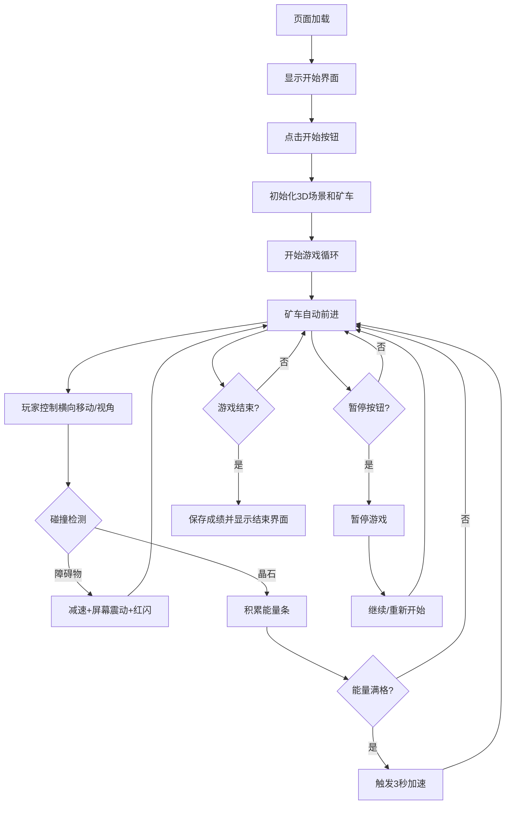

## 1. 产品概述

深渊矿车竞速是一款3D无限跑酷类网页游戏，玩家驾驶矿车在阴暗的矿洞隧道中高速穿梭，躲避石柱障碍物并收集能量晶石获得加速冲刺能力，目标是跑出最远距离。

- 核心玩法：俯视角3D隧道驾驶，躲避障碍物，收集晶石加速，追求高分
- 目标用户：喜欢休闲竞技和3D视觉效果的网页游戏玩家
- 产品价值：提供沉浸式的地下矿洞探险体验，结合简单操作与渐进式难度曲线

## 2. 核心功能

### 2.1 功能模块
1. **3D场景渲染**：无限隧道生成、矿车模型、障碍物与晶石
2. **游戏逻辑引擎**：碰撞检测、能量系统、加速机制、难度递增
3. **用户界面**：HUD信息显示、暂停菜单、成绩记录

### 2.2 功能详情
| 模块名称 | 功能描述 |
|---------|---------|
| 无限隧道生成 | 每100单位距离生成新隧道段落，段落长度、弯曲度、障碍物密度随距离递增 |
| 障碍物系统 | 随机生成石柱障碍物，出现前0.5秒淡入警告动画 |
| 晶石收集系统 | 2-5个晶石每段，缓慢旋转+淡蓝色粒子光晕，收集积累能量条 |
| 加速机制 | 5格能量条，每满一格触发3秒加速（速度+50%） |
| 碰撞反馈 | 撞击障碍物时车速骤降、0.3秒屏幕震动、红色闪烁 |
| 操作控制 | 键盘左右方向键横向移动，鼠标滚轮调节俯仰角(20°-60°) |
| 矿车动画 | 0.1秒平滑插值移动，车身倾斜反馈 |
| HUD显示 | 左上角速度(km/h带滚动动画)、距离(0.1米精度)、5格能量条；右上角本局最佳和历史最高分 |
| 暂停系统 | 右下角暂停按钮，磨砂玻璃模态遮罩，暂停所有动画和碰撞检测 |

## 3. 核心流程

## 4. 用户界面设计

### 4.1 设计风格
- **主色调**：深灰(#1a1a2e)、暗蓝(#16213e)、紫色(#0f3460)
- **高亮色**：青蓝(#00d4ff)、明黄(#ffe082)
- **整体风格**：暗色科幻工业风，磨砂玻璃效果，霓虹光感
- **字体**：无衬线等宽字体，数字使用滚动动画效果
- **按钮**：圆角矩形，青蓝色边框发光效果，悬停明黄色高亮

### 4.2 页面设计
| 页面/区域 | 模块名称 | UI元素 |
|----------|---------|--------|
| 游戏主界面 | HUD-左上 | 速度表(km/h数字滚动)、距离(m)、5格能量条(充满亮青光) |
| 游戏主界面 | HUD-右上 | 本局最佳成绩、历史最高分(从localStorage读取) |
| 游戏主界面 | HUD-右下 | 暂停按钮(圆角，青蓝色图标) |
| 游戏主界面 | 3D场景 | 俯视角隧道，矿车居中底部，隧道延伸远方，岩石纹理荧光 |
| 暂停模态 | 遮罩层 | 半透明磨砂玻璃(backdrop-filter: blur(8px)) |
| 暂停模态 | 内容区 | 游戏暂停标题、继续按钮、重新开始按钮(青蓝+明黄配色) |

### 4.3 响应式
- 桌面端优先，3D画布自适应窗口大小
- HUD元素使用固定定位，保持在角落不随窗口缩放错位

### 4.4 3D场景设计
- **环境氛围**：阴暗矿洞，雾效(深色雾)，微弱荧光点缀
- **光照**：环境光(暗蓝紫色) + 矿车前灯(聚光灯)
- **相机**：俯视角，跟随矿车，俯仰角20°-60°可调
- **材质**：隧道壁带随机岩石纹理法线贴图，晶石自发光材质
- **后处理**：轻微泛光(晶石光晕)、屏幕震动效果
- **性能**：60FPS目标，对象池复用隧道段、障碍物、晶石
