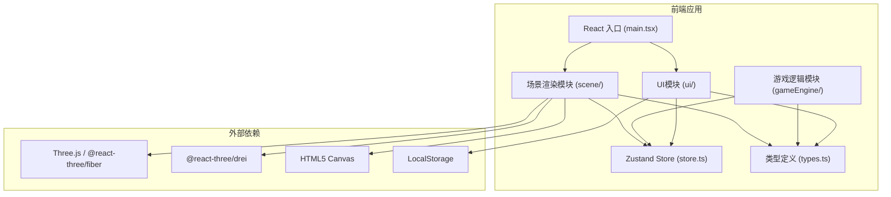

## 1. 架构设计



## 2. 技术栈说明

- **前端框架**：React@18 + TypeScript@5
- **构建工具**：Vite@5 + @vitejs/plugin-react
- **3D引擎**：Three.js + @react-three/fiber + @react-three/drei
- **状态管理**：Zustand
- **工具库**：uuid
- **状态存储**：浏览器 LocalStorage (保存历史最高分)

## 3. 模块目录结构

```
src/
├── types.ts              # 全局类型定义
├── store.ts              # Zustand 状态仓库
├── scene/
│   └── SceneManager.ts   # Three.js场景管理、隧道生成、矿车模型
├── gameEngine/
│   ├── CollisionSystem.ts # AABB碰撞检测、能量收集
│   └── GameLoop.ts       # 游戏主循环、状态更新
├── ui/
│   ├── HUD.tsx           # 游戏内HUD界面
│   └── Menu.tsx          # 暂停/开始菜单
├── App.tsx               # 根组件
└── main.tsx              # 入口文件
```

## 4. 核心数据模型

### 4.1 类型定义 (types.ts)
```typescript
// 矿车状态
interface CartState {
  position: { x: number; y: number; z: number }
  rotation: { x: number; y: number; z: number }
  velocity: number
  isShaking: boolean
  isFlashing: boolean
}

// 隧道段落
interface TunnelSegment {
  id: string
  startZ: number
  length: number
  curvature: number
  obstacles: Obstacle[]
  crystals: Crystal[]
}

// 障碍物
interface Obstacle {
  id: string
  position: { x: number; z: number }
  warningStartTime: number
  opacity: number
  active: boolean
}

// 能量晶石
interface Crystal {
  id: string
  position: { x: number; z: number }
  rotation: number
  collected: boolean
}

// AABB包围盒
interface AABB {
  minX: number; maxX: number
  minZ: number; maxZ: number
}

// 游戏状态枚举
type GameStatus = 'idle' | 'playing' | 'paused' | 'gameover'
```

### 4.2 Zustand Store (store.ts)
```typescript
interface GameStore {
  // 玩家状态
  playerX: number
  playerZ: number
  velocity: number
  baseSpeed: number
  isBoosting: boolean
  boostEndTime: number
  
  // 能量系统
  energy: number      // 0-5
  maxEnergy: number
  
  // 分数系统
  distance: number
  bestDistance: number
  highScore: number
  
  // 游戏状态
  gameStatus: GameStatus
  cameraPitch: number  // 20-60度
  shakeIntensity: number
  flashIntensity: number
  
  // Actions
  setPlayerPosition: (x: number, z: number) => void
  addEnergy: () => void
  activateBoost: () => void
  updateDistance: (delta: number) => void
  triggerHit: () => void
  setGameStatus: (status: GameStatus) => void
  setCameraPitch: (angle: number) => void
  resetGame: () => void
}
```

## 5. 关键技术点

### 5.1 隧道分片生成与对象池
- 每100单位距离生成一个新TunnelSegment
- 使用对象池复用已通过的隧道段落3D对象
- 段落参数(长度/弯度/密度)根据distance线性递增

### 5.2 AABB碰撞检测
- 矿车碰撞盒：车身中部简化为矩形
- 障碍物/晶石各维护AABB
- 每帧遍历当前可见段落的障碍物/晶石做相交检测

### 5.3 性能优化
- 对象池复用：隧道墙、石柱、晶石模型
- 视锥剔除：仅渲染当前视野内的段落
- 简化几何体：低面数模型
- 状态批处理：Zustand订阅精确到具体字段

### 5.4 动画系统
- 晶石旋转：每帧更新rotation.y
- 数字滚动动画：使用requestAnimationFrame插值
- 屏幕震动：相机位置随机偏移，0.3秒衰减
- 平滑插值：矿车移动使用lerp(0.1秒插值)
