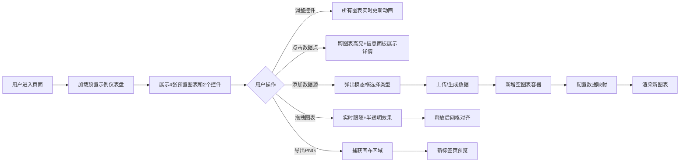

## 1. 产品概述

基于数据驱动的动态信息仪表盘应用，允许用户连接多数据源并在可拖拽画布中自由组合图表与控件，实现实时数据可视化与交互式分析。

- 核心价值：提供灵活、高性能的数据可视化平台，支持多种数据源接入，通过拖拽式界面快速构建专业仪表盘
- 目标用户：数据分析师、运营人员、产品经理等需要快速构建数据看板的用户
- 市场定位：轻量级、高度可定制的开源数据可视化工具

## 2. 核心功能

### 2.1 用户角色

| 角色 | 注册方式 | 核心权限 |
|------|----------|----------|
| 普通用户 | 无需注册，直接使用 | 连接数据源、创建图表、配置控件、导出快照 |

### 2.2 功能模块

1. **仪表盘主页面**：控件面板、多画布工作区、顶部工具栏、信息面板
2. **数据源管理**：JSON/CSV文件上传、模拟实时流生成、数据解析转换
3. **图表引擎**：折线图、柱状图、饼图、热力图渲染，支持联动高亮
4. **交互控制**：拖拽移动、缩放调整、控件筛选、数据点选中
5. **导出功能**：PNG快照导出与预览

### 2.3 页面详情

| 页面名称 | 模块名称 | 功能描述 |
|----------|----------|----------|
| 仪表盘主页 | 顶部工具栏 | 提供添加数据源、导出PNG、重置布局等操作按钮 |
| 仪表盘主页 | 左侧控件面板 | 包含日期滑块、城市下拉选择器等筛选控件，支持毛玻璃效果 |
| 仪表盘主页 | 中心画布区 | 可拖拽、可缩放的多图表容器，支持网格对齐 |
| 仪表盘主页 | 右侧信息面板 | 展示选中数据点的详细信息和环比变化 |
| 数据源模态框 | 数据源选择 | 支持JSON文件、CSV文件、模拟实时流三种类型 |
| 图表菜单 | 浮动操作菜单 | 编辑数据映射、更改图表类型、删除图表 |
| 数据映射面板 | 字段拖拽配置 | 将数据源字段拖拽到X轴、Y轴、分组字段 |

## 3. 核心流程

## 4. 用户界面设计

### 4.1 设计风格

- **主色调**：靛蓝渐变 `#7c3aed` → `#a78bfa`，用于按钮、图表边框、选中高亮
- **辅助色**：珊瑚橙 `#f97316`、翡翠绿 `#10b981`，用于图表系列配色
- **背景色**：深色主题，背景 `#1e1e2e`，卡片 `#2a2a3e`
- **文字色**：`#cdd6f4`
- **边框色**：`#4a4a6a`
- **按钮样式**：圆角8px，hover放大1.05倍，0.2秒过渡
- **字体**：使用 Inter 字体家族，标题600字重，正文400字重
- **布局风格**：三栏布局（控件面板-画布-信息面板），卡片式设计，圆角12px，带2px边框和阴影
- **动效风格**：图表更新0.4秒缓动动画，热力图0.2秒渐变，拖拽时半透明

### 4.2 页面设计概述

| 页面名称 | 模块名称 | UI元素 |
|----------|----------|----------|
| 仪表盘主页 | 顶部工具栏 | 靛蓝渐变按钮、圆角12px、hover放大、毛玻璃背景 |
| 仪表盘主页 | 控件面板 | 毛玻璃效果（rgba(255,255,255,0.05)，模糊12px），圆角12px，内边距16px |
| 仪表盘主页 | 图表容器 | 圆角12px，2px边框 `#4a4a6a`，阴影效果，拖拽时半透明，最小300x200px |
| 仪表盘主页 | 信息面板 | 深色卡片，数据详情展示，环比变化百分比带颜色指示 |
| 数据源模态框 | 模态框 | 深色半透明遮罩，居中卡片，三选一数据源类型卡片 |
| 图表菜单 | 浮动菜单 | 齿轮图标，hover显示，下拉式操作菜单 |

### 4.3 响应式

- **桌面优先**设计，视口宽度小于768px时：
  - 控件面板折叠为顶部滑动菜单，可展开/收起
  - 主画布图表自动调整为单列垂直布局
  - 信息面板改为底部抽屉式设计
  - 图表最小宽度调整为100%可用宽度

### 4.4 性能指标

- 数据解析：最大支持10000条记录，300ms内完成
- 图表渲染：最多同时显示8个图表，300ms内完成
- 交互反馈：延迟不超过50ms
- 动画帧率：不低于55FPS，目标60FPS
