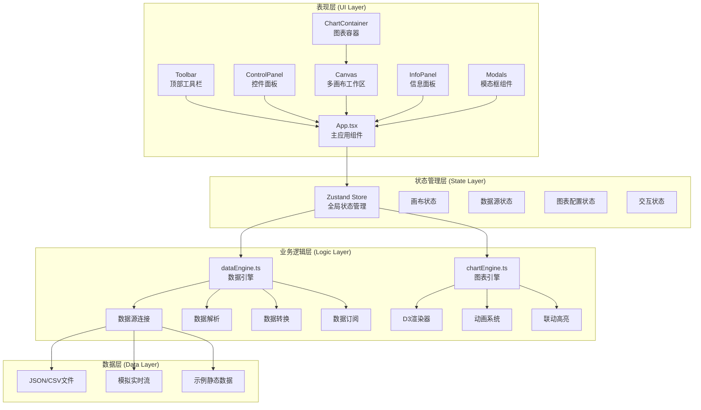
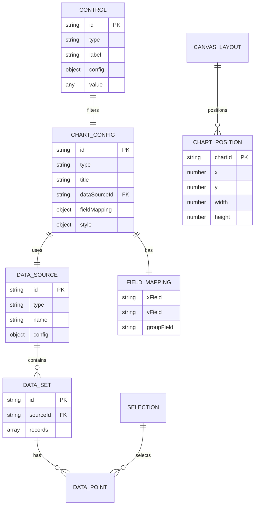

## 1. 架构设计



## 2. 技术描述

- **前端框架**：React 18 + TypeScript 5
- **构建工具**：Vite 5
- **状态管理**：Zustand 4
- **图表库**：D3.js 7
- **唯一标识**：uuid 9
- **导出功能**：html2canvas 1
- **图标库**：lucide-react
- **项目初始化**：使用 vite-init react-ts 模板创建

## 3. 核心模块职责

### 3.1 数据引擎 (dataEngine.ts)

- 管理多种数据源连接（JSON/CSV/模拟流）
- 数据解析与格式转换
- 提供统一的数据订阅接口
- 支持数据筛选与字段映射
- 输出格式化后的数据集

### 3.2 图表引擎 (chartEngine.ts)

- 基于D3实现四种图表类型渲染
  - 折线图：趋势展示，支持路径动画
  - 柱状图：对比展示，支持柱子高度动画
  - 饼图：占比展示，支持扇区展开动画
  - 热力图：活跃度展示，支持颜色渐变动画
- 图表间联动高亮机制
- 统一的动画过渡系统（0.4s ease-in-out）

### 3.3 状态管理 (Zustand Store)

```typescript
interface DashboardState {
  // 数据源
  dataSources: DataSource[];
  activeDataSourceId: string | null;
  
  // 图表配置
  charts: ChartConfig[];
  
  // 画布状态
  canvasLayout: CanvasLayout;
  
  // 控件状态
  controls: ControlState;
  
  // 交互状态
  selectedDataPoint: DataPoint | null;
  highlightedDataIds: string[];
  
  // Actions
  addDataSource: (source: DataSource) => void;
  updateChart: (id: string, config: Partial<ChartConfig>) => void;
  updateControl: (id: string, value: any) => void;
  selectDataPoint: (point: DataPoint | null) => void;
  setHighlighted: (ids: string[]) => void;
}
```

## 4. 目录结构

```
src/
├── types.ts              # 类型定义
├── dataEngine.ts         # 数据引擎
├── chartEngine.ts        # 图表引擎
├── App.tsx               # 主应用组件
├── index.css             # 全局样式
├── components/           # UI组件
│   ├── Toolbar.tsx       # 顶部工具栏
│   ├── ControlPanel.tsx  # 控件面板
│   ├── Canvas.tsx        # 画布区域
│   ├── ChartContainer.tsx # 图表容器
│   ├── InfoPanel.tsx     # 信息面板
│   ├── DataSourceModal.tsx # 数据源模态框
│   ├── ChartMenu.tsx     # 图表浮动菜单
│   ├── DataMappingPanel.tsx # 数据映射面板
│   └── charts/           # 具体图表组件
│       ├── LineChart.tsx
│       ├── BarChart.tsx
│       ├── PieChart.tsx
│       └── HeatmapChart.tsx
├── hooks/                # 自定义Hooks
│   ├── useDragResize.ts  # 拖拽缩放Hook
│   └── useAnimationFrame.ts # 动画帧Hook
├── store/                # Zustand状态管理
│   └── useDashboardStore.ts
└── utils/                # 工具函数
    ├── dataParser.ts     # 数据解析工具
    ├── animation.ts      # 动画工具
    └── export.ts         # 导出工具
```

## 5. 数据模型

### 5.1 数据模型定义



### 5.2 预置示例数据

应用启动时内置4张图表的示例数据：

1. **销售趋势折线图**：过去30天每天的销售额数据（日期、销售额、环比）
2. **品类销量柱状图**：6个产品品类的销量对比（品类、销量、目标完成率）
3. **市场占比饼图**：5个地区的市场份额（地区、占比、同比变化）
4. **用户活跃度热力图**：24小时×7天的用户活跃度矩阵（小时、星期、活跃值）

## 6. 性能优化策略

### 6.1 数据处理优化
- 使用 Web Worker 处理大量数据解析（最大10000条）
- 数据缓存机制，避免重复计算
- 增量更新，仅更新变化的部分

### 6.2 渲染优化
- D3 使用 requestAnimationFrame 进行动画
- 图表组件使用 React.memo 避免不必要重渲染
- 使用 ResizeObserver 监听容器尺寸变化
- Canvas 渲染热力图等大数据量图表

### 6.3 交互优化
- 拖拽使用 transform3d 启用GPU加速
- 节流和防抖处理高频事件
- 虚拟滚动处理长列表
