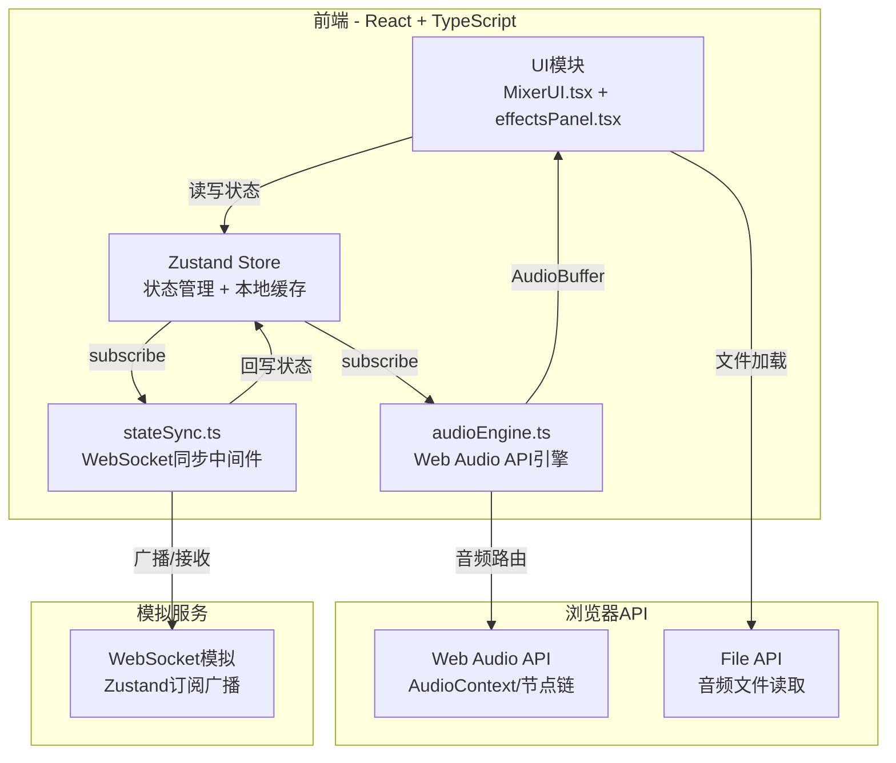

## 1. 架构设计



### 数据流向

1. **用户操作 → 状态更新**：UI组件调用Zustand store的action更新参数
2. **状态更新 → 音频引擎**：audioEngine通过subscribe监听store变化，重新配置音频节点
3. **状态更新 → 协作同步**：stateSync监听store变化，通过WebSocket广播给其他用户
4. **远程更新 → 状态回写**：stateSync接收远程变更，回写Zustand store，触发audioEngine重新配置

### 模块间调用关系

```
MixerUI.tsx ──读写──→ Zustand Store ──订阅──→ audioEngine.ts
     │                    │                    
     │                    └──订阅──→ stateSync.ts ──广播──→ WebSocket(模拟)
     │                                        │
     └──调用──→ audioEngine.ts（播放/停止/导出）  └──回写──→ Zustand Store
     
effectsPanel.tsx ──读写──→ Zustand Store
```

## 2. 技术说明

- 前端框架：React 18 + TypeScript
- 构建工具：Vite + @vitejs/plugin-react
- 状态管理：Zustand（轻量级、支持subscribe中间件）
- 音频处理：Web Audio API（AudioContext、BiquadFilterNode、DelayNode、ConvolverNode、OfflineAudioContext）
- 协作同步：WebSocket模拟（通过Zustand subscribe监听状态变化并广播）
- 唯一标识：uuid
- 初始化工具：vite-init（react-ts模板）

## 3. 路由定义

| 路由 | 用途 |
|------|------|
| / | 混音工作台主页面（单页应用） |

## 4. 文件结构与职责

```
├── package.json          # 依赖：react react-dom zustand uuid typescript vite @vitejs/plugin-react
├── index.html            # 入口页面
├── vite.config.ts        # Vite构建配置
├── tsconfig.json         # TypeScript严格模式，目标ES2020
└── src/
    ├── types.ts          # 类型定义：轨道、效果链、混音参数、WS消息
    ├── audioEngine.ts    # 音频引擎：AudioContext管理、节点链、混音合成
    ├── stateSync.ts      # 状态同步：WebSocket模拟、广播/接收参数变更
    ├── MixerUI.tsx       # 主UI：轨道列表、波形、音量/EQ控件、全局控制
    ├── effectsPanel.tsx  # 效果链面板：延迟/混响开关与参数
    ├── components/
    │   ├── Knob.tsx      # 旋钮控件
    │   ├── Slider.tsx    # 滑块控件
    │   └── Waveform.tsx  # 波形缩略图Canvas组件
    ├── store.ts          # Zustand store定义
    ├── App.tsx           # 应用根组件
    ├── main.tsx          # 入口文件
    └── index.css         # 全局样式与主题变量
```

### 核心模块职责

| 文件 | 职责 | 被调用方 | 调用方 |
|------|------|----------|--------|
| types.ts | 定义所有TypeScript接口和类型 | 所有模块 | 无 |
| store.ts | Zustand store定义，管理轨道状态、播放状态、导出进度 | UI组件读写、audioEngine订阅、stateSync监听 | MixerUI, effectsPanel, audioEngine, stateSync |
| audioEngine.ts | 创建AudioContext、管理轨道音源节点与效果器节点链、执行混音合成、提供音量和频段调节方法 | 被store subscribe触发 | Store(被动), MixerUI(主动调用播放/停止/导出) |
| stateSync.ts | WebSocket连接管理（模拟），接收远程参数更新并回写Zustand store | Store | Store(被动触发) |
| MixerUI.tsx | 展示轨道列表、波形缩略图、音量滑块、均衡器旋钮、全局播放控制、导出按钮 | Store | 用户交互 |
| effectsPanel.tsx | 管理每轨效果链的启用/禁用和参数微调 | Store | 用户交互 |

## 5. 音频处理架构

### 5.1 单轨音频节点链

```
AudioBufferSourceNode → BiquadFilter(low) → BiquadFilter(mid) → BiquadFilter(high) 
    → [DelayNode(可选)] → [ConvolverNode(混响,可选)] → GainNode(音量) → destination
```

### 5.2 离线导出节点链

```
OfflineAudioContext(44100, duration, 2)
    → 同样节点链结构 → MediaStreamDestination → WAV编码
```

### 5.3 性能约束

- AudioContext baseLatency最小化（优先使用低延迟模式）
- 参数变更到听觉反馈延迟 < 50ms
- 导出处理时间 ≤ 音频时长 × 0.3
