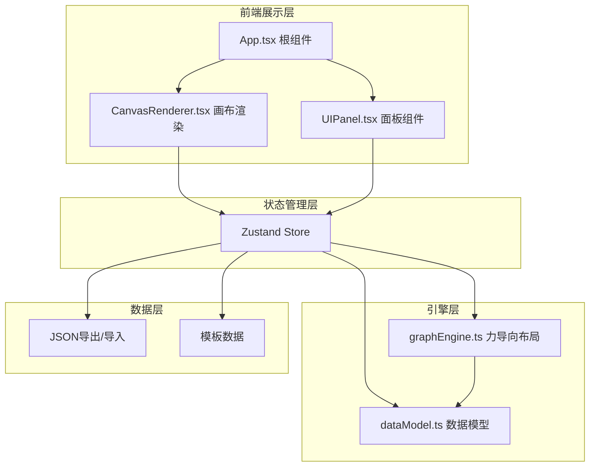
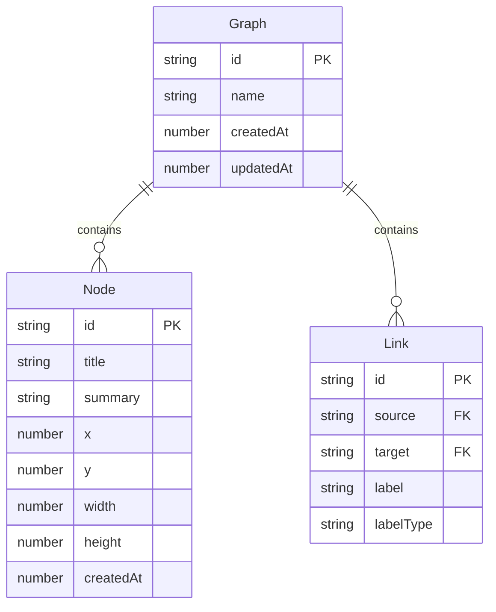

## 1. 架构设计



三层分离架构：
- **展示层**：React组件负责UI渲染和用户交互事件
- **状态层**：Zustand集中管理全局状态，连接展示层和引擎层
- **引擎层**：数据模型定义、力导向布局算法、序列化逻辑

## 2. 技术说明

- 前端：React@18 + TypeScript + Vite
- 状态管理：Zustand
- 画布渲染：Canvas 2D API（通过ref直接操作，非DOM渲染）
- 初始化工具：vite-init（react-ts模板）
- 后端：无（纯前端应用）
- 数据库：无（本地JSON文件导入导出）
- 路由：无（单页应用，无多页面路由）

## 3. 路由定义

| 路由 | 用途 |
|------|------|
| / | 主画布页面，包含所有功能 |

## 4. 数据模型

### 4.1 数据模型定义



### 4.2 数据定义

```typescript
interface KnowledgeNode {
  id: string;
  title: string;
  summary: string;
  x: number;
  y: number;
  width: number;
  height: number;
  createdAt: number;
}

interface KnowledgeLink {
  id: string;
  source: string;
  target: string;
  label: string;
  labelType: 'parent-child' | 'causal' | 'similarity' | 'custom';
}

interface GraphData {
  id: string;
  name: string;
  nodes: KnowledgeNode[];
  links: KnowledgeLink[];
  createdAt: number;
  updatedAt: number;
}

interface GraphState {
  nodes: KnowledgeNode[];
  links: KnowledgeLink[];
  selectedNodeId: string | null;
  selectedLinkId: string | null;
  toolMode: 'select' | 'create' | 'connect' | 'delete';
  camera: { x: number; y: number; zoom: number };
}
```

## 5. 文件组织

| 文件路径 | 职责 |
|----------|------|
| package.json | 依赖管理（react, react-dom, zustand, uuid, typescript, vite, @vitejs/plugin-react） |
| index.html | 入口页面，meta viewport和主容器 |
| vite.config.ts | Vite构建配置，React插件和路径别名 |
| tsconfig.json | TypeScript严格模式，esnext模块 |
| src/dataModel.ts | Node、Link、Graph数据类型定义，创建和验证函数 |
| src/graphEngine.ts | 力导向布局算法、导出导入序列化逻辑 |
| src/store.ts | Zustand全局状态store定义 |
| src/components/CanvasRenderer.tsx | Canvas画布组件，节点/连线绘制，交互事件处理 |
| src/components/UIPanel.tsx | 左右侧面板组件，工具按钮和节点详情 |
| src/App.tsx | 根组件，组合CanvasRenderer和UIPanel |
| src/main.tsx | 应用入口，挂载React根 |
| src/templates.ts | 预置模板数据（数学知识体系、计算机科学基础等） |

## 6. 性能策略

- Canvas 2D直接渲染：所有节点和连线通过Canvas API绘制，避免大量DOM节点
- 请求动画帧：拖拽和动画使用requestAnimationFrame保证60fps
- 空间索引：通过简单的网格分区加速命中检测
- 增量渲染：仅重绘视口内可见的节点和连线
- 力导向布局异步计算：布局算法在requestAnimationFrame中分帧执行，避免阻塞UI
