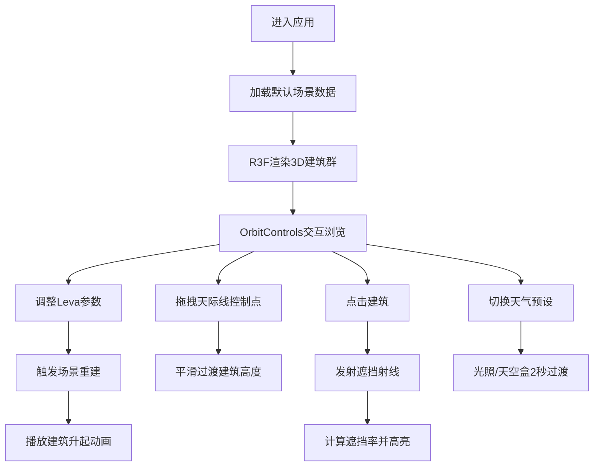

## 1. 产品概述

三维建筑体量与街道天际线交互推演应用，为建筑设计汇报和城市更新方案评审提供直观的3D可视化工具。解决甲方和设计师仅凭2D平面图难以感受建筑体量对街道尺度真实影响的痛点，支持实时参数化调整、天际线推演和视觉遮挡分析。

- **核心价值**：将专业建筑设计过程轻量化、交互化，使非专业人员也能直观理解建筑方案对城市空间的影响
- **目标用户**：建筑设计师、城市规划师、甲方决策者、方案评审专家
- **市场定位**：面向建筑设计领域的专业级轻量化Web3D交互工具

## 2. 核心功能

### 2.1 用户角色

| 角色 | 注册方式 | 核心权限 |
|------|----------|----------|
| 设计师用户 | 无需注册，直接使用 | 调整参数、保存/加载预设、导出方案 |
| 评审专家 | 无需注册，直接使用 | 查看方案、交互探索、遮挡分析 |

### 2.2 功能模块

1. **主场景页面**：3D视口、建筑群渲染、天际线曲线、遮挡可视化
2. **控制面板**：Leva参数调节面板、天气预设切换、预设加载
3. **交互系统**：建筑选中、天际线拖拽、遮挡射线、场景缩放旋转

### 2.3 页面详情

| 页面名称 | 模块名称 | 功能描述 |
|-----------|-------------|---------------------|
| 主场景 | 3D渲染引擎 | Three.js + R3F渲染建筑群、街道、天空盒，支持OrbitControls交互 |
| 主场景 | 参数化建筑生成 | 根据街道宽度、层高、层数、颜色动态生成带窗户纹理的建筑，重建动画0.5秒 |
| 主场景 | 天际线推演 | 半透明天际线参考曲线，高度标注，可拖拽控制点调整建筑高度 |
| 主场景 | 遮挡分析 | 点击建筑发射射线，计算遮挡率，被遮挡建筑半透明显示 |
| 控制面板 | 参数调节 | 街道宽度10-50m、层高2.8-4.5m、层数3-20层、立面颜色、转角弧度 |
| 控制面板 | 天气系统 | 晴天/阴天/黄昏三档预设，2秒平滑过渡光照和天空盒 |
| 控制面板 | 预设管理 | 支持拖入JSON文件加载预设场景，带进度条动画 |

## 3. 核心流程

**主交互流程**：
用户进入应用 → 查看默认街道场景 → 通过Leva面板调整建筑参数 → 场景实时重建并播放渐入动画 → 拖拽天际线控制点微调高度 → 点击特定建筑进行遮挡分析 → 切换天气预设查看不同光照效果 → 可保存/加载JSON预设

## 4. 用户界面设计

### 4.1 设计风格

**极简科技暗色主题**，营造专业建筑评审氛围

- **主背景色**：#1a1a2e（深空蓝黑）
- **强调色**：#4ea8ff（脉冲蓝光）、#ff9d4e（黄昏橙）
- **辅助色**：#ffffff85（半透明白）、#00ff88（遮挡率绿）
- **按钮风格**：圆角8px，微妙泛光边框（box-shadow: 0 0 12px rgba(78,168,255,0.3)）
- **字体**：主标题使用 Space Grotesk，正文使用 Inter，数字标注使用 JetBrains Mono
- **布局风格**：3D场景全屏沉浸，控制面板悬浮右上角，无边框卡片式设计
- **视觉细节**：建筑边缘使用发光线框，选中时蓝色脉冲光晕，天际线使用流动虚线

### 4.2 页面设计概览

| 页面名称 | 模块名称 | UI元素 |
|-----------|-------------|-------------|
| 主场景 | 3D视口 | 全屏Canvas，背景#1a1a2e，低多边形PBR建筑，发光窗户 |
| 主场景 | 天际线曲线 | 半透明蓝紫色曲线，高度标注文字，可拖拽控制点小球 |
| 主场景 | 遮挡可视化 | 蓝色虚线流动射线，被遮挡建筑半透明，遮挡率百分比悬浮标签 |
| 控制面板 | Leva面板 | 半透明白底rgba(255,255,255,0.85)，圆角12px，滑块带发光边框 |
| 控制面板 | 天气切换 | 三档图标按钮，选中态发光，hover时缩放1.05 |
| 控制面板 | 预设加载 | 拖拽区域虚线边框，进度条动画线性渐变 |
| 移动端 | 底部抽屉 | 控制面板转为底部抽屉，上滑展开，手势缩放支持 |

### 4.3 响应式

- **设计策略**：Desktop-first，移动端自适应
- **断点**：768px以下切换移动端布局
- **桌面端**：控制面板悬浮右上角（width: 320px），支持调整透明度
- **移动端**：控制面板折叠为底部抽屉，场景全屏，支持双指缩放、单指旋转
- **触摸优化**：按钮最小触控区域44x44px，控制点增大到16px便于触摸

### 4.4 3D场景指引

**环境与氛围**
- 天空盒：使用程序化渐变天空，随天气预设切换颜色
- 地面：深灰色哑光平面，带微妙网格线显示街道尺度
- 雾效：指数雾，晴天时弱，阴天时强，增强空间深度感

**光照设置**
- 晴天：暖色定向光(5500K) + 柔和环境光，开启PCF软阴影
- 阴天：冷色半球光 + 大面积环境光，阴影柔和模糊
- 黄昏：橙红色逆光(2800K) + 补光，阴影拉长，开启Bloom泛光

**相机设置**
- 初始位置：街道尽头45°俯角，焦距50mm
- 控制方式：OrbitControls，限制最大俯角90°，最小距离20m，最大距离200m
- 阻尼系数：0.08，平滑交互体验

**构图与焦点**
- 视觉重心：街道透视消失点位于画面黄金分割点
- 天际线曲线位于画面上1/3处，引导视线
- 选中建筑使用蓝色光晕突出，成为视觉焦点

**交互与动画**
- 建筑生成：从地面Y轴缩放升起，每栋延迟0.05秒，总时长0.5秒
- 选中效果：边框蓝色脉冲，周期1.5秒，振幅0.3
- 天气过渡：光照强度、颜色、天空盒颜色使用lerp线性插值，2秒完成
- 遮挡射线：虚线流动动画，dashRatio: 0.5，speed: 2

**后处理效果**
- Bloom泛光：强度0.4，阈值0.8，用于窗户发光和选中光晕
- 色调映射：ACES Filmic，曝光度1.0
- 抗锯齿：MSAA 4x + FXAA

**性能预算**
- 建筑数量：最多20栋，每栋三角形数控制在2000以内
- Draw Call：控制在50以内，使用InstancedMesh批量渲染窗户
- 帧率目标：稳定60FPS，最低45FPS
- 内存占用：纹理资源控制在50MB以内

## 5. 非功能需求

### 5.1 性能约束
- 参数调整后场景重建 ≤ 500ms
- 交互过程帧率稳定 ≥ 45FPS
- 遮挡分析计算 ≤ 200ms
- 首屏加载时间 ≤ 3s

### 5.2 兼容性
- 支持Chrome 90+、Firefox 88+、Safari 14+
- 支持WebGL 2.0，降级提示WebGL 1.0
- 移动端支持iOS 13+、Android 9+
