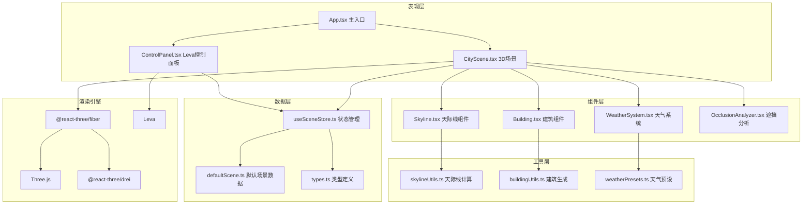
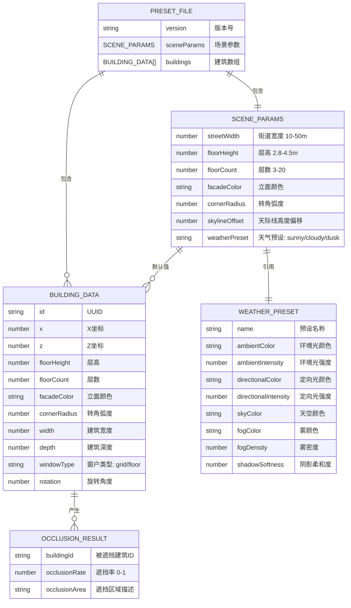

## 1. 架构设计



## 2. 技术描述

- **前端框架**：React 18 + TypeScript 5
- **构建工具**：Vite 5 + @vitejs/plugin-react
- **3D渲染**：Three.js r160 + @react-three/fiber 8.15 + @react-three/drei 9.92
- **UI组件**：Leva 0.9.35（参数控制面板）
- **状态管理**：Zustand 4.4（轻量状态管理）
- **动画库**：@react-spring/three 9.7（3D动画）
- **工具库**：uuid 9.0
- **后处理**：@react-three/postprocessing 2.15

## 3. 文件结构与调用关系

```
src/
├── App.tsx                      # 主入口，Canvas初始化，数据分发
│   ├── 调用 CityScene.tsx 传递场景数据
│   ├── 调用 ControlPanel.tsx 传递参数回调
│   └── 监听 useSceneStore 状态变化
├── CityScene.tsx                # 3D场景主组件
│   ├── 调用 Building.tsx 渲染每栋建筑
│   ├── 调用 Skyline.tsx 绘制天际线
│   ├── 调用 WeatherSystem.tsx 管理光照
│   ├── 调用 OcclusionAnalyzer.tsx 遮挡分析
│   └── 从 skylineUtils.ts 获取计算数据
├── ControlPanel.tsx             # Leva控制面板
│   ├── 直接使用 useControls hook
│   └── 调用 useSceneStore 更新参数
├── components/
│   ├── Building.tsx             # 单体建筑组件
│   │   ├── 使用 BoxGeometry + MeshStandardMaterial
│   │   ├── 调用 buildingUtils.ts 生成窗户
│   │   └── 使用 useSpring 做升起动画
│   ├── Skyline.tsx              # 天际线曲线组件
│   │   ├── 使用 CatmullRomCurve3
│   │   ├── 可拖拽控制点 (DragControls)
│   │   └── 调用 skylineUtils.ts 计算参考点
│   ├── WeatherSystem.tsx        # 天气系统组件
│   │   ├── 管理 DirectionalLight / AmbientLight
│   │   ├── 使用 useFrame 做2秒过渡动画
│   │   └── 调用 weatherPresets.ts 获取预设
│   ├── OcclusionAnalyzer.tsx    # 遮挡分析组件
│   │   ├── 使用 Raycaster 计算遮挡
│   │   ├── 绘制虚线流动射线
│   │   └── 显示遮挡率百分比标签
│   └── PresetLoader.tsx         # 预设加载组件
│       ├── 拖拽文件上传
│       ├── 进度条动画
│       └── 解析JSON更新useSceneStore
├── utils/
│   ├── skylineUtils.ts          # 天际线计算工具
│   │   ├── 函数: calculateSkylinePoints()
│   │   ├── 函数: analyzeOcclusion()
│   │   └── 函数: interpolateHeights()
│   ├── buildingUtils.ts         # 建筑生成工具
│   │   ├── 函数: generateBuildingGeometry()
│   │   ├── 函数: createWindowTexture()
│   │   └── 函数: generateCornerRadius()
│   └── weatherPresets.ts        # 天气预设配置
│       ├── sunny / cloudy / dusk 预设
│       └── lerpWeather() 插值函数
├── store/
│   └── useSceneStore.ts         # Zustand状态管理
│       ├── 街道宽度、层高、层数等参数
│       ├── 建筑数据数组
│       ├── 天气预设
│       └── 选中建筑ID
├── types/
│   └── index.ts                 # TypeScript类型定义
│       ├── BuildingData 接口
│       ├── SceneParams 接口
│       ├── WeatherPreset 接口
│       └── OcclusionResult 接口
├── data/
│   └── defaultScene.ts          # 默认场景JSON数据
└── styles/
    └── globals.css              # 全局样式（暗色主题）
```

**数据流向**：
1. `defaultScene.ts` → `useSceneStore.ts`（初始化）
2. `ControlPanel.tsx` → `useSceneStore.setState()`（参数更新）
3. `useSceneStore.getState()` → `CityScene.tsx`（订阅变化）
4. `CityScene.tsx` → `Building.tsx` / `Skyline.tsx`（分发数据）
5. `skylineUtils.ts` → `Skyline.tsx`（计算结果）
6. `PresetLoader.tsx` → `useSceneStore`（加载JSON）

## 4. 路由定义

| 路由 | 用途 |
|-------|---------|
| / | 主场景页面（唯一页面） |

**说明**：本应用为单页应用(SPA)，无需多路由。所有功能集中在主场景中，通过Canvas渲染和悬浮控制面板实现完整交互。

## 5. 数据模型

### 5.1 数据模型定义



### 5.2 TypeScript类型定义

```typescript
// types/index.ts
export interface BuildingData {
  id: string;
  x: number;
  z: number;
  floorHeight: number;
  floorCount: number;
  facadeColor: string;
  cornerRadius: number;
  width: number;
  depth: number;
  windowType: 'grid' | 'floor';
  rotation: number;
}

export interface SceneParams {
  streetWidth: number;
  floorHeight: number;
  floorCount: number;
  facadeColor: string;
  cornerRadius: number;
  skylineOffset: number;
  weatherPreset: 'sunny' | 'cloudy' | 'dusk';
}

export interface WeatherPreset {
  name: string;
  ambientColor: string;
  ambientIntensity: number;
  directionalColor: string;
  directionalIntensity: number;
  skyColor: string;
  fogColor: string;
  fogDensity: number;
  shadowSoftness: number;
  sunPosition: [number, number, number];
}

export interface OcclusionResult {
  buildingId: string;
  occlusionRate: number;
  intersectionPoints: THREE.Vector3[];
}

export interface SkylinePoint {
  x: number;
  height: number;
  buildingId: string;
}

export interface PresetFile {
  version: '1.0';
  sceneParams: SceneParams;
  buildings: BuildingData[];
}
```

### 5.3 默认场景数据示例

```typescript
// data/defaultScene.ts
import { PresetFile } from '../types';

export const defaultScene: PresetFile = {
  version: '1.0',
  sceneParams: {
    streetWidth: 24,
    floorHeight: 3.2,
    floorCount: 8,
    facadeColor: '#e8e4de',
    cornerRadius: 0.3,
    skylineOffset: 0,
    weatherPreset: 'sunny'
  },
  buildings: [
    {
      id: 'b1',
      x: -18,
      z: 0,
      floorHeight: 3.2,
      floorCount: 10,
      facadeColor: '#e8e4de',
      cornerRadius: 0.3,
      width: 12,
      depth: 15,
      windowType: 'grid',
      rotation: 0
    },
    // ... 更多建筑
  ]
};
```

## 6. 核心算法说明

### 6.1 天际线计算算法

```typescript
// utils/skylineUtils.ts
export function calculateSkylinePoints(
  buildings: BuildingData[],
  streetWidth: number,
  offset: number
): SkylinePoint[] {
  // 1. 按x坐标排序建筑
  // 2. 提取每栋建筑的顶部高度（层高×层数）
  // 3. 在街道两侧分别生成天际线点
  // 4. 应用高度偏移
  // 5. 用于CatmullRomCurve3生成平滑曲线
}
```

### 6.2 遮挡分析算法

```typescript
// utils/skylineUtils.ts
export function analyzeOcclusion(
  sourceBuilding: BuildingData,
  allBuildings: BuildingData[],
  streetWidth: number
): OcclusionResult[] {
  // 1. 从源建筑正面发射多条射线到街道对面
  // 2. 使用THREE.Raycaster检测与其他建筑的交点
  // 3. 计算每条射线被遮挡的长度比例
  // 4. 综合计算遮挡率百分比
  // 5. 返回遮挡建筑列表和遮挡率
}
```

### 6.3 高度平滑过渡算法

```typescript
// utils/skylineUtils.ts
export function interpolateHeights(
  controlPoints: SkylinePoint[],
  buildings: BuildingData[],
  draggedPointIndex: number,
  newHeight: number
): BuildingData[] {
  // 1. 更新被拖拽控制点的高度
  // 2. 使用三次样条插值平滑相邻点的高度
  // 3. 更新对应建筑的层数（高度/层高）
  // 4. 返回更新后的建筑数组
}
```

## 7. 性能优化策略

1. **建筑批量渲染**：使用 `InstancedMesh` 批量渲染窗户，减少Draw Call
2. **几何复用**：相同尺寸建筑共享 `BufferGeometry`
3. **LOD策略**：远景建筑使用简化几何体
4. **阴影优化**：只对主建筑投射阴影，使用 `PCFSoftShadowMap`
5. **材质复用**：相同颜色建筑共享 `MeshStandardMaterial`
6. **按需重建**：参数变化时只重建受影响的建筑，而非全部
7. **WebWorker**：遮挡分析计算放在WebWorker中执行，避免阻塞主线程
8. **资源池**：建筑几何体和材质使用对象池管理，避免频繁GC

## 8. 外部依赖清单

| 包名 | 版本 | 用途 |
|------|------|------|
| react | ^18.2.0 | UI框架 |
| react-dom | ^18.2.0 | DOM渲染 |
| typescript | ^5.3.0 | 类型系统 |
| vite | ^5.0.0 | 构建工具 |
| @vitejs/plugin-react | ^4.2.0 | Vite React插件 |
| three | ^0.160.0 | 3D渲染引擎 |
| @react-three/fiber | ^8.15.0 | React Three.js绑定 |
| @react-three/drei | ^9.92.0 | R3F组件库 |
| @react-three/postprocessing | ^2.15.0 | 后处理效果 |
| @react-spring/three | ^9.7.0 | 3D动画 |
| leva | ^0.9.35 | 参数控制面板 |
| zustand | ^4.4.0 | 状态管理 |
| uuid | ^9.0.0 | ID生成 |
| @types/three | ^0.160.0 | Three.js类型定义 |
| @types/uuid | ^9.0.0 | uuid类型定义 |
