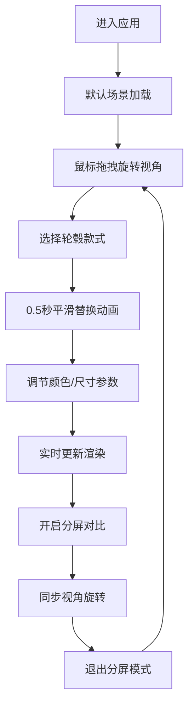

## 1. 产品概述

交互式轮毂装车效果三维预览与对比应用，为汽车工业设计师和市场调研人员提供在真实街景中快速预览不同款式轮毂装车效果的工具，解决传统PS方法难以多角度对比和实时调整尺寸的痛点。

- 主要用途：汽车轮毂款式选型、尺寸对比、颜色预览、市场调研辅助决策
- 目标用户：汽车工业设计师、市场调研人员、汽车改装爱好者
- 产品价值：提升轮毂选型效率，降低设计沟通成本，提供直观的三维可视化对比体验

## 2. 核心功能

### 2.1 用户角色

| 角色 | 注册方式 | 核心权限 |
|------|----------|----------|
| 设计师用户 | 无需注册 | 浏览轮毂款式、调节参数、分屏对比、导出预览图 |

### 2.2 功能模块

1. **三维场景预览模块**：轿车三维模型展示、轮毂装配、视角控制、地面反射
2. **轮毂选配模块**：5种轮毂款式选择、颜色调节、尺寸调节、缩略图预览
3. **分屏对比模块**：左右分屏对比两种轮毂、同步视角控制、平滑切换动画
4. **交互控制模块**：鼠标拖拽旋转视角、参数滑块调节、分屏切换按钮

### 2.3 页面详情

| 页面名称 | 模块名称 | 功能描述 |
|-----------|-------------|---------------------|
| 主页面 | 三维场景区 | 实时渲染整车三维模型，支持鼠标拖拽旋转视角，垂直角度限制-20°到60°，轮毂持续缓慢旋转 |
| 主页面 | 左侧选配面板 | 280px宽垂直面板，包含Logo、5种轮毂选项卡（带缩略图）、颜色滑块（10档）、尺寸滑块（17-22英寸） |
| 主页面 | 分屏对比区 | 点击右上角按钮切换左右分屏，左侧显示当前轮毂，右侧显示历史轮毂，视角同步 |

## 3. 核心流程

用户进入应用 → 默认展示银色轿车配经典五辐轮毂 → 鼠标拖拽旋转观察效果 → 点击左侧不同轮毂款式（0.5秒平滑过渡动画）→ 调节颜色和尺寸滑块（实时响应<100ms）→ 点击分屏按钮对比两种轮毂 → 同步旋转视角对比 → 退出分屏继续调整

## 4. 用户界面设计

### 4.1 设计风格
- 主色调：深色背景 #1a1a1a，面板 #2a2a2a，文字 #e0e0e0
- 强调色：金色 #d4a843（用于选中状态、滑块已滑动部分、按钮悬停）
- 字体：采用现代无衬线字体，标题加粗，正文清晰易读
- 按钮样式：圆角4px，悬停有微动画，分屏按钮为半透明悬浮设计
- 布局风格：左侧固定选配面板 + 右侧弹性三维场景区，卡片式轮毂选项

### 4.2 页面设计概述

| 页面名称 | 模块名称 | UI元素 |
|-----------|-------------|-------------|
| 主页面 | 三维场景区 | Three.js Canvas、半透明圆形地面反射（半径5单位）、OrbitControls视角控制 |
| 主页面 | 左侧选配面板 | Logo标题区（深灰底白字）、5个轮毂卡片（带缩略图、名称、选中金色描边）、颜色滑块（轨道4px，金色填充）、尺寸滑块 |
| 主页面 | 分屏控制 | 右上角悬浮按钮（双矩形图标）、分屏分割线（0.3秒收缩动画） |

### 4.3 响应式设计
- 桌面端（≥768px）：左侧280px固定面板 + 右侧场景区
- 移动端（<768px）：左侧面板折叠为顶部抽屉式菜单，点击展开/收起
- 触摸优化：支持触摸滑动旋转视角，滑块支持触摸拖动

### 4.4 3D场景指导
- 环境：中性灰色环境光 + 方向光模拟日光，半透明圆形地面增强真实感
- 光照：AmbientLight(0xffffff, 0.5) + DirectionalLight(0xffffff, 0.8) + 半球光
- 相机：默认位置(0, 1.5, 6)，fov 50°，近裁0.1，远裁1000
- 轮毂位置：前后轮悬架位置预设，左右对称分布
- 动画：车轮持续5°/秒旋转，轮毂切换时缩放过渡动画（旧缩小→新放大）
- 性能：模型预加载策略，帧率稳定≥50FPS，加载时间≤2秒

## 5. 性能与技术约束
- 场景帧率：稳定50FPS以上
- 轮毂切换响应：点击到完全替换≤2秒
- 参数调节延迟：≤100ms
- 动画流畅度：所有过渡动画≥30FPS
