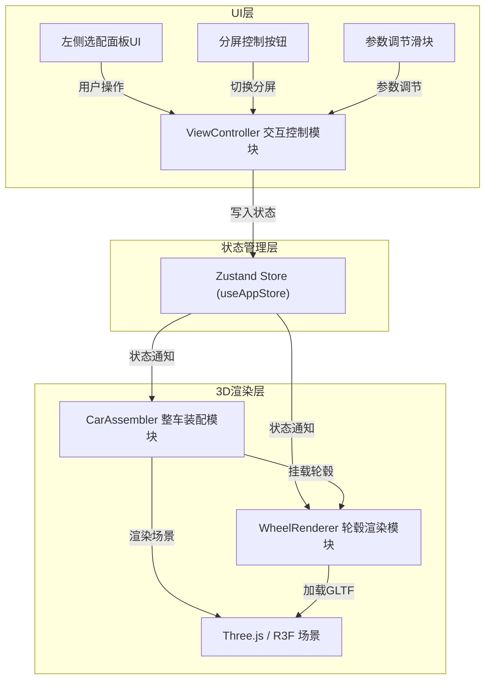

## 1. 架构设计



## 2. 技术描述

- **前端框架**：React@18 + TypeScript@5 + Vite@5
- **3D渲染**：Three@0.160 + @react-three/fiber@8 + @react-three/drei@9
- **状态管理**：Zustand@4（全局应用状态）
- **动画库**：@react-three/drei 内置 useFrame + 自定义tween动画
- **工具库**：uuid@9（唯一标识符）
- **样式方案**：CSS Modules / 内联样式 + CSS变量
- **构建工具**：Vite@5 + @vitejs/plugin-react@4

## 3. 目录结构

```
auto191/
├── package.json
├── index.html
├── vite.config.ts
├── tsconfig.json
├── src/
│   ├── types.ts              # 全局类型定义
│   ├── store/
│   │   └── useAppStore.ts    # Zustand状态仓库
│   ├── modules/
│   │   ├── wheelRenderer.tsx # 轮毂渲染模块
│   │   └── carAssembler.tsx  # 整车装配模块
│   ├── controllers/
│   │   └── viewController.tsx # 交互控制模块
│   ├── components/
│   │   └── App.tsx           # 根组件
│   └── main.tsx              # 应用入口
└── public/
    └── models/               # GLTF模型资源目录
        ├── car.glb           # 车身模型
        └── wheels/           # 轮毂模型目录
            ├── wheel1.glb    # 经典五辐
            ├── wheel2.glb    # 运动双辐
            ├── wheel3.glb    # 交叉辐
            ├── wheel4.glb    # 密辐式
            └── wheel5.glb    # 概念碟形
```

## 4. 数据流向设计

### 4.1 状态数据流

```
UI控制模块 → 写入选配参数 → Zustand Store → 通知订阅组件
     ↑                                              ↓
     └──────── 渲染结果反馈 ───────── 整车装配模块/轮毂渲染模块
```

### 4.2 Store状态定义

```typescript
interface WheelParams {
  wheelId: string;
  color: string;
  size: number; // 英寸
}

interface CameraState {
  position: [number, number, number];
  target: [number, number, number];
}

interface AppState {
  // 车辆与轮毂
  selectedCarId: string;
  leftWheelParams: WheelParams;   // 分屏左侧/单屏
  rightWheelParams: WheelParams;  // 分屏右侧
  wheelHistory: string[];         // 轮毂切换历史
  
  // 视图控制
  comparisonMode: boolean;
  cameraState: CameraState;
  
  // 加载状态
  loadingWheels: Set<string>;
  
  // Actions
  setWheelParams: (side: 'left' | 'right', params: Partial<WheelParams>) => void;
  selectWheel: (wheelId: string) => void;
  setColor: (color: string) => void;
  setSize: (size: number) => void;
  toggleComparisonMode: () => void;
  setCameraState: (state: CameraState) => void;
  setWheelLoaded: (wheelId: string, loaded: boolean) => void;
}
```

## 5. 模块接口定义

### 5.1 WheelRenderer 轮毂渲染模块

```typescript
interface WheelRendererProps {
  wheelId: string;
  color: string;
  size: number;
  position?: [number, number, number];
  rotation?: [number, number, number];
}

// 功能：
// 1. 根据wheelId动态加载对应GLTF模型
// 2. 应用color到轮毂主体和轮辋边缘材质
// 3. 根据size计算缩放比例（17-22英寸映射为0.9-1.2倍）
// 4. 报告加载状态到store
// 5. 接收外部rotation控制车轮旋转
```

### 5.2 CarAssembler 整车装配模块

```typescript
interface CarAssemblerProps {
  side: 'left' | 'right' | 'single';
}

// 功能：
// 1. 加载车身GLTF模型并定位
// 2. 从store读取对应侧的轮毂参数
// 3. 在四个轮位（前后左右）挂载WheelRenderer
// 4. 轮位预设位置：
//    - 前左轮：[-1.2, 0.4, 1.8]
//    - 前右轮：[1.2, 0.4, 1.8]
//    - 后左轮：[-1.2, 0.4, -1.8]
//    - 后右轮：[1.2, 0.4, -1.8]
// 5. useFrame实现车轮5°/秒旋转动画
// 6. 轮毂切换时执行缩放过渡动画（0.5秒）
// 7. 渲染半透明圆形地面（半径5单位）
```

### 5.3 ViewController 交互控制模块

```typescript
// 功能：
// 1. OrbitControls：限制minPolarAngle=70°, maxPolarAngle=110°（-20°到60°）
// 2. 左侧选配面板：5种轮毂选项、颜色滑块、尺寸滑块
// 3. 分屏切换按钮：右上角悬浮
// 4. 响应式处理：<768px时顶部抽屉菜单
// 5. 轮毂缩略图：使用独立迷你Canvas渲染
```

## 6. 轮毂预设配置

```typescript
const WHEEL_PRESETS = [
  { id: 'wheel1', name: '经典五辐', modelPath: '/models/wheels/wheel1.glb' },
  { id: 'wheel2', name: '运动双辐', modelPath: '/models/wheels/wheel2.glb' },
  { id: 'wheel3', name: '交叉辐', modelPath: '/models/wheels/wheel3.glb' },
  { id: 'wheel4', name: '密辐式', modelPath: '/models/wheels/wheel4.glb' },
  { id: 'wheel5', name: '概念碟形', modelPath: '/models/wheels/wheel5.glb' },
];

const COLOR_PRESETS = [
  '#c0c0c0', // 银色
  '#a0a0a0', // 浅灰
  '#808080', // 中灰
  '#606060', // 深灰
  '#404040', // 炭黑
  '#2a2a2a', // 黑色
  '#1a1a1a', // 纯黑
  '#8b7355', // 暗金
  '#b8860b', // 金色
  '#ffd700', // 亮金
];

const SIZE_RANGE = { min: 17, max: 22, step: 1 };
```

## 7. 性能优化策略

1. **模型预加载**：应用启动时预加载所有轮毂模型到内存缓存
2. **GLTF压缩**：使用Draco压缩的GLB模型，控制单模型<500KB
3. **实例化渲染**：四个轮位复用同一轮毂几何体
4. **状态订阅优化**：使用Zustand的selector避免不必要重渲染
5. **动画合并**：车轮旋转统一在CarAssembler中用useFrame批量更新
6. **LOD策略**：轮毂模型使用多级细节（可选）
7. **事件防抖**：滑块调节使用requestAnimationFrame批量更新
