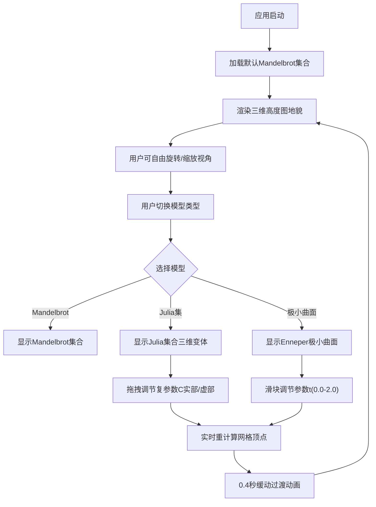

## 1. 产品概述

沉浸式三维数学结构探索应用，帮助学习者通过交互式三维可视化直观理解分形几何、复变函数和拓扑学中的抽象数学概念。将复杂的数学公式转化为可触摸、可旋转、可参数化调节的三维地貌景观，降低数学学习的认知门槛。

- 目标用户：数学爱好者、学生、教师、科研人员
- 核心价值：将抽象数学概念转化为直观的三维可视化体验
- 市场定位：教育辅助工具与数学艺术探索平台

## 2. 核心功能

### 2.1 功能模块

1. **三维场景渲染模块**：Mandelbrot集合三维高度图、Julia集合三维变体、极小曲面（Enneper曲面）
2. **交互控制面板**：模型切换、参数调节、实时预览
3. **相机控制系统**：鼠标拖拽旋转、滚轮缩放、触屏双指操作
4. **动态光照系统**：旋转光源、软阴影、高度渐变着色

### 2.2 页面详情

| 页面名称 | 模块名称 | 功能描述 |
|---------|---------|---------|
| 主页面 | 3D视口 | 全屏展示数学结构三维模型，支持鼠标/触屏交互 |
| 主页面 | 左侧控制面板 | 半透明毛玻璃效果面板，包含模型选择器和参数调节控件 |
| 主页面 | 动态光照系统 | 自动旋转的方向光，投射软阴影增强立体感 |

## 3. 核心流程

## 4. 用户界面设计

### 4.1 设计风格
- **主色调**：深空蓝背景 #0d0d1a，深蓝 #0a0a2e，橙红 #ff6b35
- **视觉风格**：深色科幻主题，沉浸式体验，科技感与艺术感并重
- **控制面板**：半透明亚光毛玻璃效果（backdrop-filter: blur(8px)）
- **控件样式**：圆角矩形（半径6px），最小宽度160px，悬停/点击0.2秒渐变色过渡
- **字体**：现代无衬线字体，清晰易读，数字等宽显示
- **动效**：参数变化0.4秒easeInOutCubic缓动过渡

### 4.2 页面设计概述

| 页面名称 | 模块名称 | UI元素 |
|---------|---------|-------|
| 主页面 | 3D视口 | 全屏Canvas，深色背景，数学结构三维模型，动态光照，软阴影 |
| 主页面 | 控制面板 | 左侧浮动半透明面板，模型下拉选择器，参数滑块组，数值显示 |
| 主页面 | 高度着色 | 深蓝(#0a0a2e)到橙红(#ff6b35)高度渐变，增强地形起伏感 |

### 4.3 响应式设计
- **桌面端**（1920x1080）：左侧固定控制面板，主视口占满剩余空间
- **iPad横屏**（1024x768）：控制面板折叠为可拖动悬浮按钮，点击展开
- **触屏优化**：支持双指旋转和缩放手势
- **性能适配**：顶点数不超过60万，重计算50ms内完成，交互延迟低于100ms

### 4.4 3D场景指引
- **环境**：深空背景 #0d0d1a，无HDRI，纯深色衬托数学结构
- **光照**：单方向光（DirectionalLight），以0.5弧度/秒绕Y轴旋转，产生流动光影效果
- **相机**：PerspectiveCamera，初始距离适中，可缩放范围1.0-20.0倍
- **材质**：标准材质（MeshStandardMaterial），顶点颜色基于高度渐变
- **阴影**：地面投射半透明软阴影（半径0.8，透明度0.3）
- **几何体**：动态更新的BufferGeometry，顶点数控制在60万以内
- **后期**：无复杂后期处理，保持高性能
- **性能预算**：稳定30FPS以上，重计算与网格更新50ms内完成
