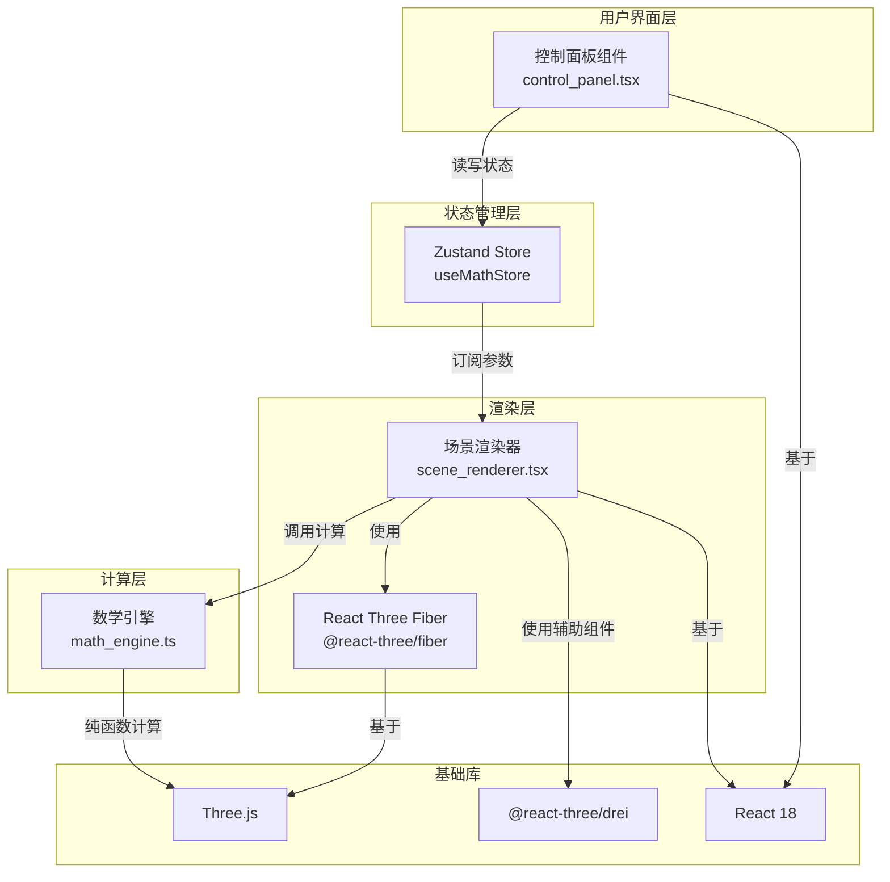

## 1. 架构设计



## 2. 技术描述

- **前端框架**：React 18 + TypeScript
- **构建工具**：Vite 5 + @vitejs/plugin-react
- **3D渲染**：Three.js + @react-three/fiber + @react-three/drei
- **状态管理**：Zustand
- **样式方案**：CSS Modules / inline styles（组件内聚样式）
- **工具库**：uuid

## 3. 项目结构

```
src/
├── app.tsx              # 根组件，状态与视图组合
├── scene_renderer.tsx   # 3D场景渲染模块
├── control_panel.tsx    # UI控制面板模块
└── math_engine.ts       # 纯数学计算模块
```

## 4. 模块职责

### 4.1 math_engine.ts
- 纯函数计算，与UI/渲染完全解耦
- 导出三个核心函数：
  - `generateMandelbrotHeightmap(params)` - Mandelbrot集合三维高度图
  - `generateJuliaSet_3D(params)` - Julia集合三维变体
  - `generateMinimalSurface(params)` - Enneper极小曲面
- 返回 `{ vertices: Float32Array, indices: Uint32Array, heights: Float32Array }`
- 顶点数控制在60万以内

### 4.2 scene_renderer.tsx
- 管理Three.js场景、相机、灯光
- 使用 `@react-three/fiber` 和 `@react-three/drei`
- 订阅Zustand store中的模型类型和参数
- 使用 `useFrame` 驱动光照旋转和参数过渡动画
- 调用math_engine生成几何数据，更新BufferGeometry
- 实现0.4秒easeInOutCubic缓动过渡效果

### 4.3 control_panel.tsx
- 渲染左侧浮动控制面板（毛玻璃效果）
- 读取Zustand store中的参数并显示
- 用户交互时更新store状态
- 不直接操作3D场景
- 响应式适配：桌面端展开，iPad端折叠为悬浮按钮

### 4.4 app.tsx
- 初始化Zustand store
- 组合3D场景和UI控制面板
- 作为模块间数据流的枢纽
- 全局样式和布局

## 5. 状态管理（Zustand）

```typescript
interface MathState {
  modelType: 'mandelbrot' | 'julia' | 'minimal';
  mandelbrotParams: { iterations: number; resolution: number };
  juliaParams: { cx: number; cy: number; iterations: number; resolution: number };
  minimalParams: { t: number; resolution: number };
  setModelType: (type: string) => void;
  setMandelbrotParams: (params: object) => void;
  setJuliaParams: (params: object) => void;
  setMinimalParams: (params: object) => void;
}
```

## 6. 性能优化策略

1. **几何数据复用**：使用BufferGeometry，仅更新position和normal属性
2. **计算节流**：参数快速变化时使用requestAnimationFrame合并计算
3. **顶点数控制**：resolution参数动态调整，确保顶点数≤60万
4. **过渡动画**：使用lerp插值实现平滑过渡，避免频繁重计算
5. **阴影优化**：使用柔和阴影贴图，合理设置阴影相机范围
6. **Web Worker**：可选，将重计算移至Worker线程（如需要）

## 7. 响应式断点

| 断点 | 宽度 | 布局 |
|------|------|------|
| 桌面端 | ≥1200px | 左侧固定控制面板，宽280px |
| 平板横屏 | 768-1199px | 控制面板折叠为悬浮按钮 |
| 平板竖屏 | <768px | 悬浮按钮，优化触屏交互 |
