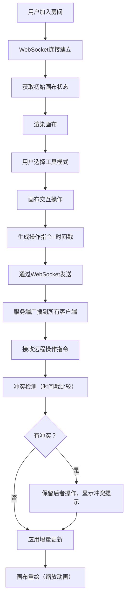

## 1. 产品概述

实时共享交互式编程白板应用，专为在线教育编程课程设计。支持讲师和最多8名学生在同一无限画布上实时协作绘图、书写和嵌入代码块，解决市面白板工具缺乏编程专用能力和同步延迟过高的问题。

- 核心目标：提供低延迟、高帧率的多人协作编程白板体验
- 目标用户：在线编程课程讲师与学生、远程编程协作团队

## 2. 核心功能

### 2.1 用户角色

| 角色 | 登录方式 | 核心权限 |
|------|----------|----------|
| 讲师 | 房间链接加入 | 创建房间、画布完全控制权、导出/保存 |
| 学生 | 房间链接加入 | 绘制、添加代码块、文本标注 |

### 2.2 功能模块

1. **画布渲染模块**：无限画布、网格背景、自由画笔、几何图形、文本标注、代码块嵌入、缩放平移
2. **实时同步模块**：WebSocket通信、操作序列化、冲突检测（基于时间戳）、重连机制
3. **工具栏模块**：画笔/形状/文本/代码块模式切换、颜色选择、线宽调节、撤销/重做、历史记录
4. **代码块模块**：Monaco Editor 嵌入、语法高亮、拖拽移动、双击编辑
5. **导出模块**：PNG导出（1920x1080）、JSON项目文件导出/导入

### 2.3 页面详情

| 页面名称 | 模块名称 | 功能描述 |
|----------|----------|----------|
| 主画布页 | 无限画布 | 自由绘制、几何图形（直线/矩形/椭圆，Shift约束比例）、文本标注（点击定位） |
| 主画布页 | 代码块嵌入 | 点击放置代码块容器、语法高亮、拖拽移动、双击编辑、14px代码字体 |
| 主画布页 | 工具栏面板 | 模式切换、颜色色盘、线宽滑块（1-10px）、撤销/重做按钮 |
| 主画布页 | 连接状态 | 右上角指示灯（绿/黄/红）、点击查看ping延迟 |
| 主画布页 | 画布导航 | 滚轮缩放（0.5x-3x，鼠标为中心0.3s动画）、空格+拖拽平移 |
| 主画布页 | 冲突提示 | 左下角黄色提示条，持续5秒自动消失 |
| 主画布页 | 历史记录 | 右上角按钮，最近50步操作，支持回滚 |
| 主画布页 | 导出功能 | PNG导出（1920x1080）、JSON项目文件保存/加载 |

## 3. 核心流程

用户加入房间 → 初始化画布同步 → 选择工具模式 → 在画布上交互（绘制/添加元素）→ 操作序列化通过WebSocket发送 → 服务端广播 → 其他客户端接收并应用增量更新 → 冲突检测（时间戳）→ 画布重绘（缩放进入动画0.2s）

## 4. 用户界面设计

### 4.1 设计风格

- **整体主题**：暗色主题，专业编程工具风格
- **主背景色**：深灰 #2d2d2d（画布）
- **网格线**：浅灰 #3d3d3d，间距50px
- **工具栏背景**：#1e1e1e，宽度60px（桌面），底部栏（移动端<768px）
- **代码块容器**：圆角8px，2px边框 #555，浅灰背景
- **图标悬停**：颜色 #888 → #fff，背景 #444，0.2s过渡
- **代码高亮**：Monaco Dark+ 主题配色
- **字体**：代码字体 14px，界面字体使用现代无衬线字体

### 4.2 页面设计概述

| 页面名称 | 模块名称 | UI元素 |
|----------|----------|--------|
| 主画布页 | 左侧工具栏 | 垂直60px宽度，16x16 SVG图标，悬停变色过渡，包含：选择/画笔/直线/矩形/椭圆/文本/代码块/颜色/线宽/撤销/重做/历史/导出 |
| 主画布页 | 画布区域 | 全屏背景 #2d2d2d，网格覆盖，右上角连接指示灯，左下角冲突提示条 |
| 主画布页 | 连接指示灯 | 圆形指示灯：绿色（已连接）/黄色（重连中）/红色（断开），点击显示ping值浮层 |
| 主画布页 | 代码块组件 | 圆角8px容器，#555边框，浅灰背景，Monaco编辑器嵌入，虚线边框高亮（编辑模式） |
| 主画布页 | 冲突提示条 | 左下角黄色背景条，"冲突解决：已保留最新操作"，5秒自动消失 |
| 主画布页 | 历史记录面板 | 右上角弹出面板，最近50步操作列表，每项可点击回滚 |

### 4.3 响应式

- **桌面优先**设计，宽度≥768px时工具栏左侧垂直显示
- **移动端适配**：宽度<768px时工具栏折叠为底部水平栏，画布占满剩余高度
- **触摸优化**：移动端支持双指缩放、单指绘制/平移

### 4.4 动画与过渡

- 新元素出现：由小到大0.2秒缩放进入动画
- 画布缩放：以鼠标位置为中心0.3秒平滑过渡
- 工具栏图标悬停：0.2秒颜色和背景色过渡
- 冲突提示：淡入淡出
