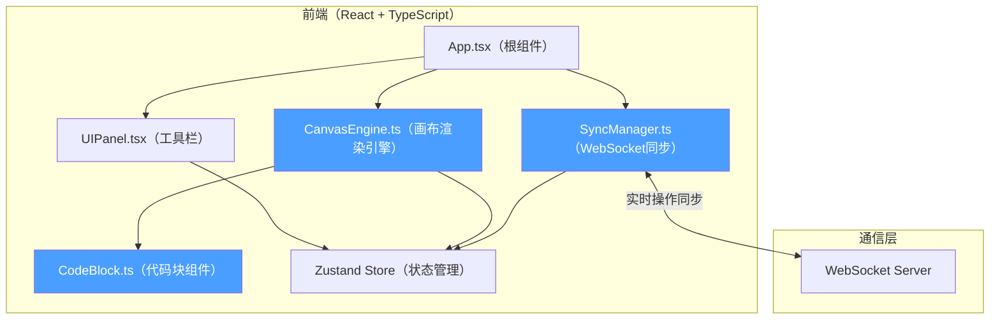

## 1. 架构设计



## 2. 技术描述

- **前端框架**：React 18 + TypeScript（严格模式，ES2022模块）
- **构建工具**：Vite 5 + @vitejs/plugin-react（HMR开启）
- **状态管理**：Zustand 4（轻量级状态管理，连接渲染与同步模块）
- **画布渲染**：HTML5 Canvas 2D API（高性能渲染循环）
- **代码编辑器**：Monaco Editor（代码块语法高亮，Dark+主题）
- **实时通信**：WebSocket（ws库），消息序列号+时间戳
- **工具库**：uuid（元素唯一标识）
- **项目初始化**：vite-init react-ts 模板

## 3. 文件结构

```
e:\solo\SoloAutoDemo\tasks\auto197/
├── package.json
├── vite.config.js
├── tsconfig.json
├── index.html
└── src/
    ├── main.tsx
    ├── App.tsx
    ├── CanvasEngine.ts
    ├── SyncManager.ts
    ├── CodeBlock.ts
    ├── UIPanel.tsx
    └── store/
        └── useCanvasStore.ts
```

### 各文件职责

| 文件 | 职责 |
|------|------|
| [CanvasEngine.ts](file:///e:/solo/SoloAutoDemo/tasks/auto197/src/CanvasEngine.ts) | 画布渲染引擎：管理绘制元素的渲染循环和事件处理；接收同步模块的增量更新并重绘；数据流向：用户交互→操作指令→同步模块→远程指令→更新画布 |
| [SyncManager.ts](file:///e:/solo/SoloAutoDemo/tasks/auto197/src/SyncManager.ts) | WebSocket同步管理：维护连接状态、消息序列号、冲突检测；CanvasEngine提交操作调用sendOp；ws.onmessage→解析→调用CanvasEngine.update |
| [CodeBlock.ts](file:///e:/solo/SoloAutoDemo/tasks/auto197/src/CodeBlock.ts) | 代码块组件：Monaco Editor嵌入（只读/编辑模式），语法高亮，行号，拖拽移动，共享坐标转换接口 |
| [UIPanel.tsx](file:///e:/solo/SoloAutoDemo/tasks/auto197/src/UIPanel.tsx) | 左侧工具栏面板：画笔/形状/文本/代码块模式、颜色选择器、线宽滑块、撤销/重做按钮；通过props/Zustand与CanvasEngine通信 |
| [App.tsx](file:///e:/solo/SoloAutoDemo/tasks/auto197/src/App.tsx) | 应用根组件：组合UIPanel、CanvasEngine、SyncManager；初始化连接；显示连接状态指示灯 |
| [store/useCanvasStore.ts](file:///e:/solo/SoloAutoDemo/tasks/auto197/src/store/useCanvasStore.ts) | Zustand状态管理：画布元素、当前工具、颜色、线宽、历史记录、连接状态 |

## 4. 数据模型

### 4.1 画布元素类型定义

```typescript
type ElementType = 'pen' | 'line' | 'rect' | 'ellipse' | 'text' | 'code';

interface BaseElement {
  id: string;           // uuid
  type: ElementType;
  x: number;            // 画布坐标X
  y: number;            // 画布坐标Y
  timestamp: number;    // 操作时间戳（用于冲突处理）
  userId: string;       // 创建用户ID
}

interface PenElement extends BaseElement {
  type: 'pen';
  points: { x: number; y: number }[];  // 贝塞尔曲线控制点
  color: string;
  lineWidth: number;
}

interface ShapeElement extends BaseElement {
  type: 'line' | 'rect' | 'ellipse';
  width: number;
  height: number;
  color: string;
  lineWidth: number;
  fill?: string;
}

interface TextElement extends BaseElement {
  type: 'text';
  content: string;
  fontSize: number;
  color: string;
}

interface CodeElement extends BaseElement {
  type: 'code';
  code: string;
  language: 'javascript' | 'python' | 'typescript' | 'html' | 'css';
  width: number;
  height: number;
}

type CanvasElement = PenElement | ShapeElement | TextElement | CodeElement;
```

### 4.2 操作指令类型

```typescript
type OpType = 'add' | 'update' | 'delete' | 'undo' | 'redo';

interface Operation {
  id: string;           // 操作ID（uuid）
  type: OpType;
  elementId: string;
  element?: CanvasElement;  // add/update时携带
  timestamp: number;
  userId: string;
  seq: number;          // 消息序列号
}
```

### 4.3 状态管理Store

```typescript
interface CanvasState {
  elements: Map<string, CanvasElement>;
  currentTool: ElementType | 'select';
  color: string;
  lineWidth: number;
  zoom: number;         // 0.5 - 3
  offsetX: number;      // 平移X
  offsetY: number;      // 平移Y
  history: Operation[]; // 最近50步
  historyIndex: number;
  connectionStatus: 'connected' | 'reconnecting' | 'disconnected';
  ping: number;
  conflictMessage: string | null;

  // Actions
  setTool: (tool: ElementType | 'select') => void;
  setColor: (color: string) => void;
  setLineWidth: (width: number) => void;
  addElement: (el: CanvasElement) => void;
  updateElement: (id: string, updates: Partial<CanvasElement>) => void;
  deleteElement: (id: string) => void;
  undo: () => void;
  redo: () => void;
  rollbackTo: (index: number) => void;
  setZoom: (zoom: number, centerX: number, centerY: number) => void;
  setOffset: (x: number, y: number) => void;
  applyRemoteOp: (op: Operation) => void;
  setConnectionStatus: (status: 'connected' | 'reconnecting' | 'disconnected') => void;
  setPing: (ms: number) => void;
  showConflict: (msg: string) => void;
}
```

## 5. 核心数据流向

### 5.1 本地操作流程

```
用户画布交互 → CanvasEngine事件处理
  → 生成CanvasElement / Operation
  → Zustand Store 更新本地状态
  → SyncManager.sendOp(op) 通过WebSocket发送
  → CanvasEngine 触发重绘
```

### 5.2 远程操作流程

```
WebSocket onmessage → SyncManager解析消息
  → 序列号检查（防丢失/重排）
  → 冲突检测（时间戳比较同位置元素）
  → 有冲突：保留timestamp较大的操作，Store.showConflict()
  → Store.applyRemoteOp() 更新状态
  → CanvasEngine 监听状态变化触发重绘（0.2s缩放动画）
```

### 5.3 画布渲染循环

- 使用 requestAnimationFrame 实现60FPS渲染
- 状态变化标记 dirty flag，在下一帧重绘
- 元素按 z-index（创建顺序）绘制
- 新元素应用 scale(0→1) 0.2s 缓动动画

## 6. 性能优化策略

| 优化点 | 策略 |
|--------|------|
| 渲染帧率 | requestAnimationFrame + dirty flag 按需重绘 |
| 画布缩放 | 以鼠标位置为中心做坐标变换，CSS transform GPU加速 |
| 元素渲染 | Canvas 2D 批量绘制，复杂元素缓存离屏Canvas |
| 同步延迟 | 操作增量发送（不发送全量），50ms防抖批量发送连续画笔点 |
| 冲突处理 | 仅比较同元素ID或位置重叠元素的时间戳 |
| 内存管理 | 历史记录最多保留50条，超出自动丢弃最早 |

## 7. 性能指标目标

- 8用户同时操作 + 100元素：同步延迟≤500ms（平均≤300ms）
- 画布渲染帧率≥55FPS
- 元素出现动画：0.2s平滑缩放
- 画布缩放动画：0.3s平滑过渡
