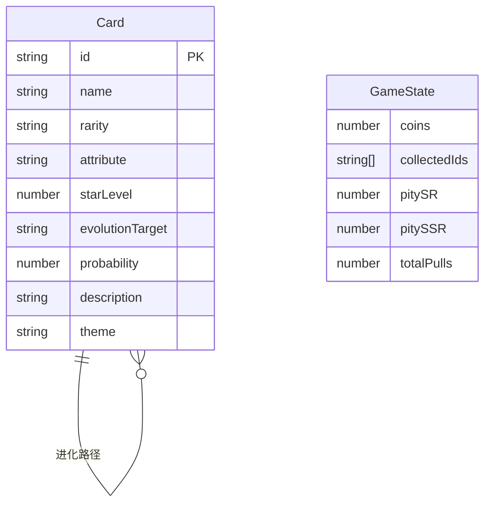

## 1. 架构设计

```mermaid
graph TB
    subgraph "前端层"
        "App.tsx 路由管理"
        "GachaMachine 抽卡组件"
        "CollectionBook 图鉴组件"
        "CardDetail 详情组件"
        "StarField 星空背景"
    end
    subgraph "数据层"
        "cards.ts 卡片数据"
        "probability.ts 概率引擎"
        "useGameStore 全局状态"
    end
    subgraph "渲染层"
        "Canvas 抽卡动画"
        "Canvas 星空粒子"
        "Canvas 雷达图"
        "Canvas 合成动画"
    end
    "App.tsx 路由管理" --> "GachaMachine 抽卡组件"
    "App.tsx 路由管理" --> "CollectionBook 图鉴组件"
    "App.tsx 路由管理" --> "CardDetail 详情组件"
    "GachaMachine 抽卡组件" --> "probability.ts 概率引擎"
    "GachaMachine 抽卡组件" --> "Canvas 抽卡动画"
    "CollectionBook 图鉴组件" --> "cards.ts 卡片数据"
    "CardDetail 详情组件" --> "Canvas 雷达图"
    "CardDetail 详情组件" --> "Canvas 合成动画"
    "GachaMachine 抽卡组件" --> "useGameStore 全局状态"
    "CollectionBook 图鉴组件" --> "useGameStore 全局状态"
```

## 2. 技术说明
- 前端：React@18 + TypeScript + Vite + Tailwind CSS
- 初始化工具：vite-init (react-ts模板)
- 状态管理：Zustand
- 路由：React Router DOM
- 动画渲染：Canvas 2D API
- 唯一标识：uuid
- 后端：无
- 数据库：无（纯前端状态管理，数据存储在内存/localStorage）

## 3. 路由定义
| 路由 | 用途 |
|------|------|
| / | 抽卡页面，中心抽卡圆盘与动画 |
| /collection | 图鉴页面，卡片网格与筛选 |
| /detail/:id | 卡片详情页面，属性雷达图与进化合成 |

## 4. 数据模型

### 4.1 数据模型定义



### 4.2 核心类型定义

```typescript
type Rarity = 'R' | 'SR' | 'SSR'
type Attribute = '火' | '水' | '风' | '地'

interface Card {
  id: string
  name: string
  rarity: Rarity
  attribute: Attribute
  starLevel: 1 | 2 | 3 | 4 | 5
  evolutionTarget?: string
  probability: number
  description: string
  theme: string
  stats: {
    attack: number
    defense: number
    speed: number
    magic: number
    luck: number
  }
}

interface GameState {
  coins: number
  collectedIds: string[]
  pitySR: number
  pitySSR: number
  totalPulls: number
}
```

## 5. 项目文件结构

```
├── package.json
├── vite.config.ts
├── tsconfig.json
├── index.html
├── src/
│   ├── App.tsx                    # 主应用路由
│   ├── main.tsx                   # 入口
│   ├── index.css                  # 全局样式
│   ├── data/
│   │   └── cards.ts               # 100+张卡片数据
│   ├── components/
│   │   ├── GachaMachine.tsx       # 抽卡机组件
│   │   ├── CollectionBook.tsx     # 图鉴组件
│   │   ├── CardDetail.tsx         # 卡片详情浮层
│   │   ├── StarField.tsx          # 星空粒子背景
│   │   └── CoinDisplay.tsx        # 货币显示组件
│   ├── utils/
│   │   └── probability.ts         # 概率计算与保底
│   └── store/
│       └── gameStore.ts           # Zustand全局状态
```

## 6. 关键技术决策

- **Canvas vs CSS动画**：抽卡动画、星空背景、雷达图使用Canvas渲染，UI交互使用CSS动画/过渡，兼顾性能与体验
- **分页加载策略**：初始加载30张卡片数据，图鉴页按需每次加载15张，使用虚拟滚动优化大数据量渲染
- **状态持久化**：使用Zustand + localStorage持久化游戏进度
- **保底机制**：SR保底10抽，SSR保底50抽，计数器存储在全局状态中
- **性能优化**：Canvas粒子数量根据requestAnimationFrame帧率动态调整，确保FPS≥30
