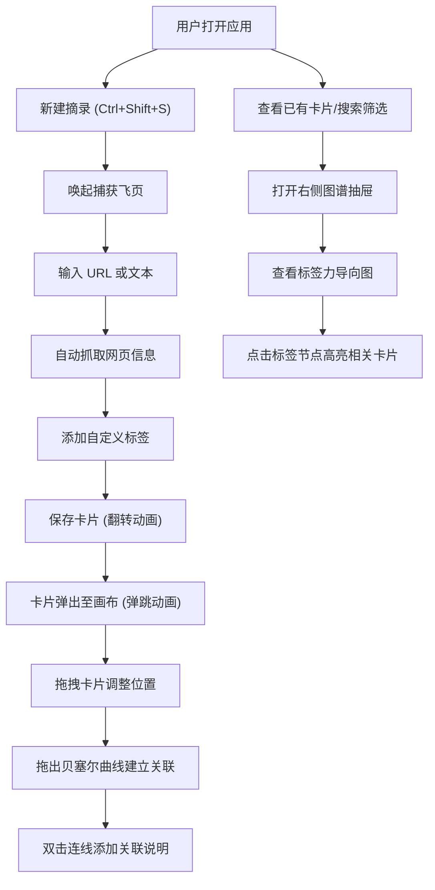

## 1. 产品概述

知识网络图谱应用（Knowledge Graph App）是一款帮助用户将碎片化的阅读笔记、网页摘录和灵感想法进行快速捕获、自动分类并生成可视化知识网络图谱的工具。它解决了传统书签或笔记工具中信息堆积后难以回溯关联、缺乏视觉化检索手段的痛点问题。

- 目标用户：知识工作者、研究者、设计师、程序员等需要管理大量碎片化信息的人群
- 核心价值：通过可视化的知识网络，让信息之间的关联关系一目了然，提升知识管理和检索效率

## 2. 核心功能

### 2.1 用户角色

| 角色 | 注册方式 | 核心权限 |
|------|----------|----------|
| 普通用户 | 无需注册，本地存储 | 创建、编辑、删除卡片，管理标签和关联关系，搜索筛选 |

### 2.2 功能模块

1. **摘录捕获飞页**：快捷键唤起模态浮窗，支持 URL 和文本输入，自动抓取网页信息，自定义标签
2. **无限画布**：卡片自由拖拽布局，贝塞尔曲线连线，关联说明
3. **知识图谱面板**：右侧抽屉，标签力导向图，关联权重可视化
4. **全文搜索筛选**：关键词搜索、标签筛选、日期范围筛选

### 2.3 页面详情

| 页面名称 | 模块名称 | 功能描述 |
|----------|----------|----------|
| 主应用 | 顶部搜索栏 | 关键词搜索、标签筛选、日期范围选择、新建卡片按钮 |
| 主应用 | 无限画布区域 | 卡片展示与拖拽、连线绘制、画布平移缩放 |
| 主应用 | 右侧图谱抽屉 | 标签力导向图、标签关联权重展示 |
| 摘录捕获飞页 | 输入表单 | URL 输入框、文本内容输入、标签输入、自动抓取网页信息 |
| 摘录捕获飞页 | 卡片预览 | 实时预览卡片样式、翻转动画关闭 |
| 卡片组件 | 交互控件 | 拖拽手柄、连线锚点、删除按钮、编辑按钮 |
| 连线组件 | 关联编辑 | 流向箭头动画、半透明光晕、双击编辑关联说明 |
| 标签图谱 | 力导向图 | 节点大小表示频率、连线粗细表示关联强度、点击高亮相关卡片 |

## 3. 核心流程

用户打开应用后，可以通过顶部搜索栏搜索和筛选已有的卡片，也可以通过新建按钮或快捷键（Ctrl+Shift+S）唤起摘录捕获飞页。用户输入 URL 或粘贴文本后，系统自动抓取网页标题和摘要，用户可添加自定义标签，保存后卡片以弹跳动画出现在画布顶部。

用户可以在画布上自由拖拽卡片调整位置，从卡片右下角拖出贝塞尔曲线与其他卡片建立关联。双击连线可添加关联说明文字。

右侧抽屉中展示自动生成的标签知识图谱（力导向图），点击标签节点可高亮并居中显示相关卡片。

## 4. 用户界面设计

### 4.1 设计风格

- **主色调**：深蓝灰 (#1a1e2e) 作为深色背景，薄荷绿 (#4ecdc4) 作为强调色
- **画布背景**：浅米色 (#f5f1e8) 网格图案
- **卡片样式**：圆角 12px，白色背景，轻微阴影，悬停时 translateY(-4px) + 阴影加深
- **字体**：使用现代无衬线字体，标题加粗，正文常规
- **动效**：所有卡片和连线的增删改动画使用 CSS transition 或 requestAnimationFrame，注重流畅性

### 4.2 页面设计概览

| 页面名称 | 模块名称 | UI 元素 |
|----------|----------|---------|
| 主应用 | 顶部搜索栏 | 深蓝灰背景、薄荷绿搜索图标、圆角输入框、标签筛选下拉、日期选择器、新建按钮 |
| 主应用 | 无限画布 | 浅米色网格背景、白色圆角卡片、贝塞尔曲线连线、箭头动画 |
| 主应用 | 右侧图谱抽屉 | 深蓝灰半透明背景、力导向图节点（薄荷绿渐变）、标签文字 |
| 摘录捕获飞页 | 模态浮窗 | 居中弹窗、白色背景、圆角 16px、输入区域、预览区域、保存/取消按钮 |
| 摘录捕获飞页 | 翻转动画 | CSS 3D transform rotateY、关闭时翻转 90° 后消失 |
| 卡片组件 | 悬停效果 | translateY(-4px)、box-shadow 加深、边框高亮薄荷绿 |
| 连线组件 | 动画效果 | 贝塞尔曲线、箭头流动动画、半透明光晕 |
| 标签图谱 | 力导向图 | 节点大小根据频率、连线粗细根据关联强度、悬停高亮 |

### 4.3 响应式设计

- **桌面端**：完整布局，画布占据主要空间，右侧抽屉可展开
- **平板端 (768px)**：画布缩小显示，卡片区域可滚动查看，图谱抽屉改为底部弹出
- **触控优化**：卡片支持触摸拖拽，双击间隔适当延长

### 4.4 性能要求

- 搜索响应时间：≤ 200ms（基于 1000 张卡片模拟数据）
- 拖拽帧率：稳定在 30FPS 以上
- 力导向图渲染：平滑动画，节点不卡顿
