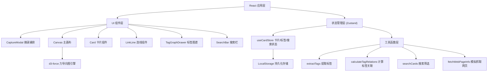
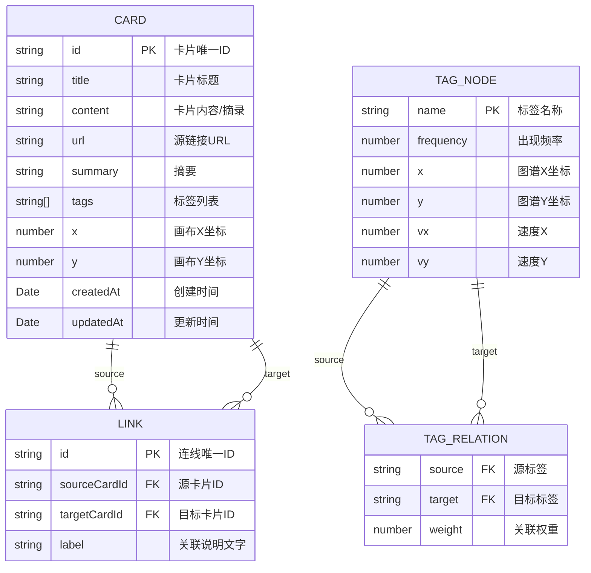

## 1. 架构设计

本项目为纯前端应用，采用 React + TypeScript + Vite 技术栈，状态管理使用 Zustand，知识图谱可视化使用 d3-force。



## 2. 技术描述

- **前端框架**：React 18 + TypeScript
- **构建工具**：Vite 5
- **状态管理**：Zustand 4
- **知识图谱可视化**：d3-force 3
- **唯一 ID 生成**：uuid 9
- **样式方案**：原生 CSS + CSS Variables（不使用 Tailwind，以保持极简主义设计的精确控制）
- **数据持久化**：LocalStorage
- **无后端服务**：纯前端应用，所有数据存储在浏览器本地

## 3. 路由定义

本应用为单页应用（SPA），无需多路由配置，所有功能在同一页面中完成。

| 路由 | 用途 |
|------|------|
| / | 主应用页面，包含画布、搜索栏、图谱抽屉 |

## 4. 数据模型

### 4.1 数据模型定义



### 4.2 TypeScript 类型定义

```typescript
interface Card {
  id: string;
  title: string;
  content: string;
  url: string;
  summary: string;
  tags: string[];
  x: number;
  y: number;
  createdAt: number;
  updatedAt: number;
}

interface Link {
  id: string;
  sourceCardId: string;
  targetCardId: string;
  label: string;
}

interface TagNode {
  name: string;
  frequency: number;
  x: number;
  y: number;
  vx: number;
  vy: number;
}

interface TagRelation {
  source: string;
  target: string;
  weight: number;
}

interface SearchFilter {
  keyword: string;
  tags: string[];
  dateFrom: number | null;
  dateTo: number | null;
}
```

## 5. 项目文件结构

```
auto21/
├── package.json
├── vite.config.ts
├── tsconfig.json
├── index.html
└── src/
    ├── main.tsx              # 应用入口
    ├── App.tsx               # 应用根组件
    ├── types.ts              # 类型定义
    ├── index.css             # 全局样式 + CSS Variables
    ├── store/
    │   └── useCardStore.ts   # Zustand 状态管理
    ├── components/
    │   ├── Canvas.tsx        # 主画布组件
    │   ├── Card.tsx          # 卡片组件
    │   ├── LinkLine.tsx      # 连线组件
    │   ├── CaptureModal.tsx  # 摘录捕获飞页
    │   ├── TagGraphDrawer.tsx # 标签图谱抽屉
    │   └── SearchBar.tsx     # 搜索栏组件
    └── utils/
        ├── tagUtils.ts       # 标签相关工具函数
        ├── searchUtils.ts    # 搜索筛选工具
        └── mockData.ts       # 模拟数据生成
```

## 6. 核心算法说明

### 6.1 标签关联权重计算（模拟 TF-IDF）

- 统计每个标签出现的频率（文档频率）
- 统计两个标签在同一卡片中共同出现的次数（共现频率）
- 使用 Jaccard 相似度计算标签关联度：`weight = cooccurrence / (freqA + freqB - cooccurrence)`

### 6.2 力导向图布局（d3-force）

- `forceManyBody`：节点间排斥力
- `forceLink`：连线间的吸引力
- `forceCenter`：向心力，保持图在中心
- `forceCollide`：防止节点重叠

### 6.3 搜索优化

- 使用文档化索引：预计算卡片的关键词索引
- 支持标题和内容的模糊匹配
- 标签匹配使用精确匹配 + 前缀匹配
