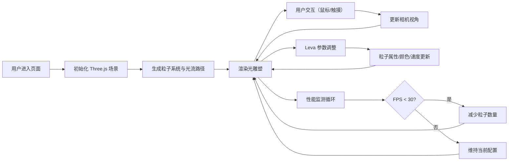

## 1. 产品概述

三维流动光雕塑交互可视化工具，为数字艺术展览场景打造的沉浸式互动装置。观众通过手势或触控改变光线流动方向和色彩韵律，营造动态光流空间体验。

- **核心目标**：以 WebGL 粒子系统呈现流动光雕塑，提供多维度交互控制
- **目标用户**：数字艺术策展人、展览观众、互动艺术爱好者
- **市场价值**：替代传统静态展品，创造可感知、可参与的沉浸式艺术体验

## 2. 核心功能

### 2.1 用户角色

| 角色 | 使用方式 | 核心需求 |
|------|----------|----------|
| 观展用户 | 浏览器访问、手势交互 | 流畅的视觉体验、直观的交互反馈 |
| 策展人 | 参数调试、主题设置 | 丰富的可配置项、稳定的性能表现 |

### 2.2 功能模块

1. **光雕塑主体**：粒子系统、贝塞尔光流路径、TubeGeometry 光带
2. **参数控制台**：Leva 实时调试面板、色彩主题切换、粒子参数调节
3. **交互控制系统**：鼠标拖拽旋转/缩放、触摸手势支持、自动视角恢复
4. **音画联动模块**：振幅滑块控制、粒子速度/尺寸/饱和度联动
5. **性能监测系统**：实时 FPS 计数器、粒子数量自适应调节

### 2.3 功能详情

| 模块名称 | 子功能 | 功能描述 |
|----------|--------|----------|
| 流动粒子系统 | 粒子生成 | 500+ 发光粒子，大小 0.1-0.5 单位随机，半透明效果 |
| 流动粒子系统 | 路径流动 | 多条贝塞尔曲线路径，粒子沿路径缓慢流动 |
| 流动粒子系统 | 速度控制 | Leva 面板实时调整流速 0.1-2.0 范围 |
| 动态色彩渐变 | 主题预设 | 黄昏暖色、极光冷色、霓虹炫色三组主题 |
| 动态色彩渐变 | 平滑过渡 | 主题切换时 1.5 秒渐变动画，无突变 |
| 动态色彩渐变 | 时间动态 | 粒子颜色随路径位置和时间动态变化 |
| 交互手势控制 | 鼠标交互 | 拖拽旋转 360°、滚轮缩放 0.5-3.0 倍 |
| 交互手势控制 | 触摸交互 | 单指旋转、双指缩放 |
| 交互手势控制 | 自动回正 | 停止交互 3 秒后缓慢自转，2 秒平滑恢复默认视角 |
| 音画联动 | 振幅控制 | Leva 滑块 0-100 范围调节 |
| 音画联动 | 视觉反馈 | 振幅增大时流速加快、粒子变大、饱和度提高 |
| 性能监测 | FPS 计数 | 右上角实时显示帧率 |
| 性能监测 | 自适应调节 | 低于 30FPS 时自动降低粒子数，最低 400 |

## 3. 核心流程

## 4. 用户界面设计

### 4.1 设计风格

- **主色调**：纯黑 (#000000) 到深蓝 (#0a1628) 径向渐变背景
- **辅助色**：淡蓝色光晕 (#4fc3f7)、白色半透明文字 (rgba(255,255,255,0.9))
- **强调色**：柔和红色脉冲 (#ff6b6b) 用于错误/加载状态
- **整体风格**：极简深色主题、微发光 (glow) 美学、磨砂玻璃质感

### 4.2 界面元素设计

| 元素类型 | 设计描述 |
|----------|----------|
| UI 面板 | 半透明磨砂玻璃效果 backdrop-filter: blur(10px) |
| 悬停效果 | transform: translateY(-2px) 上浮 + 边框柔光 |
| 参数变化 | 平滑缓动过渡，避免生硬跳变 |
| FPS 计数器 | 右上角，小字，半透明白色 |
| Leva 面板 | 右侧停靠，磨砂玻璃风格 |

### 4.3 响应式设计

| 屏幕尺寸 | 布局调整 |
|----------|----------|
| 桌面端 (>768px) | Leva 面板右侧展开，FPS 计数器右上角 |
| 移动端 (<768px) | 控制面板折叠为底部抽屉式，FPS 移至左上角小字 |
| 平板 | 支持触摸手势优化，单指旋转双指缩放 |

### 4.4 3D 场景设计

- **环境**：纯黑到深蓝径向渐变背景，营造沉浸式深空感
- **光照**：粒子自发光，无额外场景光源，强调光雕塑本身
- **相机**：PerspectiveCamera，初始距离 5 单位，视角 60°
- **构图**：光雕塑居中，占据画面核心区域，负空间充足
- **动画**：粒子沿贝塞尔曲线流动，整体缓慢自转（空闲时）
- **后处理**：轻微辉光效果增强粒子发光感
- **性能**：800 粒子保持 30FPS+，自适应粒子数量调节
