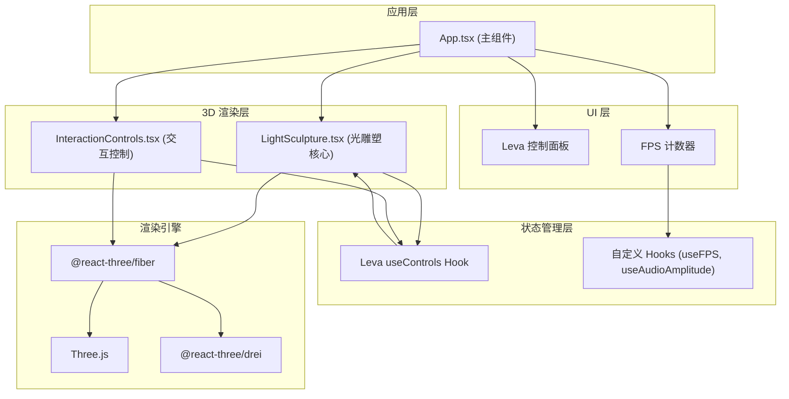

## 1. 架构设计



**数据流向：**
1. Leva 参数 → App.tsx → LightSculpture.tsx → 粒子系统更新
2. 交互事件 → InteractionControls → 相机变换 → 场景渲染
3. 性能监测 → useFPS Hook → FPS 计数器 UI
4. 振幅参数 → LightSculpture → 粒子速度/尺寸/饱和度联动

**调用关系：**
- `App.tsx` 引入并渲染 `LightSculpture` 和 `InteractionControls`
- `App.tsx` 使用 Leva 的 `useControls` 管理全局参数
- `LightSculpture.tsx` 接收 props 参数，内部使用 Three.js Points 和 TubeGeometry
- `InteractionControls.tsx` 操作相机，通过 OrbitControls 实现

## 2. 技术描述

- **前端框架**：React@18 + TypeScript@5 + Vite@5
- **构建工具**：Vite@5 + @vitejs/plugin-react
- **3D 渲染**：Three@0.160 + @react-three/fiber@8 + @react-three/drei@9
- **后处理**：@react-three/postprocessing
- **参数调试**：Leva@0.9
- **工具库**：uuid@9
- **状态管理**：Leva useControls（轻量场景参数）
- **样式方案**：原生 CSS + CSS Variables（极简主题，无 Tailwind 依赖）

## 3. 文件结构

```
src/
├── App.tsx              # 主应用组件，组装场景与UI
├── LightSculpture.tsx   # 光雕塑核心组件（粒子系统+光流路径）
├── InteractionControls.tsx # 交互控制（相机操作）
├── hooks/
│   ├── useFPS.ts        # FPS 监测 Hook
│   └── useColorTheme.ts # 色彩主题管理 Hook
├── utils/
│   ├── colorThemes.ts   # 色彩主题定义
│   └── bezierPaths.ts   # 贝塞尔路径生成工具
├── styles/
│   └── globals.css      # 全局样式与 CSS 变量
├── main.tsx             # 应用入口
└── index.css            # 入口样式
```

## 4. 核心模块设计

### 4.1 LightSculpture 组件

**Props 接口：**
```typescript
interface LightSculptureProps {
  particleCount: number;          // 粒子数量
  flowSpeed: number;              // 流动速度 0.1-2.0
  colorTheme: 'sunset' | 'aurora' | 'neon'; // 色彩主题
  amplitude: number;              // 音画联动振幅 0-100
  particleSize: number;           // 基础粒子大小
}
```

**内部状态：**
- `particlesRef`: Points 引用
- `pathsRef`: 贝塞尔曲线路径数组
- `particleData`: 每个粒子的路径索引、进度、大小、偏移

**动画循环：**
- 使用 useFrame Hook 每帧更新粒子位置
- 根据 flowSpeed 和 amplitude 计算实际速度
- 颜色根据路径位置 + 时间 + 主题插值计算

### 4.2 InteractionControls 组件

**功能：**
- 封装 drei 的 OrbitControls
- 监听交互状态，3 秒无交互后触发自动回正
- 回正动画 2 秒平滑过渡到默认视角
- 空闲时缓慢自转

**状态管理：**
- `isInteracting`: 是否正在交互
- `idleTimer`: 空闲计时器引用
- `autoRotate`: 自动旋转开关

### 4.3 性能监测模块

**useFPS Hook：**
- 记录每帧时间戳，计算滑动平均 FPS
- 当 FPS < 30 持续 1 秒时，触发粒子数降级回调
- 提供 fps 数值给 UI 显示

**自适应策略：**
- 初始粒子数：800
- 降级步长：每次减少 100
- 最低粒子数：400
- 检测间隔：每 2 秒评估一次

### 4.4 色彩主题系统

**三组主题定义：**
- `sunset`（黄昏暖色）：橙红 → 金黄 → 暖粉
- `aurora`（极光冷色）：青蓝 → 翠绿 → 紫蓝
- `neon`（霓虹炫色）：品红 → 青蓝 → 亮黄

**过渡机制：**
- 主题切换时启动 1.5 秒 lerp 过渡
- 每个粒子颜色独立插值，避免整体突变
- 使用 THREE.Color.lerp 进行颜色混合

## 5. 性能优化策略

1. **粒子系统优化**：使用 BufferGeometry 统一管理顶点数据
2. **材质复用**：共享 ShaderMaterial，仅更新 uniforms
3. **路径预计算**：贝塞尔曲线点预采样，运行时查表插值
4. **降级策略**：FPS 不足时自动降低粒子数量
5. **离屏粒子**：视锥剔除，减少绘制调用
6. **动画帧合并**：所有更新集中在 useFrame 单次回调中

## 6. 构建配置要点

- Vite 启用 React Fast Refresh
- TypeScript 严格模式 (strict: true)
- Three.js 使用 ES 模块按需导入
- 生产构建启用代码分割和 tree-shaking
- 开发服务器支持 HMR 热更新
