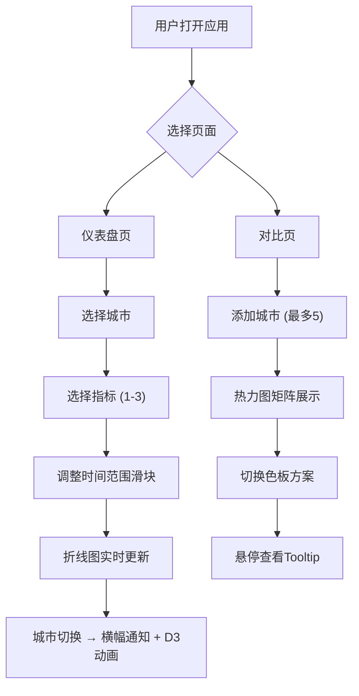

## 1. 产品概述

交互式动态环境监测数据仪表盘，用于实时展示和对比不同城市的环境指标（温度、湿度、AQI），支持自定义时间范围和指标组合，生成折线图与热力图。面向环境监测分析人员和城市管理者，提供直观的数据可视化与多维对比能力。

## 2. 核心功能

### 2.1 功能模块

1. **仪表盘页**: 城市选择、1-3个指标多选、24小时时间范围滑块、折线图实时更新、城市切换过渡动画、城市横幅通知条
2. **对比页**: 最多5个城市添加、热力图矩阵展示、行=城市/列=时间点、色板方案切换(Cold/Warm/Spectral)、Tooltip精确数值

### 2.2 页面详情

| 页面名称 | 模块名称 | 功能描述 |
|----------|----------|----------|
| 仪表盘页 | 城市选择器 | 下拉列表选择城市，毛玻璃半透明效果 |
| 仪表盘页 | 指标多选框 | 多选1-3个监测指标（温度/湿度/AQI） |
| 仪表盘页 | 时间范围滑块 | 渐变色轨道滑块，选择24小时内任意时段，拖动时显示时间提示标签 |
| 仪表盘页 | 折线图 | D3绘制带网格和渐变折线，指标颜色对应（温度红/湿度蓝/AQI橙），右上角图例，切换城市时D3 transition动画 |
| 仪表盘页 | 城市横幅通知 | 顶部显示城市名称和指示颜色的横幅，2秒后自动淡出 |
| 对比页 | 城市添加器 | 添加最多5个城市 |
| 对比页 | 热力图 | D3绘制二维矩阵，行=城市/列=时间点，颜色深浅表示数值高低，蓝→红色板 |
| 对比页 | 色板切换 | Cold/Warm/Spectral三种预设方案切换 |
| 对比页 | Tooltip | 鼠标悬停显示精确数值和城市名 |

## 3. 核心流程

用户打开应用 → 导航栏选择仪表盘/对比页 → 仪表盘页：选择城市→选择指标→调整时间范围→折线图实时更新 → 对比页：添加多个城市→查看热力图→切换色板→悬停查看数值

## 4. 用户界面设计

### 4.1 设计风格

- **主色调**: 背景色#1a1a2e，卡片背景#16213e，文字色#e0e0e0 — 深色科技风
- **辅助色**: 温度红(#ff4757)、湿度蓝(#3742fa)、AQI橙(#ffa502)
- **按钮风格**: 圆角按钮，hover放大1.05倍+边框光晕
- **字体**: 标题使用Outfit（几何感、科技风），正文使用Source Sans 3
- **布局**: 固定顶部导航栏 + 主内容区 + 底部状态栏
- **图标**: lucide-react图标库

### 4.2 页面设计概览

| 页面名称 | 模块名称 | UI元素 |
|----------|----------|--------|
| 全局 | 导航栏 | 固定定位、毛玻璃背景、应用名称、导航标签、主题指示 |
| 全局 | 状态栏 | 底部固定，显示当前选中城市数和指标数 |
| 仪表盘 | 城市选择器 | 毛玻璃半透明下拉框 |
| 仪表盘 | 指标多选框 | 自定义复选框，指标颜色标识 |
| 仪表盘 | 时间滑块 | 渐变色轨道，拖动提示标签 |
| 仪表盘 | 折线图 | 发光边缘折线、微弱网格线、右上角图例 |
| 仪表盘 | 城市横幅 | 顶部通知条，城市名称+指示颜色，2秒淡出 |
| 对比 | 城市添加 | 标签式城市卡片，带删除按钮 |
| 对比 | 热力图 | 蓝到红渐变色板，发光边缘，网格线 |
| 对比 | 色板切换 | 三按钮切换Cold/Warm/Spectral |
| 对比 | Tooltip | 浮动提示框，显示城市名和精确数值 |

### 4.3 响应式设计

- **大屏(≥1200px)**: 左右两栏布局（左侧仪表盘，右侧对比页缩略图）
- **中屏(768-1199px)**: 上下两栏布局
- **小屏(<768px)**: 隐藏对比页缩略图，仅显示当前页内容
- 布局切换时容器宽高伴随动画
- 所有图表监听resize事件自适应重绘

### 4.4 性能要求

- 图表渲染帧率≥30FPS
- 数据更新延迟≤200ms
- 500数据点内内存≤50MB
- D3 join/enter/exit/update增量更新
- requestAnimationFrame动画循环
- 组件卸载清除定时器和监听器
