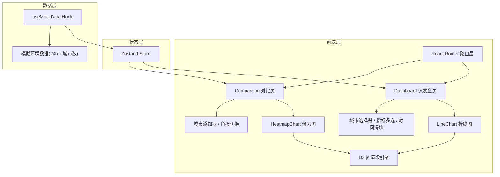

## 1. 架构设计



## 2. 技术说明

- **前端框架**: React 18 + TypeScript (严格模式)
- **构建工具**: Vite + @vitejs/plugin-react
- **路由**: react-router-dom v6
- **状态管理**: Zustand
- **图表渲染**: D3.js v7 + @types/d3
- **ID生成**: uuid
- **样式方案**: 纯CSS（CSS变量 + 全局样式），无Tailwind（用户未指定）
- **数据来源**: useMockData Hook模拟生成随机环境数据

## 3. 路由定义

| 路由 | 用途 |
|------|------|
| `/` | 重定向到仪表盘页 |
| `/dashboard` | 仪表盘页 - 单城市折线图监测 |
| `/comparison` | 对比页 - 多城市热力图对比 |

## 4. 数据模型

### 4.1 核心类型定义

```typescript
interface DataPoint {
  timestamp: number;
  temperature: number;
  humidity: number;
  aqi: number;
}

interface CityData {
  city: string;
  data: DataPoint[];
}

type Metric = 'temperature' | 'humidity' | 'aqi';

type ColorScheme = 'cold' | 'warm' | 'spectral';

interface StoreState {
  selectedCity: string;
  selectedMetrics: Metric[];
  timeRange: [number, number];
  comparisonCities: string[];
  colorScheme: ColorScheme;
}
```

### 4.2 数据流

1. useMockData生成24小时×城市数的随机数据
2. 数据注入Zustand Store
3. 组件从Store订阅所需数据切片
4. 用户操作触发Store更新 → 组件重渲染 → D3增量更新图表

## 5. 文件结构

```
├── package.json
├── vite.config.ts
├── tsconfig.json
├── index.html
└── src/
    ├── app.tsx                  # 主应用：路由分发、全局布局、导航栏、状态栏
    ├── pages/
    │   ├── dashboard/
    │   │   └── dashboard.tsx    # 仪表盘页
    │   └── comparison/
    │       └── comparison.tsx   # 对比页
    ├── hooks/
    │   └── useMockData.ts       # 模拟数据Hook
    ├── components/
    │   ├── lineChart.tsx        # 折线图组件
    │   └── heatmapChart.tsx     # 热力图组件
    └── styles/
        └── global.css           # 全局样式
```
