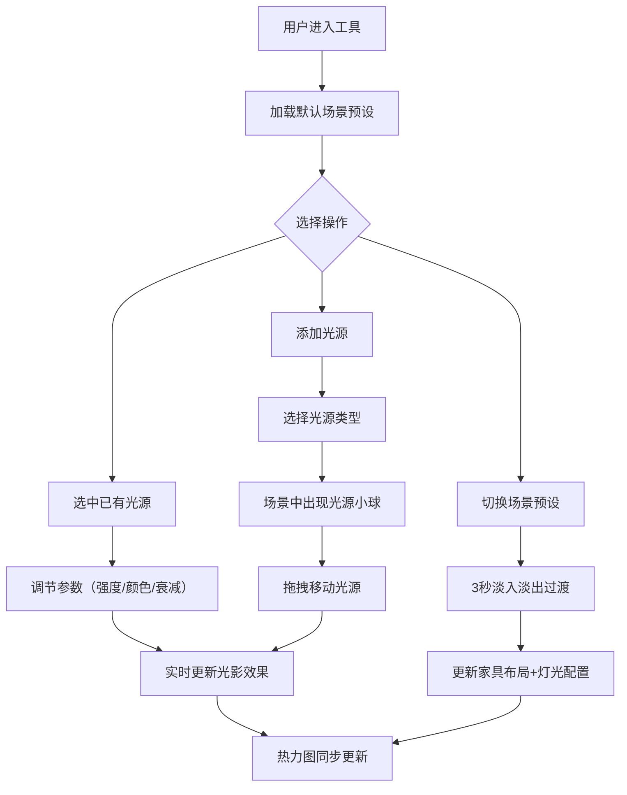

## 1. 产品概述

三维室内灯光布局与光影效果实时预览工具，面向建筑照明设计师和甲方，解决3D渲染工具切换灯光参数后等待渲染耗时长、缺乏实时交互调参能力的痛点。用户可添加/移动/调节点光源、聚光灯和平行光的参数（强度、颜色、衰减），在场景中实时预览光照对简单室内模型的渲染效果。

- 核心价值：将灯光调试从"调参→等待渲染→查看结果"的串行流程变为"调参→即时反馈"的实时交互体验
- 目标用户：建筑照明设计师、室内设计师、甲方评审人员

## 2. 核心功能

### 2.1 功能模块

1. **主场景页面**：3D室内场景渲染、光源操作、参数调节、场景预设切换

### 2.2 页面详情

| 页面名称 | 模块名称 | 功能描述 |
|---------|---------|---------|
| 主场景页面 | 3D场景区域 | 渲染室内模型（墙壁、地板、家具体块）、所有光源对象及其辅助线、光强热力图叠加 |
| 主场景页面 | 光源控制面板 | 右侧毛玻璃悬浮面板，提供灯光类型选择、强度滑块、颜色拾取器、坐标微调、衰减调节 |
| 主场景页面 | 场景信息叠加层 | 左上角显示当前场景预设名称和光源数量 |
| 主场景页面 | 场景预设切换栏 | 底部按钮组，提供简约客厅/书房角落/画廊展厅三套预设，切换时3秒淡入淡出过渡 |
| 主场景页面 | 光强热力图 | 场景角落半透明俯视热力图，蓝→红渐变，帮助感知光照不均匀区域 |

## 3. 核心流程

用户打开工具后进入默认"简约客厅"场景，场景中已有初始灯光配置。用户可通过右侧控制面板添加新光源（点光源/聚光灯/平行光），添加后3D场景中出现带光晕的虚拟小球标识光源位置。用户可拖拽小球在XZ平面移动，点击小球选中后激活参数编辑面板，实时调节强度、颜色、衰减等参数，场景光影即时更新。聚光灯和平行光还支持拖拽方向箭头旋转照射角度。用户可切换场景预设，家具布局和灯光配置随之变化。场景角落的热力图实时反映光照强度分布。

## 4. 用户界面设计

### 4.1 设计风格

- **主色调**：#1a1a2e（深蓝黑主背景）、#16213e（次级面板）、#0f3460（操作区）、#e94560（强调色/交互高亮）
- **风格**：深色科技感主题，毛玻璃效果面板，圆角控件
- **字体**：Orbitron（标题/数据）+ Noto Sans SC（正文/控制面板），突出科技感同时保证中文可读性
- **布局**：3D场景占页面80%，右侧悬浮毛玻璃控制面板，左上角信息叠加，底部预设切换栏
- **动效**：参数变化时0.2s缩放脉冲、拖拽时光标抓取手型、场景切换3s淡入淡出、滑块弹性回弹

### 4.2 页面设计概览

| 页面名称 | 模块名称 | UI元素 |
|---------|---------|--------|
| 主场景页面 | 3D场景区域 | 深色背景、实时阴影、光源辅助线与光晕球、热力图叠加层 |
| 主场景页面 | 光源控制面板 | 毛玻璃面板(backdrop-filter:blur(10px))、圆角滑块、圆形颜色选择器、预设色板（暖白3000K/日光5500K/冷白6500K） |
| 主场景页面 | 信息叠加层 | 半透明深色背景标签、Orbitron字体显示场景名和光源数量 |
| 主场景页面 | 预设切换栏 | 底部居中按钮组、选中态高亮#e94560、切换时3s淡入淡出 |

### 4.3 响应式设计

- 1440px及以上：3D场景80%宽度，右侧固定悬浮控制面板
- 768px-1440px：控制面板折叠为可展开的抽屉式结构，通过按钮切换展开/收起
- 触摸设备：拖拽操作适配touch事件

### 4.4 3D场景指导

- **环境**：室内场景，无HDRI，使用自定义光源照明
- **光照**：用户自定义的多光源组合，点光源/聚光灯/平行光，支持阴影映射
- **相机**：透视相机，默认45°俯视角，支持OrbitControls旋转/缩放
- **模型**：简约几何体块表示家具（长方体沙发/桌子/书架等），带简单材质
- **交互**：光源小球可拖拽（DragControls）、可点击选中、方向箭头可旋转
- **后处理**：可选Bloom效果增强光晕表现
- **性能预算**：4光源30FPS以上，最多8光源不崩溃，参数调节到光影更新<300ms
